# Logical Database Design Exercises

> [!IMPORTANT]
> Write your answers to a Word document named `ld_exercises_YOURFAMILYNAME.docx` and submit the document to Moodle.

The objective of this exercise is to familiarize yourself with the basics of logical design, have hands-on practice in primary key and foreign key considerations, and learn to derive relations for simple ER diagrams. Refer to this week's lesson slides as materials.

In this exercise set, we work with natural primary keys only. In all tasks, show your answers as relation schemas as below:

<pre>
Department (<strong><ins>deptno</ins></strong>, deptname)

Employee (<strong><ins>empno</ins></strong>, familyname, givenname, deptno)
    <strong>FK (deptno) REFERENCES Department (deptno)</strong>
</pre>

Remember to **underline primary keys** and write a **foreign key definition for each foreign key (below the relation schema)**.

## Task 1: Warm-up

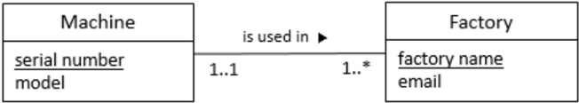

Which one of the below reflects correctly the ER diagram above?

> [!TIP]
> Start by identifying the relationship type (one-to-one, many-to-one, or many-to-many). Then, refer to the examples on the lesson slides on how the relations are derieved with different relationship types.

### a.

<pre>
Machine (<ins>serialnumber</ins>, model, factoryname)
    FK (factoryname) REFERENCES Factory (factoryname)
Factory (<ins>factoryname</ins>, email)
</pre>

### b.

<pre>
Machine (<ins>serialnumber</ins>, model)
Factory (<ins>factoryname</ins>, email)
</pre>

### c.

<pre>
Machine (<ins>serialnumber</ins>, model, factoryname)
Factory (<ins>factoryname</ins>, email, serialnumber)
    FK (serialnumber) REFERENCES Machine (serialnumber)
</pre>

### d.

<pre>
Machine (<ins>serialnumber</ins>, model)
Factory (<ins>factoryname</ins>, email, serialnumber)
    FK (serialnumber) REFERENCES Machine (serialnumber)
</pre>

## Task 2: Warm-up drills with simple diagrams

Translate the ER diagrams below to relation schemas. **Underline primary keys** and write a **foreign key definition for each foreign key (below the relation schema)**.

> [!TIP]
> Again, start by identifying the relationship type (one-to-one, many-to-one, or many-to-many). Then, figure out how to derive the relations for that specific relationship type.

### a.

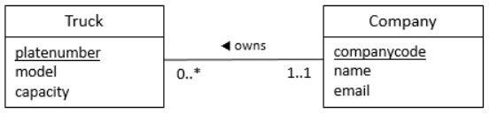

### b.

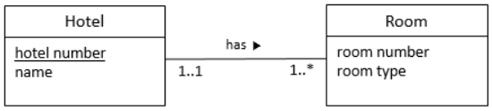

### c.

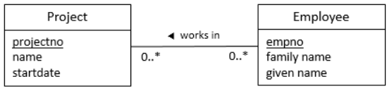

### d.

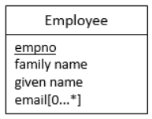

### e.

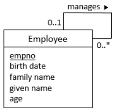

> [!TIP]
> Even if the `Employee` entity has a relationship with itself, derive the relations just the same, based on the relationship type.

## Task 3: Translating ER diagrams to relation schemas

Translate the ER diagrams below to relation schemas. **Underline primary keys** and write a **foreign key definition for each foreign key (below the relation schema)**.

### a.

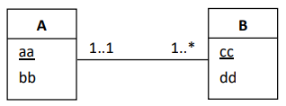

### b.

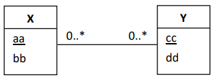

### c.

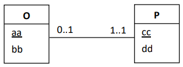

## Task 4: Boat crews

Derive relations from the ER diagram below.

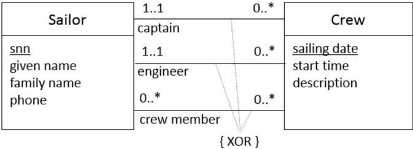

> [!NOTE]
> We do this as a simple practice. That is, derive the relations straightforwardly without thinking about any further practical business issues. You do not have to worry about the "XOR" thing.

> [!TIP]
> The name of the primary key in the parent table and the name of the foreign key in the child table can be different. The foreign key definition "binds" a foreign key to a primary key. For example, let's consider that a department has a manager:
> <pre>
> Department (<ins>deptno</ins>, deptname, <strong>managerno</strong>)
>     <strong>FK (managerno) REFERENCES Employee (employee_id)</strong>
> Employee (<ins>empno</ins>, familyname, givenname, deptno)
>     FK (deptno) REFERENCES Department (deptno)
> </pre>

## Task 5: University

Derive relations from the ER diagram below.

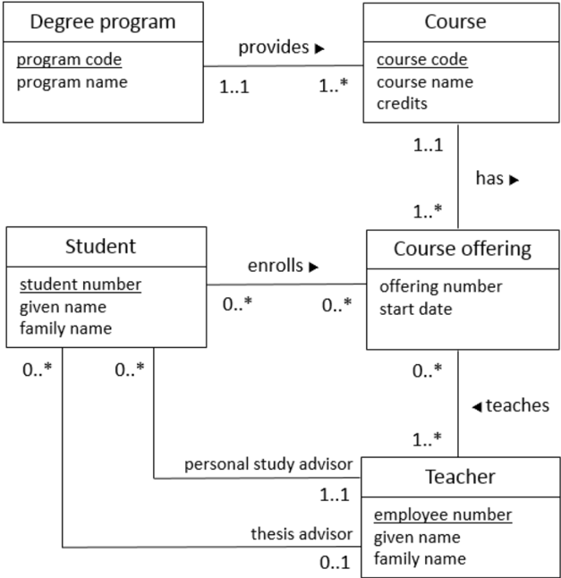

> [!NOTE] 
> We do this as a simple practice. That is, derive the relations straightforwardly without thinking about any further practical issues.
