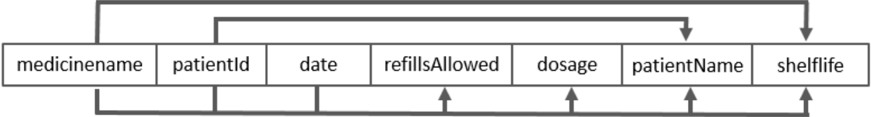

# Normalisation Exercises

> [!IMPORTANT]
> Write your answers to a Word document named `normalisation_exercises_YOURFAMILYNAME.docx` and submit the document to Moodle.

The objective of this exercises is to familiarise yourself with the basics of database normalisation, to understand the basic normalisation terminology, have hands-on practise in identifying functional dependencies and validating relations with the Boyce-Codd normal form, and decomposing relations when needed. Refer to this week's lesson slides as materials.

## Task 1

Functional dependency describes the relationship between attributes in a relation. It occurs when attribute A in a relation uniquely determines attribute B. That is, for each value of A there is exactly one value of B and that holds all the time. This can be written `A → B`. For example `studentnumber → surname`.

- `A → B` means that A uniquely determines B.
- `{A, B} → C` means that A and B together uniquely determine C.
- `A → B, C, D` means that A uniquely determines B, C and D.

The determinant of a functional dependency refers to the attribute, or group of attributes, on the left-hand side of the arrow. In `A → B`, A is the determinant of B.

Consider the student data. Suppose that each student has a social security number. **Which of the following dependencies are true?**

1. `date of birth → student number`
2. `student number → date of birth`
3. `student number → height`
4. `height → student number`
5. `social security number → student number`
6. `student number → social security number`

> [!TIP]
> `studentnumber → surname` is a functional dependency because for a student number there is exactly one surname. In contrast, `surname → studentnumber` is not a functional dependency because for a surname there can be many different student numbers.

## Task 2

Which of the following functional dependencies do definitely not hold over the table below?

| A   | B   | C   | D   |
| --- | --- | --- | --- |
| 1   | 2   | 3   | 5   |
| 4   | 2   | 3   | 7   |
| 5   | 3   | 3   | 7   |

1. `A → B`
2. `B → C`
3. `{B, C} → A`
4. `B → A`

> [!TIP]
> For example with the `A → B` functional dependency candidate, write down what kind of value(s) specific value of A has for B. For example, `A: 1 → B: 2`, `A: 4 → B: 2`, `A: 5 → B: 3`. If there is a `A` value that has different `B` values, it is not functional dependency.

## Task 3

Which of the following functional dependencies do definitely not hold over the table below?

| A   | B   | C   | D   |
| --- | --- | --- | --- |
| 1   | 3   | 5   | 5   |
| 2   | 2   | 3   | 7   |
| 1   | 2   | 5   | 7   |

1. `C → B`
2. `C → A`
3. `{C, D} → A`
4. `A → D`

## Task 4

Determine candidate keys for the following relations that have the specified functional dependencies.

> [!TIP]
> Candidate key is a attribute (or group of attributes) that determine all other attributes. Attribute can also determine an attribute _through_ other attributes. E.g. If `X → Y` and `Y → Z`, then also functional dependency `X → Z` exists.

### Relation A

<pre>RelationA (X, Y, Z)</pre>

Functional dependencies:

- `Z → X`
- `Z → Y`

### Relation B

<pre>RelationB (A, B, C, D)</pre>

Functional dependencies:

- `C → A`
- `D → B`
- `A → D`

### Relation C

<pre>RelationC (A, B, C, D)</pre>

Functional dependencies:

- `C → D` 
- `C → A` 
- `B → C`

### Relation D

<pre>RelationD (A, B, C)</pre> 

Functional dependencies:

- `B → A` 
- `C → B`
- `B → C`
- `C → A`

## Task 5

Here's a recap of the normal form rules:

- 1NF: relation **must have a primary key** and all attributes **have atomic values** (no multi-valued attributes).
- 2NF: if relation has a composite candidate key, there should not be a **partial functional dependency** in which part of a candidate key determines a non-candidate key attribute. E.g., if `(course_code, instance_number)` is a candidate key of a `CourseInstance` relation, `course_code → course_name` would be a partial functional dependency.
- 3NF: there should not be a functional dependency between two **non-candidate key** attributes.
- BCNF: there should not be a functional dependency in which the determinant (left) is not a whole candidate key.

In each normal form, all so the previous normal form's rules should be followed.

**What is the normal form for each of the relations below?** Start by specifying the primary key, if it is not already specified. Give arguments!

1. <pre>CrewMember (<ins>date</ins>, <ins>ssn</ins>)</pre>
2. <pre>ProjectMember (projectno, empno, empRoleInTheProject, gender)</pre>
3. <pre>Country (continent, countryname, population)</pre>
4. <pre>Department (deptno, deptname, companycode, companyname)</pre>
5. <pre>Textbook (ISBN, bookname, chapternumber, chaptername, publisher)</pre>
6. <pre>Employee (empno, surname, firstname, Phone(phonenumber, phonetype))</pre>
6. <pre>R (A, B, C, D)</pre>

    There are the following functional dependencies:

    - `{A, B} → D`
    - `{A, C} → D`
    - `B → C`
    - `C → B`

> [!TIP]
> Start with the rules of the 1NF. If those are followed, move on to the 2NF and so on. If the normal form rules are violated, the relation is in the previous normal form. For example if the 1NF rules are follow, but the 2NF rules are violated, the relation is in 1NF.

## Task 6

Based on the dependency diagram below, create relations that are in BCNF.

In your relation schemas:

- Underline primary keys and include all foreign key definitions: `FK (a) REFERENCES R2 (a)`.
- Show functional dependencies in your relations (using notation `A → B`).

## Task 7

Normalise the relations below to BCNF.

- Determine the primary key for the relation.
- Determine the current normal form of the relation. Give arguments!
- Decompose the relation when needed and write new relation schemas. Underline primary keys and include all foreign key definitions: `FK (a) REFERENCES R2 (a)`.
- Show functional dependencies in your relations (using notation `A → B`).

### Relation A

<pre>Player (playerno, surname, firstname, teamnumber, teamname)</pre>

| playerno | surname | firstname | teamnumber | teamname |
| -------- | ------- | --------- | ---------- | -------- |
| 10       | Jones   | Jack      | 1          | Hawks    |
| 11       | Smith   | Sam       | 1          | Hawks    |
| 12       | Allan   | Laird     | 2          | Chickens |
| 13       | Brown   | Charlie   | 2          | Chickens |
| 14       | Hayes   | Hans      | 3          | Ducks    |

### Relation B

<pre>Booking (ISBN, bookname, patronid, surname, firstname, bookingdate, bookingtime)</pre>

| ISBN    | bookname | patronid | surname | firstname | bookingdate | bookingtime |
| ------- | -------- | -------- | ------- | --------- | ----------- | ----------- |
| 123-456 | Java     | 10       | Jones   | Jack      | 2016-02-10  | 10:33:01    |
| 123-456 | Java     | 11       | Smith   | Sam       | 2016-02-12  | 12:10:23    |
| 432-234 | C#       | 10       | Jones   | Jack      | 2016-03-01  | 14:01:59    |
| 432-234 | C#       | 11       | Smith   | Sam       | 2016-03-01  | 08:00:27    |

### Relation C

<pre>Order (orderno, productno, productname, quantity, clientno, deliveryaddress, clientaddress)</pre>

| orderno | productname | productno | quantity | clientno | deliveryaddress | clientaddress |
| ------- | ----------- | --------- | -------- | -------- | --------------- | ------------- |
| 1       | Hammer      | 10        | 2        | A1       | Worksite 11     | East 1        |
| 1       | Drill       | 20        | 1        | A1       | Worksite 11     | East 1        |
| 2       | Hammer      | 10        | 5        | B2       | Worksite 77     | Woods 2       |
| 3       | Crowbar     | 40        | 3        | B2       | Worksite 33     | Woods 2       |
| 3       | Hammer      | 10        | 1        | B2       | Worksite 33     | Woods 2       |
| 4       | Crowbar     | 40        | 7        | A1       | Worksite 66     | East 1        |
| 4       | Hammer      | 10        | 5        | A1       | Worksite 66     | East 1        |
| 4       | Drill       | 20        | 4        | A1       | Worksite 66     | East 1        |

## Task 8

Suppose the following relation:

<pre>XYZ (a, b, c, d, e)</pre>

With the following functional dependencies:

- `a → b, c, d, e`
- `b → d`

1. Determine the primary key.
2. Explain why the relation `XYZ` is not in 3NF.
3. Normalise the relation `XYZ` to BCNF.

## Task 9

Suppose the following relation:

<pre>XYZ (a, b, c, d)</pre>

With the following functional dependencies:

- `a → c`
- `{a, d} → b, c`

1. Determine the primary key.
2. Explain why the relation `XYZ` is not in 2NF.
3. Normalise the relation `XYZ` to BCNF.

---

## ⭐ Bonus task 10

Suppose the following relation:

<pre>R (A, B, C)</pre>

With the functional dependency `B → C`. If `A` is a candidate key for relation `R`, is it possible for `R` to be in BCNF? If not, explain why not.
