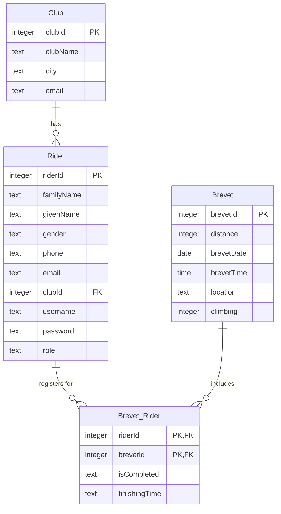

# Physical Design Exercises

> [!IMPORTANT]
> Submit the following files to Moodle:
>
> - `physical_design_tables_YOURFAMILYNAME.sql`: contains SQL statements for creating tables and inserting data.
> - `physical_design_indexes_YOURFAMILYNAME.sql`: contains SQL statements for creating indexes.
> - `db_diagram_YOURFAMILYNAME.png`: screenshot of the database diagram.

The objective of this exercise is to familiarise yourself with the basics of database tables and index creation and gain hands-on practice in creating tables and indexes. Refer to this week's lesson slides and the "SQL Create Table Syntax" task as materials.

# The task

The database design team has been able to design and document the structure of the Haaga-Helia Randonneurs cycling competition database. Your job is to implement the actual database structures in SQL Server.

1. Create tables with integrity constraints based on the data dictionary descriptions below.
2. Create the basic set of indexes for all tables (do not worry about the small number of rows). **NB!** SQL Server automatically creates some indexes. View the indexes on each table to see that you have not created any redundant indexes!
3. Insert some rows into each table.
4. Verify that your integrity constraints don't allow inserting invalid rows. That is, execute inserts with invalid column values and make sure that inserts don't succeed.
5. Create a database diagram in the SQL Server Management Studio for the database tables. Include a screenshot of the diagram in the Moodle submission.

> [!TIP]
> Here are some tips:
> 1. Create one table at a time. If the table has a foreign key, you need to create the referenced table first.
> 2. If you have created a table and need to modify its columns, the easiest way is to drop the table first using the `DROP TABLE NameOfTable` statement and create the table again.

## ⭐ Bonus task

> [!IMPORTANT]
> This task is optional.

1. Write a query that displays a list of riders (riderId, givenName, familyName) who have finished a certain brevet.
2. Write a query that displays the total number of completed brevets for each rider (riderId, familyName, givenName, completedBrevetsCount), ordered from most to least completions.
3. Write a query that displays the winning time of each brevet (brevetId, distance, winningTime).

## Entity type descriptions

| Entity type      | Description                                              | Synonyms, aliases                                      | Occurrence                                                                                                            | Min - max  | Volatility per year |
| ---------------- | -------------------------------------------------------- | ------------------------------------------------------ | --------------------------------------------------------------------------------------------------------------------- | ---------- | ------------------- |
| Brevet           | A non-competitive long-distance cycling event            | event, ride, sportive, randonnee                       | Every year ca. 20-30 brevets are organised                                                                            | 60 - 1000  | + 20-30             |
| Rider            | A cyclist whose hobby is randonneuring                   | randonneur, cyclist                                    | New riders emerge all year round. Possibly 20-30 new riders each year                                             | 200 - 2000 | + 10-30             |
| Club             | A cycling club or team.                                  | cycling club, team, randonneur club                    | HH Randonneurs add new clubs from time to time and update the information, but only very rarely delete the old ones   | 20 - 100   | + 1-3               |
| User credentials | Credentials that can be used to establish user identity. | identification credentials, authentication credentials | User credentials will be created for each rider. In addition, user credentials will be created for each administrator | 220 - 2000 | + 10-40             |

## Relationship type descriptions

| Relationship type   | Description                   | Synonyms, aliases | Occurrence                                          | Min - max   | Volatility per year |
| ------------------- | ----------------------------- | ----------------- | --------------------------------------------------- | ----------- | ------------------- |
| Brevet registration | A rider signs up for a brevet | brevet sign up    | Typically, there are 5-50 sign-ups per brevet  | N/A - 10000 | + 400-500           |
| Brevet completion   | A rider finishes a brevet     | diploma           | Typically, there are 5-50 finishers per brevet | N/A - 10000 | + 400-500           |

## Relations

### Brevet

| Attribute  | Description                                                        | Type    | Required | Key         | Special domain                | CHECK constraint |
| ---------- | ------------------------------------------------------------------ | ------- | -------- | ----------- | ----------------------------- | ---------------- |
| brevetId   | Surrogate key: Unique brevet identifier                            | Integer | Yes      | PRIMARY KEY | -                             | -                |
| distance   | The distance in kilometres to be cycled when completing the brevet | Integer | Yes      | -           | 200,300, 400, 600, 1000, 1200 | Yes              |
| brevetDate | The date when the brevet takes place                               | Date    | Yes      | -           | -                             | -                |
| brevetTime | The time when the brevet starts                                    | Time    | Yes      | -           | -                             | -                |
| location   | The location where the brevet starts                               | Text    | Yes      | -           | -                             | -                |
| climbing   | The total (in meters) to be climbed when completing the brevet    | Integer | Yes      | -           | 0-99999                       | Yes              |

### Brevet_Rider

| Attribute     | Description                                                            | Data type | Required | Key                                   | Special  domain          | CHECK constraint |
| ------------- | ---------------------------------------------------------------------- | --------- | -------- | ------------------------------------- | ------------------------ | ---------------- |
| riderId       | Unique rider identifier                                                | Integer   | Yes      | IN PRIMARY KEY, FOREIGN KEY → Rider   | -                        | -                |
| brevetId      | Unique brevet identifier                                               | Integer   | Yes      | IN PRIMARY KEY,  FOREIGN KEY → Brevet | -                        | -                |
| isCompleted   | Brevet completion status 'N' = registered only, 'Y' = brevet completed | Text      | Yes      | -                                     | 'N','Y'                  | Yes              |
| finishingTime | The time it took for  the rider to finish the brevet                                             | Time      | -      | -                                     | - | -                |

### Club

| Attribute | Description                           | Data type | Required | Key           | Special  domain | CHECK constraint |
| --------- | ------------------------------------- | --------- | -------- | ------------- | --------------- | ---------------- |
| clubId    | Surrogate key: Unique club identifier | Integer   | Yes      | PRIMARY KEY   | -               | -                |
| clubName  | The name of the club                  | Text      | Yes      | ALTERNATE KEY | -               | -                |
| city      | The home place of the club            | Text      | Yes      | -             | -               | -                |
| email     | The club's contact email              | Text      | Yes      | -             | -               | -                |

### Rider

| Attribute  | Description                                      | Data type | Required | Key           | Special domain  | CHECK constraint |
| ---------- | ------------------------------------------------ | --------- | -------- | ------------- | --------------- | ---------------- |
| riderId    | Surrogate key: Unique rider identifier           | Integer   | Yes      | PRIMARY KEY   | -               | -                |
| familyName | Family name                                      | Text      | Yes      | -             | -               | -                |
| givenName  | Given name                                       | Text      | Yes      | -             | -               | -                |
| gender     | Gender                                           | Text      | Yes      | -             | 'F','M', 'O'    | Yes              |
| phone      | Phone                                            | Text      |          | -             | -               | -                |
| email      | Email                                            | Text      |          | -             | -               | -                |
| clubId     | Club identifier                                  | Integer   | Yes      | FOREIGN KEY   | -               | -                |
| username   | Username                                         | Text      | Yes      | ALTERNATE KEY | -               | -                |
| password   | Password                                         | Text      | Yes      | -             | -               | -                |
| role       | The authorisation role for the user's privileges | Text      | Yes      | -             | 'user', 'admin' | Yes              |

## Database diagram

