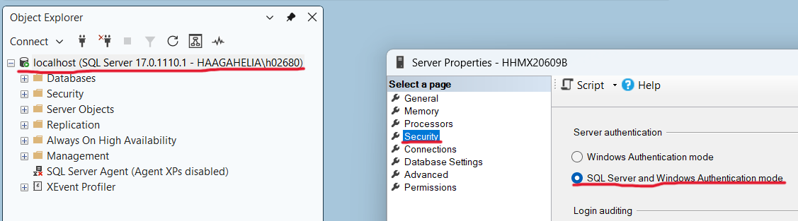

# SQL access control exercises

> [!IMPORTANT]
> Please submit this exercise as a `access_control_exercises_YOURFAMILYNAME.sql` file to Moodle.

The objective of this exercise is to familiarize yourself with the basics of SQL access control with database users, database roles and privileges. Use this week's lesson slides as materials.

## The task setup

In the tasks you will be granting privileges to another user to your database objects and observe how those privileges affect the database operations. So, the tasks requires you to use two users.

If you are using the _Haaga-Helia's SQL Server (non-Windows users)_, all you need to do to get started is to log in using the SQL Server Management Studio. Take a look at the [Using Haaga-Helia's SQL Server](../materials/sql-server/haaga-helia-sql-server.md) guide if you have trouble.

If you have installed the _SQL Server on your own computer_, do the following to get started:

1. Connect to the SQL Server on your own computer (like you have done in the exercise before) in SQL Server Management Studio.
2. In the "Object Explorer" panel on the left, right-click the connection starting with "localhost" (or your Windows username) and choose "Properties". In the dialog, click "Security" and in the security settings, tick "SQL Server and Windows Authentication mode" and click "Ok".
    
3. In the Windows app bar, type "Services" in the search bar and click the "Services" application. Scroll down to "SQL Server" service, right-click it, and click "Restart".
4. In the SQL Server Management Studio, open a new query window. Create a new SQL Server login name and username (e.g. `visitor`) in your database. Then, grant the `CONNECT` privilege to the new username. You can do these steps by executing the following statements:

   ```sql
   -- feel free to change login name or password
   CREATE LOGIN visitor WITH PASSWORD = 'SECRET_password_12345'
   CREATE USER visitor FROM LOGIN visitor
   GRANT CONNECT TO visitor
   ```

## Task 1

> [!TIP]
> This week's lesson slides have useful examples for SQL access control.

> [!IMPORTANT]
> In _Haaga-Helia's SQL Server_ (not on SQL Server your own computer), you should refer to the table as `schemaName.TableName`. The `schemaName` is the username of the user who created the table, for example `DM_USER_99.TableName`. So, in your queries include your username as the schema name, for example `SELECT * FROM DM_USER_99.Student`.

1. Create a new table as below (replace "XX" with a table name of your own choice).

    ```sql
    CREATE TABLE XX (
      id INTEGER NOT NULL,
      data VARCHAR(50) NOT NULL,
      CONSTRAINT PK_XX PRIMARY KEY(id)
    )
    ```

2. Insert a couple of rows into your table.
3. Next, let's login using other user without any priviledges. Open a new connection to your SQL Server instance by clicking "Connect" in the "Object Explorer" panel on the left and choosing "Database Engine". Choose the "Authentication" option as "SQL Server Authentication" and login with the following username and password:
  - In _Haaga-Helia's SQL Server_, the username is `DM_USER_50` and the password is the same as your user's password (check the password from Moodle home page's "SQL Server Usernames" link).
  - In _your own computer's SQL Server_, the username and password is the one you created previously (username `visitor` and password `SECRET_password_12345` by default).
4. Under the new connection (ends with the other user's username) in the "Object Explorer" panel, open a new query window in the database in which you created the table. You should now have two query windows: one for your user and one for the other user.
5. In _your user's query window_, give the `SELECT` privilege on your table to the other user (either the `visitor` user or `DM_USER_50` depending on your SQL Server setup).
6. In the _other user's query window_, try to select all rows from the table you created previously. If the other user fails to select the rows, revisit the previous step.
7. Revoke the `SELECT` privilege from the other user in _your user's query window_.
8. Finally, in the _other user's query window_, try to select all rows from your table. The select operation should not succeed anymore. If it does, revisit the previous step.

## Task 2

1. In _your user's query window_, create a new database role depending on your SQL Server setup:
  - In _Haaga-Helia's SQL Server_, create a role named `friends_of_XX` and replace `XX` with last two digits from your Haaga-Helia's SQL Server username.
  - In _your own computer's SQL Server_, create a role named `friends`
2. Give the `SELECT` and `INSERT` privileges on your table to the role you created. The table is the table that you created in the previous task.
3. Add the _other user_ as a member to the role you created.
4. In the _other user's query window_, try to select all rows from your table. If the other user fails to select the rows, revisit the previous step.
5. In the _other user's query window_, insert a couple of rows into your table.
6. In _your user's query window_, list all rows from your table. You should now see the rows that the other user inserted.
7. Revoke the `INSERT` privilege from the role you created in _your user's query window_.
8. Test the current privileges of the role by doing the following in the _other user's query window_:
  - Select all rows from your table.
  - Insert a new row into your table.
9.  Remove all members from the role in _your user's query window_.
10. Delete the role in _your user's query window_.

> [!IMPORTANT]
> To submit a single file in Moodle, copy the contents of the other user's query window to your user's query window and save it as a `.sql` file.
