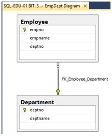

# SQL Intro Assignment

> [!IMPORTANT]
> Before starting with the tasks, read through the [Using SQL Server Management Studio](../materials/sql-server/sql-server-management-studio.md) guide.

> [!IMPORTANT]
> Please submit all your `.sql` files to Moodle.

In this exercise, always **execute the given SQL statements one by one**. Copy and paste a statement to the query window in SQL Server Management Studio, **highlight the statement**, execute it by cliking the "Execute" button, and finally take a look at the query result. Then, move on to the next statement.

## Task 1: Introduction

> [!IMPORTANT]
> Save your work on task 1 to a file named `sql_intro_1_YOURSURNAME.sql`. See the [Using SQL Server Management Studio](../materials/sql-server/sql-server-management-studio.md) guide to learn how to save your queries.

Open a new query window in SQL Server Management Studio in which you'll put these statements. Create tables `Department` and `Employee` by executing the following two `CREATE TABLE` statements:

```sql
-- Task 1 
CREATE TABLE Department ( 
    deptno INTEGER NOT NULL, 
    deptname VARCHAR(50) NOT NULL, 
    CONSTRAINT PK_Department PRIMARY KEY(deptno) 
) 
 
CREATE TABLE Employee ( 
    empno INTEGER NOT NULL, 
    empname VARCHAR(50) NOT NULL, 
    deptno INTEGER NOT NULL, 
    CONSTRAINT PK_Employee PRIMARY KEY(empno), 
    CONSTRAINT FK_Employee_Department FOREIGN KEY(deptno) REFERENCES Department(deptno) 
)
```

Insert some data into these tables by executing the following `INSERT` statements:

```sql
INSERT INTO Department(deptno, deptname) VALUES (10, 'Sales')
```

```sql
INSERT INTO Department(deptno, deptname) VALUES (20, 'Marketing')
```

```sql
INSERT INTO Employee(empno, empname, deptno) VALUES (1, 'John',  10), (2, 'Susan', 20), (3, 'Mary',  10)
```

Execute the following `SELECT` statements **one by one** to see some of the data that is saved in the database:

```sql
SELECT deptno, deptname FROM Department
```

```sql
SELECT deptname FROM Department WHERE deptno = 10
```

```sql
SELECT deptname FROM Department ORDER BY deptname
```

```sql
SELECT empname, deptname FROM Employee JOIN Department ON (Department.deptno = Employee.deptno) ORDER BY empname
```

Execute the following `SELECT` statements one by one to see some of the metadata that the DBMS has saved in the database:

```sql
SELECT * FROM INFORMATION_SCHEMA.TABLES
```

```sql
SELECT TABLE_NAME, COLUMN_NAME, DATA_TYPE, CHARACTER_MAXIMUM_LENGTH FROM INFORMATION_SCHEMA.COLUMNS
```

```sql
SELECT TABLE_NAME, CONSTRAINT_NAME, COLUMN_NAME FROM INFORMATION_SCHEMA.CONSTRAINT_COLUMN_USAGE ORDER BY TABLE_NAME
```

## Task 2: Creating a database diagram

> [!IMPORTANT]
> Nothing is required to be submitted on this task.

1. In the "Object Explorer" panel in SQL Server Management Studio, double-click on "databases" folder and under it, dobule-click the "BIT_SWD03" database. Under the database, right-click the "Database Diagrams" folder and click "New Database Diagram".
2. In the dialog, select the tables that you want to add to the diagram and click "Add". 
3. Right-click on the canvas and select "Show Relationship Labels" and right-click on the canvas and select "Arrange Tables". When you save the diagram SSMS asks you to enter a name for the diagram. Save the diagram as "Employee_Department_diagram".

Finally, the database diagram should look like the one below. Congratulations! You have created your first database tables and a database diagram that documents the structure. 



## Task 3: SQL Queries

> [!IMPORTANT]
> Save your work on task 1 to a file named `sql_intro_3_YOURSURNAME.sql`.

> [!TIP]
> See task 1 for examples.

1. Write and execute an `INSERT` statement that inserts a new department into the database. The department number is 30 and department name is 'Management'.
2. Write and execute an `INSERT` statement that inserts a new employee into the database. The employee number is 4 and employee name is 'Athena'. She works for the Management department.
3. Write and execute a `SELECT` statement that lists names of all employees . Do not display anything else but employee name.
4. Write and execute a `SELECT` statement that displays the name of the employee whose employee number is 2.
5. Write and execute a `SELECT` statement that lists names of those employees who work for department 10. Display employee name and department number.

## Task 4: Creating tables

> [!IMPORTANT]
> Save your work on task 1 to a file named `sql_intro_4_YOURSURNAME.sql`.

> [!TIP]
> See task 1 for examples.

Suppose the following relations:

> [!NOTE]
> Primary keys are underlined.

```
Cyclist (<u>cyclistNumber</u>, familyName, givenName, teamNumber)
Team (<u>teamNumber</u>, teamName)
```

1. Create `Cyclist` and `Team` tables. Determine column data types yourself. Create the required primary key and foreign key constraints. NB! There will be exactly one foreign key constraint.
2. Create a new database diagram "Team_Cyclist_diagram" that shows the `Cyclist` table, `Team` table and the relationship between these two tables.
3. Write and execute `INSERT` statements that populate the `Cyclist` table with at least 3 rows and `Team` table at least with 2 rows. You can create the data (cyclist names etc.) yourself.
4. Test that the primary key and foreign key constraints work as required. That is, try to insert some rows that the DBMS should not accept.
5. Write and execute a `SELECT` statement that lists all teams in alphabetical order. Display team name only.
6. Write and execute a `SELECT` statement that lists all cyclists. Display family name and given name only.
7. Write and execute a `SELECT` statement that lists all cyclists with team names. Display family name, given name, and team name for each cyclist.