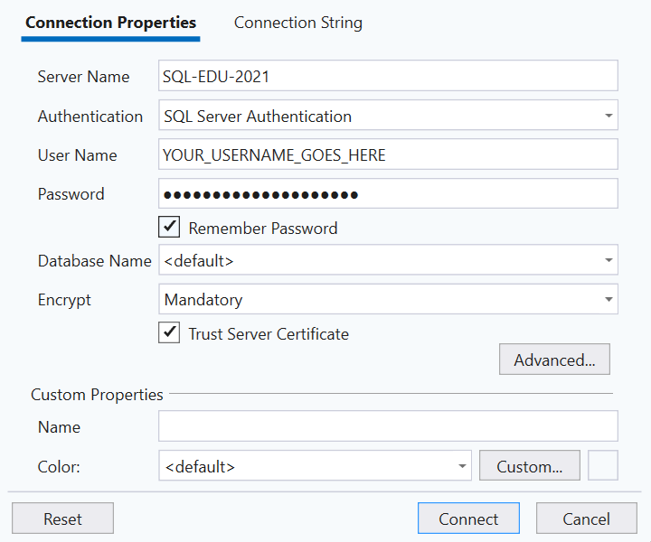

# Using Haaga-Helia's SQL Server

> [!IMPORTANT]  
> If you are using Haaga-Helia's SQL Server, _you don't need to install anything_ (no SQL Server or SQL Server Management Studio).

Using Haaga-Helia's SQL Server with SQL Server Management Studio requires using remote access. First, follow the instructions in the [Remote access using VDI](https://www.haaga-helia.fi/en/study/remote-access) guide to establish remote access using the Citrix Workspace App.

## Connecting the SQL Server with SQL Server Management Studio

Once you have established the remote connection using the Citrix Workspace App, open the SQL Server Management Studio application. You can find it using the Windows search bar. Once the application is open, a "Connect" dialog should pop up. If not, click "Connect" in the "Object Explorer" panel on the left and choose "Database Engine".

In Moodle's "General" tab, you'll find a "SQL Server usernames" link with the properties you need to use. Once you have typed in the correct connection properties, click the "Connect" button.

If there's no error dialog, you have successfully connected to Haaga-Helia's SQL Server. 🎉
