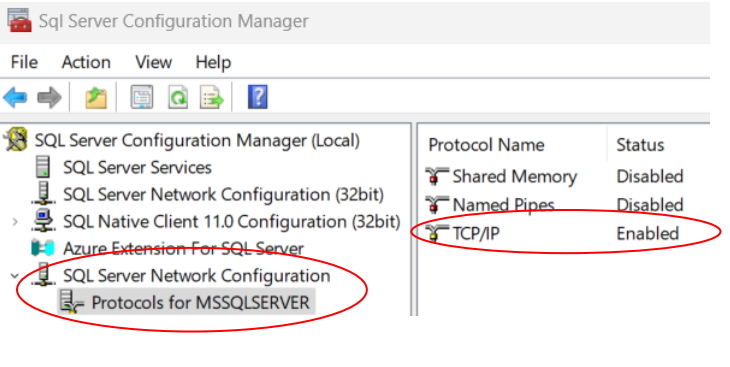
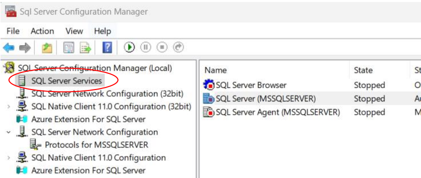
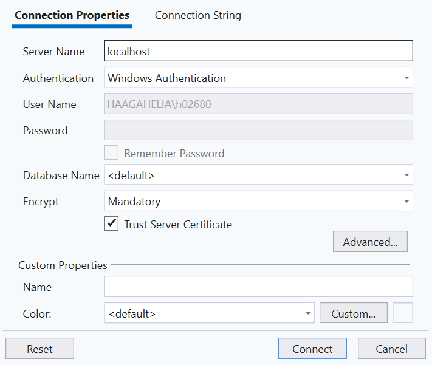
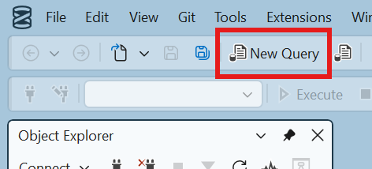

# SQL Server Installation

First, [Download the SQL Server Standard Developer edition](https://www.microsoft.com/en-us/sql-server/sql-server-downloads). It is the _SQL Server Database Management System_. In the installer, _choose the "Basic" installation type_ and go through the installation steps.

Then, [Download SQL Server Management Studio](https://learn.microsoft.com/en-us/ssms/install/install). It is the _graphical user interface for interacting with the SQL Server_, used for e.g. executing database queries.

After both installations are ready, open the _SQL Server Configuration Manager_ application to check and set SQL Server Network Configuration. You can find the application using the Windows search bar. _If TCP/IP is not enabled, then right-click on TCP/IP and choose "Enable"_.



If SQL Server is in the _"Stopped" state_, then Right-Click on SQL Server (MSSQLSERVER) and choose "Start".



Also, start SQL Server Agent if it is not running yet. Now the required services should be in the "Running" state.

## Connecting SQL Server with SQL Server Management Studio

Next, open the SQL Server Management Studio. You can find it using the Windows search bar. Once the application is open, a "Connect" dialog should pop up. If not, click "Connect" in the "Object Explorer" panel on the left and choose "Database Engine".

In the connection dialog, type in the following properties:

- Server name: localhost
- Authentication: Windows Authentication
- Trust Server Certificate: tick the checkbox

Then, click the "Connect" button.



If there's no error dialog, you have successfully connected to your SQL Server. 🎉

## Creating a database

Once connected to the SQL Server in the SQL Server Management Studio, click the "New Query" button to open a new query window.



In the query window, type in the following query (both lines):

```sql
CREATE DATABASE BIT_SWD03
ALTER DATABASE BIT_SWD03 COLLATE Finnish_Swedish_CI_A
```

Then, click the "Execute" button below the "New Query" button. This will create a database named "BIT_SWD03".

In the "Object Explorer" panel on the left, right-click the "Databases" folder and click "Refresh". Then, open the "Databases" folder by clicking the "+" button next to it. You should see the "BIT_SWD03" in the list of databases.
