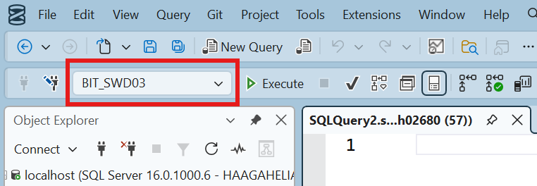
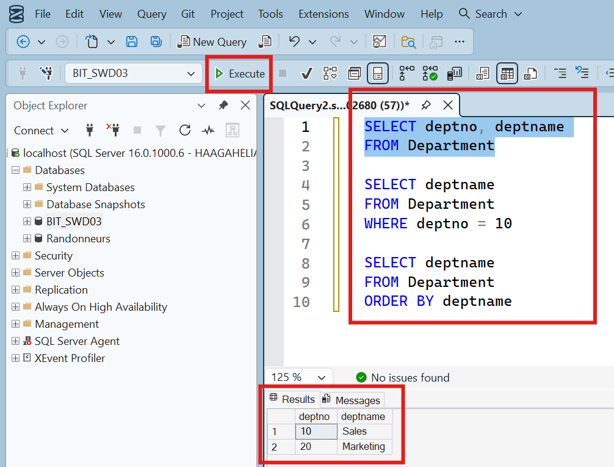
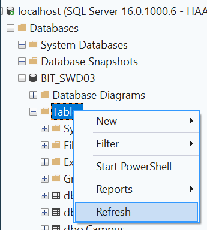
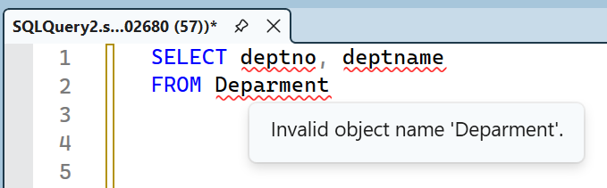

# Using SQL Server Management Studio

> [!IMPORTANT]  
> Make sure that you have either [installed SQL Server](./sql-server-installation.md) (Windows users) or know how to use the [Haaga-Helia's SQL Server](haaga-helia-sql-server.md) (other operating system users, e.g., macOS) before reading this guide.

SQL Server Management Studio is the graphical user interface for interacting with the SQL Server Database Management System. This guide provides instructions on the basic usage of the SQL Server Management Studio.

## Connecting SQL Server with SQL Server Management Studio

Read the following guides depending on which SQL Server instance you use:

- If you have _installed SQL Server on your own computer_, [follow this guide](./sql-server-installation.md#connecting-sql-server-with-sql-server-management-studio).
- If you are using _Haaga-Helia's SQL Server_, [follow this guide](haaga-helia-sql-server.md#connecting-sql-server-with-sql-server-management-studio).

## Executing database queries

Once connected, you can open a new query window by clicking the "New Query" button or right-clicking the "BIT_SWD03" database in the "Object Explorer" panel and clicking "New Query".

> [!CAUTION]
> It is very important that the target database is selected as "BIT_SWD03" before executing the query, as in the screenshot below.
>
> 
>
> If not, choose the "BIT_SWD03" database from the dropdown menu.

We can execute database queries in the following way:

1. Type in the database query in the query window.
2. Click the "Execute" button to execute the database query. If we highlight a part in our query, only the highlighted statements are executed (like in the screenshot below). If nothing is highlighted, every statement in the query window will be executed.
3. In the results tab at the bottom of the query window, the query result will be displayed. This can, e.g., be a result table of the selected data, or an error message.

> [!IMPORTANT]
> When we create or drop a database table by executing an SQL statement, we have to refresh the "Tables" folder in the "Object Explorer" to see the changes (which are actually applied at the database level).
>
> 

## IntelliSense: smart code completion and syntax checking

IntelliSense provides smart code completion and syntax checking. It helps you to complete table and column names, etc. IntelliSense underlines syntax errors and potential semantic errors in red. This feature makes it easy to e.g. spot typing errors, like mistyping a table name.

> [!IMPORTANT]
> If there seems to be incorrect red underlining or if objects are missing from IntelliSense features such as completion lists, then you need refresh the cache by pressing the <kbd>CTRL</kbd> + <kbd>Shift</kbd> + <kbd>R</kbd> keyboard shortcut.

