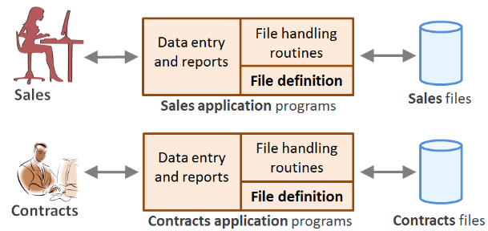
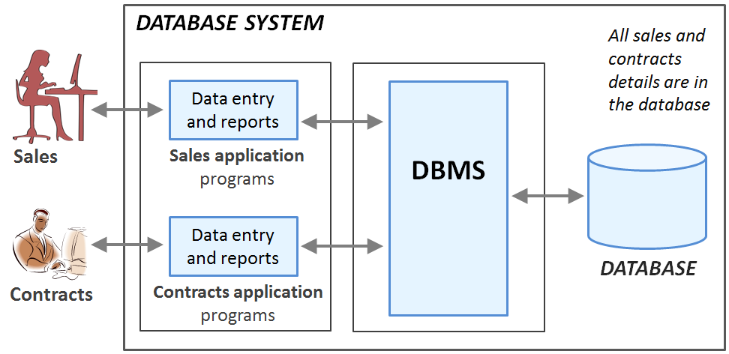

# Data Management and Databases

Welcome to the Data Management and Databases course!

---

# Introduction to databases

- The learning objectives for this week are:
  - Knowing what kind of topics are covered during the course
  - Knowing the course schedule and the purpose of the weekly teaching sessions
  - Knowing how the course is assessed
  - Knowing the objective of _data management_
  - Knowing the meaning of the term _database_ and _database management system_ (DBMS)
  - Knowing wat kind of functions a full-scale DBMS should provide
  - Knowing and advantages of the _database approach_ over the _file-based approach_ in data management

---

# About the course

- During the course, we will learn among other things:
  - The key concepts and terminology of data management and databases
  - Design and document the database's structure based on the requirements
  - Retrieve and manipulate the database's data with SQL
- Each week there are two different teaching sessions:
  - Lectures where we go through the theory of the weekly topics
  - Laboratory sessions where we apply what we've learned by working on exercises together
- The teaching session schedule can be found on the course's Moodle page
- There are weekly exercises that need to be submitted in Moodle before the next week's lecture

---

# Assesment

- ⚠️ To confirm the course participation the following need to be submitted before the second week's session:
  - The first part of your learning diary
  - The first week's assignments (orientation exercise and intro assignment)
- The course assesment is based on the combined points from two exams:
  - The first exam, half way through the course, will cover SQL operations
  - The second exam, at the end of the course, will cover rest of the course topics
- _At least 70% of the exercises must be submitted to pass the course_, otherwise submissions can only have a positive impact on the final grade
- More details about the exam schedule and practicalities can be found in Moodle

---

# Database

> _"A representation of facts or ideas in a formalized manner capable of being
> communicated or manipulated by some process"_
>
> ― Definition for the word "Data" in Oxford Languages

> _"A permanent structure for housing something"_
>
> ― Definition for the word "Base" in Oxford Languages

- In a digital world we are constantly accessing and manipulating stored information:
  - When we open our favorite messaging app, we can see the previously sent messages and we can send new messages
  - When we pay a bill and transfer money from one bank account to another
- These kinds of shared collections of logically related information are _databases_

---

# Definition of database

- There are many different formal defitions for the term "database" and the definition has evolved during the years
- Based on the definition of Connolly & Begg in year 2005, database is defined as:
  
> _"A database is a shared collection of logically related data (and a description of this data), designed to meet the information needs of an organization."_

---

# Definition of database

- "shared collection": database is accessible to specific applications, users, and organizations
- "logically related data": the different pieces of information has logical relations, e.g. messages in a messaging app are related to the sender and the receiver users
- "persistent data": data is in permanent storage and doesn't unexpectantly vanish
- "description of this data": on top of the actual data such as the user's name, the database contains _metadata_ like table and column names
- "information needs": the kind of information stored in the database is use-case specific
  - For example, a simple messaging app needs to store information about users and messages

---

# Data management

- _Data management_ is the development, maintenance and coordination of _database systems_
- A database system consists of five major components: _hardware_, _software_, _data_ (the database), _procedures_ and _users_
- Procedures refer to the policies, conventions, instructions, and rules that govern the design and use of the database

---

# The objective of data management

- The objective of data management is to design, implement, coordinate, and maintain database systems in such a way that all the required data is:
  - Valid and consistent
  - Up to date
  - Available in the required format
  - Available when needed
  - Fetrievable fast enough
  - Safe from different types of technical failures and accidents
  - Protected from unauthorized access and other types of misuse

---

# Data management example

- Let's consider the following information needs for a database:
  - A real estate company is renting properties
  - Each property has a property owner and a lease if the property is rented
  - Each lease has a client who is renting the property from the owner
  - The company has a sales team responsible for finding clients for the available properties and a contracts team responsible for managing the leases

---

# File-based approach in data management



- Data for sales and contracts teams is in _separate files_
- Each team uses a separate application that defines and manages data in application-specific files
- Each file has a specific format
- Applications that use these files depend on knowledge about that format

---

- In the filesystem, there are the following sales files:
  - PrivateOwner (ownerNo, fName, lName, address, telNo)
  - PropetyForRent (propertyNo, street, city, postcode, rooms, rent, ownerNo)
  - Client (clientNo, fName, lName, address, telNo, prefType, maxRent)
- And the following contracts files:
  - Lease (leaseNo, propertyNo, clientNo, paymentMethod, deposit, paid,
  - rentStart, rentFinish, duration)
  - PropetyForRent (propertyNo, street, city, postcode, rent)
  - Client (clientNo, fName, lName, address, telNo)

---

# Problems of file-based approach

- Data dependence
  - Code is tightly coupled with the file structure: if it is modified, all programs that use the file have to be changed accordingly
- Duplication of data
  - Storing the same information in multiple files (e.g. the Client files in both sales and contacts teams) will lead to inconsistency
- Difficulty in accessing data
  - New requirement needs a new program or changes in an existing program
- No provision for security and shared access to the data
  - No service for providing user access to some, but not all, data
- Lack of coordination and standardisation
  - No centralised control of enterprise data

---

# Database Management System (DBMS)


- Problems of the file-based approach can be avoided by delegating data related operations to a _separate software_
- _Database Management System_ (DBMS) is the software that:
  - Controls all access to the database
  - Allows users to define the database, usually through a _Data Definition Language_ (DDL)
  - Allows users to insert, update, delete, and retrieve data from the database, usually through a _Data Manipulation Language_ (DML)

---

# Data manipulation comparison

```python
# Fetching data from a DBMS:
connection = psycopg2.connect(
  # ...
)
cursor = connection.cursor()
cursor.execute("SELECT clientNo, fName, lName, address, telNo FROM Client")
clients = cursor.fetchall()

# Fetching data from a file:
file = open("clients.csv", "r")
clients = []
for line in file:
  columns = line.split(",")
  clients.append((columns[0], columns[1], columns[2], columns[3], columns[4]))
```

---

# Database approach in data management



- Data for both sales and contracts team is in the _same database_
- Each team uses a separate application that communicates with the same DBMS using a data manipulation language
- The DBMS retrieves and manipulates data in the database on behalf of the application

---

In the database, the structure of sales and contracts details is the following:

- _PrivateOwner_ (ownerNo, fName, lName, address, telNo)
- _PropetyForRent_ (propertyNo, street, city, postcode, rooms, rent, ownerNo)
- _Client_ (clientNo, fName, lName, address, telNo, prefType, maxRent)
- _Lease_ (leaseNo, propertyNo, clientNo, paymentMethod, deposit, paid, rentStart, rentFinish)

---

# Advantages of database approach

- Program-data independence
  - Improved data accessibility
- Effective access to data
  - Standard database language with both programmatic and interactive interfaces
- Data integrity
  - Integrity can be maintained with the support of user-defined integrity constraints
- Data security
  - Security restrictions can be applied on detailed level
- Coordination and standardisation
  - Centralised data administration

---

# Functions of a DBMS

- The most fundamental function of DBMS is _retrieving and manipulating data in the database_
- This function should be provided in such a way that the physical level storage structures are completely hidden from the user
  - This offers a great amount of flexibility: the storage structures can change without the need to touch the application's code
- Other important functions of a DBMS are:
  - Integrity Services
  - Transaction Support
  - Concurrency Control Services
  - Recovery Services
  - Authorization Services

---

# Database Management System (DBMS)

- Nowadays, the _relational database management system_ (RDBMS) is the de facto standard
- _SQL_ is the formal and de facto database language standard for RDBMSs
- SQL has both DDL and DML features
- There are multiple RDBMS products, such as _MySQL_ and _PostgreSQL_

---

# Summary

- _Database_ is a shared collection of logically related persistent data
- Database is designed to meet specific information needs
- _Data management_ is the development, maintenance and coordination of _database systems_
- _Database management system_ (DBMS) is a software that allows users to insert, update, delete, and retrieve data from the database
- The most fundamental function of DBMS is _retrieving and manipulating data in the database_
