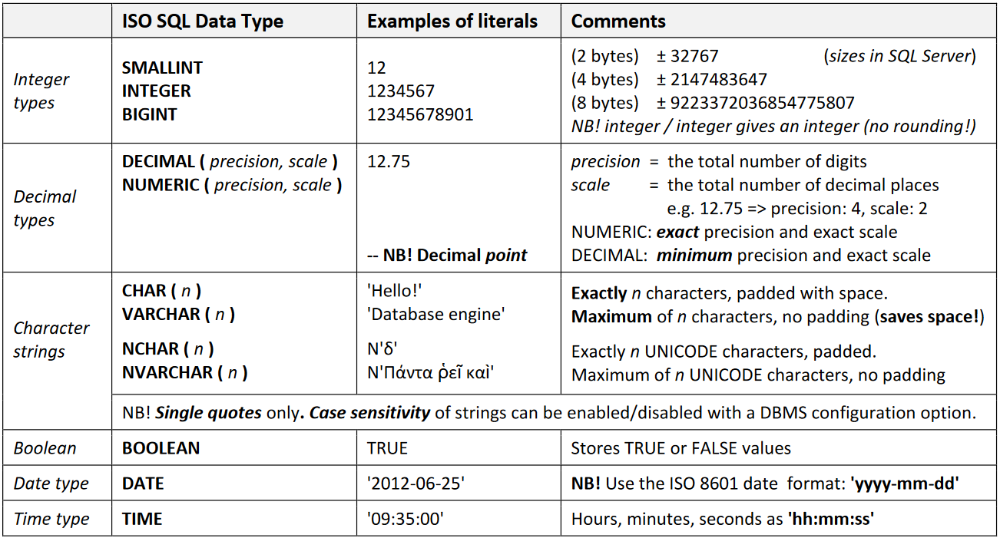

# Introduction to SQL

- The learning objectives for this week are:
  - Knowing how to use a graphical interface to perform database operations
  - Knowing how to to create database tables using SQL
  - Knowing how to to define primary and foreign key constraints using SQL
  - Knowing how to to insert data into a table
  - Knowing how to to write simple database queries using SQL

---

# SQL

- _SQL_ is the standard database language for relational databases. With SQL we can:
  - Create the database and table structures
  - Perform insertion, modification, and deletion of data from the tables
  - Perform database queries
- The query operates on tables and builds a result table from one or more tables in the database
- An SQL query is a single statement in which you describe what you want from the database

---

# SQL

- SQL is used with relational database management systems (RDMS), such as _Microsoft SQL Server_, which we will be using during the course
- RDMS software can be running on local computer on a server on the internet
- We can send database queries to a RDMS using e.g. programming interfaces, command line interfaces or graphical interfaces
- During the course we have the option to either install the SQL Server on our computer or use the SQL server running in Haaga-Helia's servers

---

# Communicating with a RDMS

Here's an example on performing a database query in Python programming language:

```python
import psycopg2

# Establish connection with the RDMS
connection = psycopg2.connect(
    # ...
)

cursor = connection.cursor()
# Execute the database query
cursor.execute("SELECT course_code, course_name, credits FROM Course")
courses = cursor.fetchall()
```

---

# Communicating with a RDMS

- During this course we will be using a graphical interface called _SQL Server Management Studio_ to communicate with the SQL Server
- With SQL Server Management Studio we can for example inspect and manage database related information, perform database queries and visualize the structure of the database tables

---

# SQL as a data definition language

---

# Create database

- Database is a named collection of tables
- In addition to tables, database holds different kinds of configuration, for example related to access control
- We can create a database with the `CREATE DATABASE` statement

```sql
CREATE DATABASE University
```

---

# Create table

- The actual data of a database lives inside _tables_
- Table has a name and a collection of _columns_
- We can create a table with the `CREATE TABLE` statement

```sql
CREATE TABLE Student (
    student_number INTEGER,
    first_name VARCHAR(50),
    surname VARCHAR(50)
)
```

---

# Create table

- Table and column names should describe the information they store
  - The "Student" table contains rows that represent students
  - The "first_name" column contains the family name of the student
- Table and column names should consist of letters, digits or underscores. They _should not contain whitespace_
- In column names, underscode is commonly used instead of whitespace. For example "first_name" instead of "first name"
- Table names are commonly in _singular format_, for example "Student"
- Each column has a _type_ that determines the kind of values the column can have
- For example an `INTEGER` type of column can only contain integer values

---

# Data types



---

# Example of a table creation

- Let's consider a table named "Country" that stores information about countries
- The table needs the following columns:
  - "country_code", the three characters long code that identifies the country. This is the table's primary key
  - "country_name", the name of the country
  - "population" the number of people living the country
- _What is the SQL statement that creates the "Country" table with the mentioned columns?_

---

# Constraints

- _Constraints_ specify rules for the data in a table
- For example `NOT NULL` constraint ensures that a column cannot have a `NULL` (empty) value
- The `NOT NULL` constraint is defined _after the column type_ in the `CREATE TABLE` statement

```sql
CREATE TABLE Student (
    student_number INTEGER NOT NULL,
    first_name VARCHAR(50) NOT NULL,
    surname VARCHAR(50) NOT NULL
)
```

---

# Primary key constraint

- _Primary key_ uniquely identifies each row in the table
- _Primary key constraint_ prevents duplicate rows to exist for the table
- Primary key constraint is defined with the `PRIMARY KEY` constraint _after the column definitions_ in the `CREATE TABLE` statement

```sql
CREATE TABLE Student (
    student_number INTEGER NOT NULL,
    first_name VARCHAR(50) NOT NULL,
    surname VARCHAR(50) NOT NULL,

    -- The primary key is the student_number column
    CONSTRAINT Pk_Student PRIMARY KEY (student_number)
)
```

---

# Foreign key constraint

- _Foreign key_ is a column or group columns whose values are required to match those of the primary key of the referenced table
- _Foreign key constraint_ prevents foreign key not being matched by a primary key in the referenced table
- Foreign key constraint is defined with the `FOREIGN KEY` constraint _after the column definitions_ in the `CREATE TABLE` statement

```sql
CREATE TABLE Laptop (
    serial_number VARCHAR(10) NOT NULL,
    student_number INTEGER NOT NULL,

    -- The primary key is the serial_number column
    CONSTRAINT Pk_Laptop PRIMARY KEY (serial_number),
    --- The foreign key student_number references the primary key student_number in the Student table
    CONSTRAINT Fk_Student FOREIGN KEY (student_number)
    REFERENCES Student(student_number)
)
```

---

# Drop table

- We can delete a table in the database with the `DROP TABLE` statement
- ⚠️ This operation will delete all rows in the table

```sql
DROP TABLE Laptop
```

---

# SQL as a data manipulation language

---

# Insert

- We insert a new row into a table by defining the table name and the values for the columns
- A new row can be inserted with the `INSERT INTO` statement
- ⚠️ String literals are defined with _single quotes_, for example `'Kalle'`

```sql
INSERT INTO Student (student_number, first_name, surname) VALUES (1, 'Kalle', 'Ilves')
```

---

# Insert

- Constraits are checked once a new row if inserted
- For example if `NOT NULL` constraint of a column is violated, there will be an error

```sql
-- ❌ surname columns has a NOT NULL constraint, omitting it will cause an error
INSERT INTO Student (student_number, first_name) VALUES (1, 'Kalle')
```

---

# Select

- The `SELECT` statement is used to select rows from a table
- With the `SELECT` statement we define a group of columns we want to select the data from and the name of the target table
- The result is a result table containing the rows from the target table with the specified columns

```sql
SELECT first_name, surname FROM Student
```

---

# Where

- We can filter the selected rows of a table with a `WHERE` clause
- With the `WHERE` clause we define a condition which the selected rows should satisfy
- The result table only contains the rows that satisfy the condition

```sql
SELECT first_name, surname FROM Student WHERE first_name = 'Matti'
```

---

# Comparison operators

- The `WHERE` clause conditions support similar _comparison operators_ as many programming languages

```sql
WHERE first_name = 'Matti' -- equal to. ⚠️ Note, just a single = symbol
WHERE first_name <> 'Matti' -- not equal to
WHERE age > 18 -- greater than
WHERE age >= 30 -- greater than or equal
WHERE age < 18 -- less than
WHERE age <= 30 -- less than or equal
```

---

# Logical operators

- Comparisons can be combined with _logical operators_ to achieve conditions such as "age is greater than 18 _and_ age is less than 30"

```sql
WHERE age > 18 AND age < 30  -- AND operator
WHERE first_name = 'Matti' OR first_name = 'Kaarina' -- OR operator
WHERE NOT age < 18 -- NOT operator
```

---

# Logical operators

- We can use brackets to determine in which order the logical operators should be applied

```sql
WHERE (skill = 1 OR skill = 2) AND salary > 10000
```

---

# Order by

- The order of result table's row is unpredictable, it might not bee the same each time we execute the query
- We can use the `ORDER BY` clause to define in which order we want the rows to be in the result table
- The sorting is done based on columns

```sql
SELECT course_name, credits
FROM Course
ORDER BY credits -- rows will be sorted by the credits column's value
```

---

# Order by

- Table might contain multiple rows with the same value in the column used in the `ORDER BY` clause
- To determine the order of such rows we can provide multiple columns to the `ORDER BY` clause

```sql
SELECT course_name, credits
FROM Course
-- when the credits is the same, the course_name is used to determine the order
ORDER BY credits, course_name
```

---

# Order by

- The `ORDER BY` sorts the records in _ascending order_ (smallest value first) by default
- We can change the order by using either `ASC` (ascending order) or `DESC` (descending order) keyword

```sql
SELECT course_name, credits
FROM Course
-- use descending order for credits and ascending order for course_name
ORDER BY credits DESC, course_name ASC
```

---

# Summary

- We can create database tables using the `CREATE TABLE` statement
- `PRIMARY KEY` constraint is used to define the table's primary key
- `FOREIGN KEY` constraint is used to define a foreign key referencing primary key column of another table
- `INSERT INTO` statement is used to insert a new row for the table
- `SELECT` statement is used to select rows from a table
- `WHERE` clause can be used to filter the rows of a table
- We can use comparison and logical operators to define a condition for the `WHERE` clause, for example `WHERE first_name = 'Kalle' OR first_name = 'Elina'`
- We can use `ORDER BY` clause to determine the order of rows in the result table
