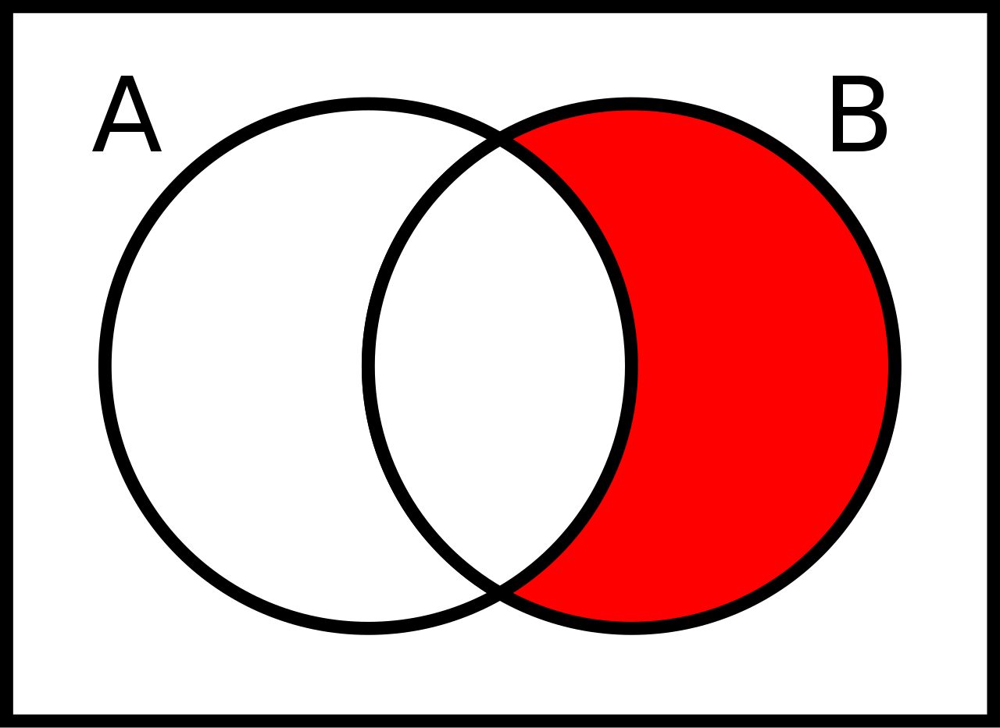

# Aggregate functions and set operators

- The learning objectives for this week are:
  - Knowing what kind of query problems can _aggregate functions_ solve
  - Knowing how to use the aggregate functions `COUNT`, `SUM`, `AVG`, `MIN` and `MAX`
  - Knowing what kind of query problems can _set operators_ solve
  - Knowing how to combine result tables with `UNION`, `EXCEPT` and `INTERSECT` set operators

---

# Aggregate functions

- Performing some calculation for multiple rows so that the end result is a _single value_ is a common query problem
- Example of such query is calculating the count of rows in a certain table
- For example, how can we calculate the number of courses in the `Course` table?
- Functions that perform such operations are referred to as _aggregate functions_

---

# The COUNT aggregate function

- The `COUNT` aggregate function returns the _total number of rows_ that match the specified criteria:

```sql
-- what's the number of courses in the Course table?
SELECT COUNT(*) as number_of_courses FROM Course
```

- The result table contains a single row:

| number_of_courses |
| ----------------- |
| 7                 |

---

# The COUNT aggregate function

- We can also filter the rows the aggregate function operates on using the `WHERE` clause:

```sql
-- what's the number of courses with more than 3 credits?
SELECT COUNT(*) as number_of_courses FROM Course
WHERE credits > 3
```

- The result table contains a single row:

| number_of_courses |
| ----------------- |
| 2                 |

---

# The COUNT aggregate function

- We can also provide a column name for the `COUNT` aggregate function in which case the function returns the number of the _non-null values_ of the given column:

```sql
-- what's the number of students with an email address?
SELECT COUNT(email) as number_of_students_with_email
FROM Student
```

---

# The SUM aggregate function

- The `SUM` aggregate function returns the _sum of all the values_ of a column:

```sql
-- what's the sum of salaries of female teachers?
SELECT SUM(salary) as sum_of_salaries FROM Teacher
WHERE gender = 'F'
```

- The result table contains a single row:

| sum_of_salaries |
| --------------- |
| 102273.00       |

---

# The AVG aggregate function

- The `AVG` aggregate function returns the _average value_ of a column:

```sql
-- what's the average grade from course with code "a730"?
SELECT AVG(grade) as average_grade FROM CourseGrade
WHERE course_code = 'a730'
```

- The result table contains a single row:

| average_grade |
| ------------- |
| 3             |

---

# The AVG aggregate function

- Calculating the average includes a division operation, which can produce decimal numbers
- To avoid losing the decimal part of the average, we need to cast integer column values to a `DECIMAL` type:

```sql
-- multiplying an integer with 1.0 will end up with a DECIMAL type
SELECT AVG(grade * 1.0) as average_grade FROM CourseGrade
WHERE course_code = 'a730'
```

| average_grade |
| ------------- |
| 3.333333      |

---

# The AVG aggregate function

- We can limit the number of decimal places in the result by using casting the result to a `DECIMAL` type with specific precision and scale:

```sql
-- use scale of 2 in the DECIMAL type to round to two decimals places
SELECT CAST(AVG(grade * 1.0) AS DECIMAL(9, 2)) as average_grade
FROM CourseGrade
WHERE course_code = 'a730'
```

| average_grade |
| ------------- |
| 3.33          |

---

# The MIN aggregate function

- The `MIN` function returns the _smallest value_ of a column

```sql
-- what's the lowest grade from course with code "a730"?
SELECT MIN(grade) as lowest_grade FROM CourseGrade
WHERE course_code = 'a730'
```

- The result table contains a single row:

| lowest_grade |
| ------------ |
| 1            |

---

# The MAX aggregate function

- The `MAX` function returns the _largest value_ of a column

```sql
-- what's the highest grade from course with code "a730"?
SELECT MAX(grade) as highest_grade FROM CourseGrade
WHERE course_code = 'a730'
```

- The result table contains a single row:

| highest_grade |
| ------------- |
| 5             |

---

# Multiple aggregate functions in a single query

- We can have multiple aggregate functions in the same query:

```sql
-- what's the highest and lowest grade from course with code "a730"?
SELECT MAX(grade) as highest_grade, MIN(grade) as lowest_grade FROM CourseGrade
WHERE course_code = 'a730'
```

- The result table contains a single row with two columns:

| highest_grade | lowest_grade |
| ------------- | ------------ |
| 5             | 1            |

---

# Combining results tables with set operators


- We can use the results from _multiple result tables_ using the `UNION`, `EXCEPT`, and `INTERSECT` _set operators_
- For example, the `UNION` operator returns _all_ the rows from two or more result tables _without duplicate values_:

```sql
-- What are all the surnames among teachers and students?
SELECT surname FROM Teacher
UNION
SELECT surname FROM Student
```

---

# The UNION operator

<div style="display: flex; justify-content: space-around">
  <div>

```sql
SELECT surname FROM Teacher
```

| surname  |
| -------- |
| Huhta    |
| Hellerus |

  </div>
  <div>

```sql
SELECT surname FROM Student
```

| surname |
| ------- |
| Kokki   |
| Kuikka  |

  </div>

  <div>

```sql
SELECT surname FROM Teacher
UNION
SELECT surname FROM Student
```

| surname  |
| -------- |
| Huhta    |
| Hellerus |
| Kokki    |
| Kuikka   |

  </div>
</div>

---

# The EXCEPT operator



- The `EXCEPT` operator returns only the rows from the first result table that are _not included_ in the second result table _without duplicate values_:

```sql
-- What are the campus cities that no student lives in?
SELECT city FROM Campus
EXCEPT
SELECT city FROM Student
```

---

# The EXCEPT operator

<div style="display: flex; justify-content: space-around">
  <div>

```sql
SELECT city FROM Campus
```

| city     |
| -------- |
| Helsinki |
| Vantaa   |

  </div>
  <div>

```sql
SELECT city FROM Student
```

| city     |
| -------- |
| Helsinki |
| Espoo    |

  </div>

  <div>

```sql
SELECT city FROM Campus
EXCEPT
SELECT city FROM Student
```

| city   |
| ------ |
| Vantaa |

  </div>
</div>

---

# The INTERSECT operator


- The `INTERSECT` operator returns only the rows that _exist in both_ result tables _without duplicate values_:

```sql
-- What are the campus cities that have students living in them?
SELECT city FROM Campus
INTERSECT
SELECT city FROM Student
```

---

# The EXCEPT operator

<div style="display: flex; justify-content: space-around">
  <div>

```sql
SELECT city FROM Campus
```

| city     |
| -------- |
| Helsinki |
| Vantaa   |

  </div>
  <div>

```sql
SELECT city FROM Student
```

| city     |
| -------- |
| Helsinki |
| Espoo    |

  </div>

  <div>

```sql
SELECT city FROM Campus
INTERSECT
SELECT city FROM Student
```

| city     |
| -------- |
| Helsinki |

  </div>
</div>

---

# The set operators

- ⚠️ With set operators, the column names and data types of each `SELECT` statement _must match_:

```sql
-- ❌ first_name column is missing from the latter SELECT statement.
-- This will lead into an error.
SELECT surname, first_name FROM Teacher
UNION
SELECT surname FROM Student
```

---

# Summary

- We can perform calculations on multiple rows so that the end result is a single row using _aggregate functions_
- The `COUNT` aggregate function returns the _total number of rows_
- The `SUM` aggregate function returns the _sum of all the values_ of a column
- The `AVG` aggregate function returns the _average of values_ of a column
- The `MIN` aggregate function returns the _minimum value_ of a column
- The `MAX` aggregate function returns the _maximum value_ of a column
- The `UNION`, `EXCEPT` and `INTERSECT` _set operators_ can be used to combine results of multiple result tables
