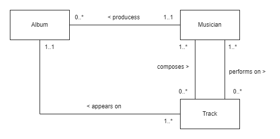

# Logical database design

- The learning objectives for this week are:
  - Knowing what is the objective _logical database design_
  - Knowing how to _derive relations_ from simple ER diagrams
  - Knowing how to determine _natural primary keys_ and _foreign keys_

---

# Logical database design

- The typical main phases in a database design process are:
  1. Conceptual database design
  2. Logical database design
  3. Physical database design
- Each phase from top to bottom adds more detail to the design
- We have familiarized ourselves with the _concetual database design_ by defining entity types and their relationship based on the requirements
- The _logical database design_ is the process of refining and translating the conceptual schema into a logical database schema based on a specific data model, e.g. the relational model

---

# Logical database design

- Entity types, attributes, and relationship types can be directly transformed into relations with some simple rules
- Typically, the logical database design process includes the following
  types of activities:
  1. Deriving relations for the logical data model
  2. Validating relations using normalisation
  3. Validating relations against user transaction
  4. Double-checking integrity constraints
  5. Reviewing logical data model with user

---

# Deriving relations for the logical data model

- The process starts by _deriving relations for the logical data model_, which includes:
  1. Creating the relations
  2. Refining the attributes
  3. Determing primary and foreign keys
  4. Determing other types of integrity constraints

---

# Creating relations

- We create the relations in the following manner:
  - For _each entity type_, create a relation that includes all simple attributes of the entity
  - For _M:N (many-to-many) relationship types_, create a _"bridge relation"_ to represent the relationship
  - For _multi-valued attributes_, create a new relation to represent the multi-valued attribute. For example, a person may have several phone numbers, but multi-valued attributes are not allow in relations

---

# Example of creating relations

- Let's consider creating relations for the following conceptual model:

---

# Example of creating relations

- In the example there's two many-to-many relationships:
  - A musician performs on multiple tracks and tracks have multiple performers
  - A musician composes multiple tracks and tracks are composed by multiple musicians
- In this case we create two bridge relations: _Track_Performer_ and _Track_Composer_
- The are no multi-valued attributes, which leaves with the following relations: _Album_, _Musician_, _Track_, _Track_Performer_, and _Track_Composer_

---

# Refining the attributes

- Once we have created the relations we need to refine the attributes in the following manner:
  - Divide a non-atomic attribute into smaller (atomic) attributes. For example person's address can be divided into, city, postal code and street address
  - Refine attribute domains: data types and lengths, requiredness,
    validation rules etc.
  - Define which attributes can have NULL values. Allow NULL in an attribute only based on _strong arguments_

---

# Determing primary keys

- There should be _exactly one primary key in each relation_
- The primary key can be either a _simple key_ (single column) or a _composite key_ (several columns)
- By definition, the primary key should always satisfy the properties of _requiredness_, _uniqueness_ and _minimality_
- The primary key _should remain stable_. That is, primary key values should not need to be updated later
- The primary key should be _reasonably short_
- The primary key should have _no privacy issues_. For example social security number has privacy issues

---

# Determing primary key for a weak entity type

- A _weak entity type_ is an entity type that is dependent on the existence of another entity type
- For example _CourseGrade_ is existence-dependent on _Student_ and _CourseOffering_
- When a relation derived from a weak entity type, the natural primary key is partially or fully derived from the weak entity type's owner entity type
- For example, the natural primary key of the _CourseGrade_ relation is a composite key that _includes columns from two foreign keys_, one referencing _Student_ and other referencing _CourseOffering_
- The primary key of the weak entity's relation cannot be made until after the foreign keys have been determined for the relation

---

# Surrogate keys

- If there is initially no suitable candidate key for a relation, then we cannot determine a natural primary key
- We have to take care of the situation by including an extra attribute in the relation to act as the primary key
- This kind of primary key is a _surrogate key_
- Surrogate keys are commonly generated values, such as incrementing or random numbers

---

# Alternate keys

- Candidate keys that are not selected to be primary the key are called _alternate keys_
- We should consider the use of the _unique constraint_ on alternate keys to make sure that their values remain unique:

  <pre>
  Student (<u>studentnumber</u>, ssn, familyname, givenname)
    UNIQUE (ssn)
  </pre>

- Especially, when we are using a surrogate primary key, a unique constraint on at least one natural alternate key improves data quality

---

# Determing foreign keys

- In a relational database, _relationships_ are represented by the _primary key/foreign key mechanism_
- Before deciding where to place the foreign key we have to identify the _parent entity type_ and the _child entity type_ involved in the relationship

---

# Determing foreign keys

- For example, in the ER diagram above _Company_ is the _parent_ entity type and _Department_ is the _child_ entity type
- When we translate this diagram to relation schemas we must do the following:
  - We create the two relations: _Company_ and _Department_
  - We determine primary keys for both relations
  - We represent the relationship by placing a copy of the parent relation's (Company) primary key into the child relation (Department), to act as the foreign key

---

# Determing foreign keys

- The result could be for example the following relation schema:

  <pre>
  Company (<u>company_id</u>, name)
  
  Department (<u>department_id</u>, company_id, name)
    FK (company_id), REFERENCES Company(company_id)
  </pre>

---

# Determing foreign keys

- To know in which relation to place the foreign key we need to _identify the relationship type_
- Most often the structure falls in one of these categories:
  - N:1 (many-to-one) binary relationship
    
  - M:N (many-to-many) binary relationship
    
  - 1:1 (one-to-one) binary relationship
    

---

# N:1 (many-to-one) binary relationship

- Place a copy of the parent relation's ("..1" side) primary key into the child relation ("..\*" side), to act as a foreign key
- If the child relation is derived from a weak entity type, then the primary key of the child relation is typically a composite key
- In the example above, we would get the following relation schema:

  <pre>
  Company (<u>company_id</u>, name)
  
  Division (<u>division_id</u>, company_id, name)
    FK (company_id), REFERENCES Company(company_id)
  </pre>

---

# M:N (many-to-many) binary relationship

- Create a bridge relation to represent the relationship
- Place a copy of the primary key from each of the parent relations into the bridge relation to act as foreign keys
- Typically, the bridge relation's primary key is a composite key that includes the both foreign keys
- In the example above, we would get the following relation schema:

  <pre>
  Athlete (<u>athlete_id</u>, first_name, family_name)
  Race (<u>race_id</u>, name, date)
  Race_Participation(<u>athlete_id</u>, <u>race_id</u>)
    FK (athlete_id), REFERENCES Athlete(athlete_id),
    FK (race_id), REFERENCES Race(race_id)
  </pre>

---

# 1:1 (one-to-one) binary relationship

- In case of _mandatory participation ("1..1") on one side only_, place a copy of the primary key from the relation on the "1..1" side into the relation on the "0..1" side to act as the foreign key
- In case of _mandatory participation on both sides_ we can usually _combine the two relations_ into one relation
- In case _optional participation ("0..1") on both sides_ the foreign key can be placed in either relation
- In the example above, we would get the following relation schema:

  <pre>
  Athlete (<u>athlete_id</u>, first_name, family_name)
  Team (<u>team_id</u>, athlete_id, name)
    FK (athlete_id), REFERENCES Athlete(athlete_id)
  </pre>

---

# Multi-value attributes

- A relation can't have attributes with _multiple values_, such as the _email_ attribute of the _Employee_ entity type above
- In such case, we must create a _new relation_ to represent the multi-valued attribute
- We move the attribute from the original relation and place it to the new relation
- We Place a copy of the parent relation's primary key into the child relation, to act as the foreign key

---

# Multi-value attributes

- In the example above, we would get the following relation schema:

  <pre>
  Employee (<u>empno</u>, first_name, family_name)
  Email (<u>email</u>, empno)
    FK (empno), REFERENCES Employee(empno)
  </pre>

---

# Summary

- The objective of logical database design is to translate the conceptual schema into a logical database schema based on a specific data model
- When we derive relations from entity types, we create a relation for each entity type
- Many-to-many relationship requires an additional bridge relation
- There should be exactly one primary key in each relation
- The foreign key placement depends on the relationship type (many-to-one, many-to-many or one-to-one)