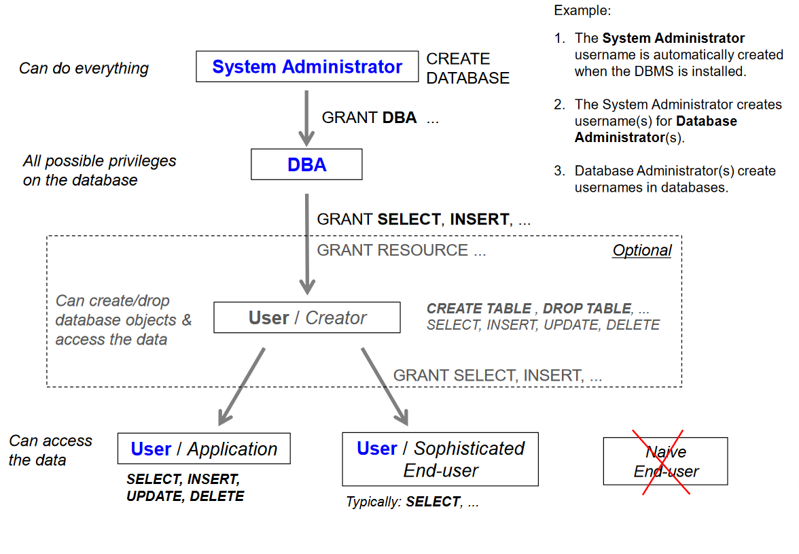

# SQL access control

- The learning objectives for this week are:
  - Knowing what is _discretionary access control_
  - Knowing what is the DBMS access control hierarchy
  - Knowing how to manage users, roles and privileges in the SQL server

---

## Database security

- Database security is accomplished by _verifying the identity of the database users_ (authentication) and _controlling what these users are permitted to do_ (authorization)
- User authentication is accomplished with either _SQL authentication_ (using a username and password registered to the DBMS) or _operating system authentication_ (the DBMS trusts the authentication service of the operating system)
- The typical user authorisation mechanism is called _discretionary access control_ (DAC)

---

## Discretionary access control (DAC)

- In _discretionary access control_ each user is given appropriate access rights (or privileges) on specific database objects (for example tables)
- Users can obtain certain privileges when they create an object (for example a table) and _they can pass some or all of these privileges to other users_ at their discretion
- The ISO SQL Standard leaves many access control details to be _implementation-dependent_
- Different DBMS share many similarities in the access control implementation, but the detailed syntax for specifying access control is _DBMS-specific_
- In the upcoming examples we will learn how to specify access control in the SQL server

---

## DBMS access control hierarchy

- Privileges are granted to an user by another user in a higher _access control hierarchy level_
- At the top of the hierarchy there's is the _system administrator_ user who has access to _everything_
- The system administrator's username is automatically created when the DBMS is installed
- The system administrator creates databases and usernames for _database administrators_
- Database administrators have all possible privileges on the database they are granted access to

---

## DBMS access control hierarchy



- Database administrators create usernames in databases and grant them different privileges
- For example certain users can be granted privileges to create database tables and grant privileges to other users for the created tables
- In contrast, certain users can be granted privileges to only retrieve data from the database (`SELECT`)

---

## Users, database roles, and privileges

- _Database users_ can be added to _database roles_, inheriting any privileges associated with those roles
- A user _privilege_ is a right to execute a particular type of SQL statement (for example `SELECT`, `INSERT`, `UPDATE`), or a right to access another user's database object
- A privilege can be granted to directly a user or database role
- Database roles make it easier to manage privileges to be granted to a group of users of the same type
- The built-in _PUBLIC_ role is contained in every database. Permissions granted to this role are inherited by all other users and roles

---

# Granting privileges

- This is the simplified syntax of the `GRANT` statement in SQL Server:
  ```sql
  GRANT privilegeList ON objectName
  TO { authorizationIdList | PUBLIC }
  [ WITH GRANT OPTION ]
  ```
- `privilegeList` consists of one or more of the following privileges
  separated by commas: `SELECT`, `INSERT`, `UPDATE`, `DELETE`, ...
- `objectName` can be any a base table, view etc.
- `authorizationIdList` consists of one or more of following separated
  by commas: user, role
- `WITH GRANT OPTION` allows privileges to be passed on to other users

---

# Example of granting privileges

- Here is an example, how we can grant `SELECT`, `INSERT`, and `UPDATE` privileges for the user `kalle` on a `Course` table:

  ```sql
  -- user "kalle" is granted privilege to connect to the database
  GRANT CONNECT TO kalle
  -- user "kalle" is granted privilege
  -- to perform SELECT, INSERT and UPDATE statements on the Course table
  GRANT SELECT, INSERT, UPDATE ON Course TO kalle
  ```

---

# Example of users, roles and privileges

- Here is an example, how we can create roles and grant privileges to roles:

  ```sql
  -- Change the database context to the specified database
  USE UniversityDatabase
  -- 1. Create database roles in the current database
  CREATE ROLE student_role
  CREATE ROLE teacher_role
  -- 2. Grant privileges to database roles
  -- Allow the user to connect to the database
  GRANT CONNECT TO student_role
  GRANT CONNECT TO teacher_role
  -- Allow the user to create tables
  -- and grant privileges on their own tables to other users/roles
  GRANT CREATE TABLE TO student_role WITH GRANT OPTION
  -- Grant different privileges on existing tables to different roles
  GRANT SELECT, INSERT, UPDATE, DELETE ON Course TO teacher_role
  GRANT SELECT ON Course TO student_role
  ```

---

# Example of users, roles and privileges

- Here is an example, how we can create username and password logins for users and add them to roles:

  ```sql
  -- 3. Create DBMS-instance-level login names for the DBMS instance
  CREATE LOGIN s001 WITH PASSWORD = 'wekPkuO-52'
  CREATE LOGIN h1234 WITH PASSWORD = 'fhhFkhw-12'
  -- 4. Create database-level user names based on existing logins
  -- Create a new user in the current database
  CREATE USER s001 FOR LOGIN s001
  CREATE USER kalle FOR LOGIN h1234
  -- 5. Add members to database roles
  ALTER ROLE student_role ADD MEMBER s001
  ALTER ROLE teacher_role ADD MEMBER kalle
  ```

---

## Modifying database roles and privileges

- Here is an example, how we can remove members and privileges from a role:

  ```sql
  -- Remove member from a database role
  ALTER ROLE student_role DROP MEMBER s001
  -- Revoke a privilege from a database user or role
  REVOKE DELETE ON Course FROM teacher_role
  -- Drop a database role
  DROP ROLE teacher_role
  ```

---

# Summary

- In _discretionary access control_ each user is given appropriate access rights (or privileges) on specific database objects
- Users can obtain certain privileges when they create an object and they can pass some or all of these privileges to other users at their discretion
- Privileges are granted to an user by another user in a higher _access control hierarchy level_
- The _system administrator_ has access to everything and they grant database access to _database administrators_
- _Database users_ can be added to _database roles_, inheriting any privileges associated with those roles
- A privilege can be granted with the `GRANT` statement directly to a user or a database role
