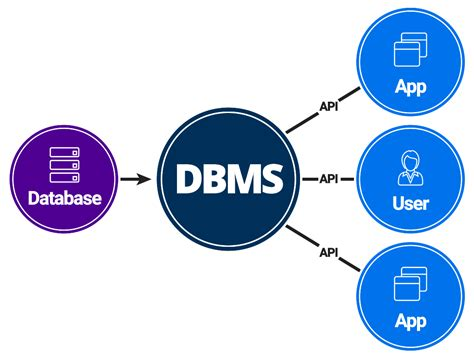
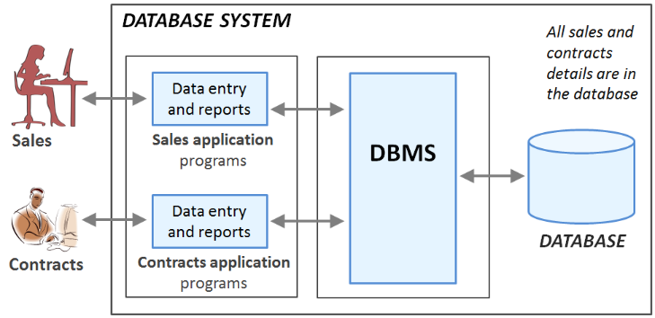

# Data Management and Databases

Welcome to the Data Management and Databases course!

---

# About the course

- During the course, we will learn among other things:
  - The key concepts and terminology of data management and databases
  - Design and document the database's structure based on the requirements
  - Retrieve and manipulate the database's data with SQL
- Each week there are two different teaching sessions:
  - Lectures where we go through the theory of the weekly topics
  - Laboratory sessions where we apply what we've learned by working on exercises together
- The teaching session schedule can be found on the course's Moodle page
- There are mandatory weekly exercises that need to be submitted in Moodle before the next week's lecture

---

# Introduction to databases

---

# Database

> Data: "A representation of facts or ideas in a formalized manner capable of being
> communicated or manipulated by some process"

> Base: "A permanent structure for housing something"

- In a digital world we are constantly accessing and manipulating stored information:
  - When we open our favorite messaging app, we can see the previously sent messages and we can send new messages
  - When we pay a bill and transfer money from one bank account to another
- These kinds of shared collections of logically related information are _databases_

---

# Definition of database

- Database is...
  - a _shared collection_ of
  - _logically related persistent data_ and
  - a _description of this data_,
  - designed to meet the _information needs_

---

# Definition of database

- "shared collection": database is accessible to specific applications, users, and organizations
- "logically related data": the different pieces of information has logical relations, e.g. messages in a messaging app are related to the sender and the receiver users
- "persistent data": data is in permanent storage and doesn't unexpectantly vanish
- "description of this data": on top of the actual data such as the user's name, the database contains _metadata_ like table and column names
- "information needs": the kind of information stored in the database is use-case specific
  - For example, a simple messaging app needs to store information about users and messages

---

# Data management

- _Data management_ is the development, maintenance and coordination of _database systems_
- A database system consists of five major components: _hardware_, _software_, _data_ (the database), _procedures_ and _users_
- Procedures refer to the policies, conventions, instructions, and rules that govern the design and use of the database

---

# The objective of data management

- The objective of data management is to design, implement, coordinate, and maintain database systems in such a way that all the required data is:
  - Valid and consistent
  - Up to date
  - Available in the required format
  - Available when needed
  - Fetrievable fast enough
  - Safe from different types of technical failures and accidents
  - Protected from unauthorized access and other types of misuse

---

# Database Management System (DBMS)

- One of the major components of a database system is the software
- _Database Management System_ (DBMS) is the software that:
  - Controls all access to the database
  - Allows users to define the database, usually through a _Data Definition Language_ (DDL)
  - Allows users to insert, update, delete, and retrieve data from the database, usually through a _Data Manipulation Language_ (DML)

---

# Database Management System (DBMS)

- Nowadays, the _relational database management system_ (RDBMS) is the de facto standard
- _SQL_ is the formal and de facto database language standard for RDBMSs
- SQL has both DDL and DML features
- There are multiple RDBMS products, such as _MySQL_ and _PostgreSQL_

---

# Database system example

- A real estate company is renting properties
- Each property has a property owner and a lease if the property is rented
- Each lease has a client who is renting the property from the owner
- The company has a sales team responsible for finding clients for the available properties and a contracts team responsible for managing the leases

---

- People in the sales and contracts teams access the same database system
- Each team uses a separate application that communicates with the DBMS using a data manipulation language
- The DBMS retrieves and manipulates data in the database on behalf of the application

---

In the database, the structure of sales and contracts details is the following:

- _PrivateOwner_ (ownerNo, fName, lName, address, telNo)
- _PropetyForRent_ (propertyNo, street, city, postcode, rooms, rent, ownerNo)
- _Client_ (clientNo, fName, lName, address, telNo, prefType, maxRent)
- _Lease_ (leaseNo, propertyNo, clientNo, paymentMethod, deposit, paid, rentStart, rentFinish)

---

The PrivateOwner table contains data such as:

| ownerNo | fName   | lName  | address       | telNo          |
| ------- | ------- | ------ | ------------- | -------------- |
| 1       | John    | Smith  | 360 Mary St   | (855) 766-3792 |
| 2       | Jessica | Miller | 2109 Yonge St | (416) 840-4465 |
| ...     | ...     | ...    | ...           | ...            |

---

# Functions of a DBMS

- The most fundamental function of DBMS is _retrieving and manipulating data in the database_
- This function should be provided in such a way that the physical level storage structures are completely hidden from the user
  - This offers a great amount of flexibility: the storage structures can change without the need to touch the application's code
- Other important functions of a DBMS are:
  - Integrity Services
  - Transaction Support
  - Concurrency Control Services
  - Recovery Services
  - Authorization Services

---

# Summary

- _Database_ is a shared collection of logically related persistent data
- Database is designed to meet specific information needs
- _Data management_ is the development, maintenance and coordination of _database systems_
- _Database management system_ (DBMS) is a software that allows users to insert, update, delete, and retrieve data from the database
- The most fundamental function of DBMS is _retrieving and manipulating data in the database_
