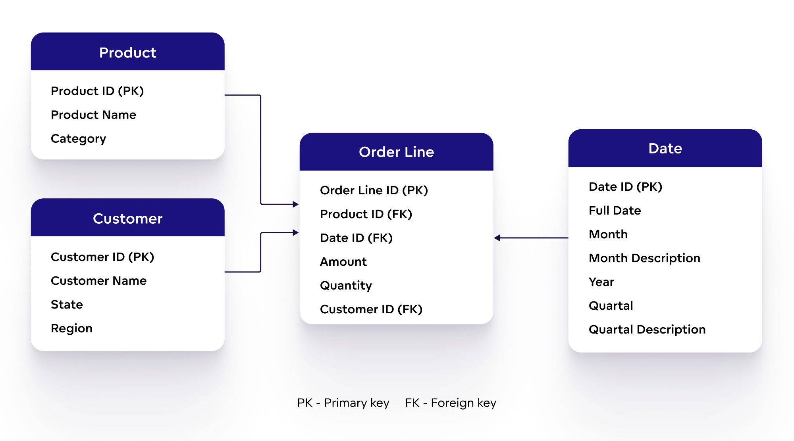
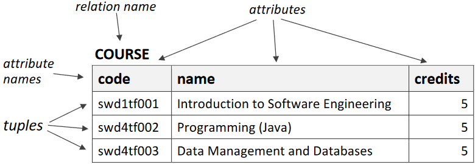
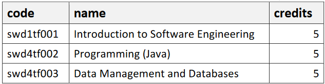
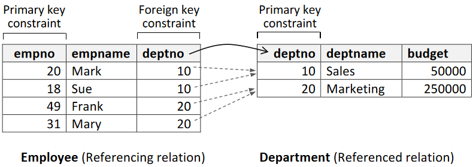

# The relational model

---

# Data Model



- A _data model_ is representation of _data elements_ and the relationships between them based on real-world objects
  - For example when modeling a simple online store, data element representing customer is related to a data element representing an order
- Data elements document real-world which means that the data model represents reality

---

# Components of a data model

- A data model consists of three components:
  1. _Structural part_: a set of rules according to which databases can be constructed
  2. _Integrity part_: a set of integrity constraints to ensure database integrity
  3. _Manipulative part_: a set of operations that are allowed on the data

---

# The relational model

- When all data model's data is logically structured within _relations_, the model is a _relational model_
- These relations are informally referred to as _tables_
- The data is perceived by the users as tables
- Relation has named _attributes_ (informally called _columns_)
- Attributes have a set of allowable values, which is referred to as the attribute's _domain_
  - For example "person" relation's "age" attribute could be an integer value larger or equal to zero
- The actual data is in relations's _tuples_ (informally called _rows_)

---



---

# Properties of relations

- Each relation has a name that is distinct from all other relation names
- Each attribute has a distinct name
- Each tuple's cell contains exactly one value
- Values of an attribute are all from the same domain
- The order of attributes has no significance
- There are no duplicate tuples
- The order of tuples has no significance

---

# Integrity constraints

- The quality of the data directly determines the quality of the whole database
- Therefore preventing entry of incorrect data is one of the most important functions of a DBMS
- _Integrity constraints_ are rules used to control the legal database states
- If the database satisfies all the integrity constraints specified on the database schema, it is in a legal state

---

# Domain integrity

- A _domain constraint_ specifies the set of allowable values for an attribute
  - For example valid grade marks are integers between 0 and 5
- Domain constraints enforce _domain integrity_

---

# Entity Integrity

- A _superkey_ is an attribute or group of attributes that uniquely identifies each tuple of a relation
- Relation can have multiple superkeys
  - In the "course" relation the "code" attribute, and group of "code" and "name" attributes are superkeys
  - What other superkeys does the "course" relation have?



---

# Entity Integrity

- A _candidate key_ is a superkey that satisfies the property of _minimality_
  - Minimality is satisfied if an attribute can't be removed from the group of attributes without breaking the uniqueness property
  - In the "course" relation the group of "code" and "name" attributes doesn't satify minimality, so it isn't a candidate key
  - What other candidate keys does the "course" relation have?


---

# Entity Integrity

- From the set of candidate keys for the relation, _exactly one_ candidate key is chosen to be the _primary key_
- The other candidate keys become _alternate keys_
- Each tuple has a value for the primary key, _it can't be missing_
- Primary key's value _should not change_
  - For example person's name or phone number might sound tempting options for a primary key but are actully subject to change
- _Primary key constraint_ prevents duplicate tuples to exist for the relation
- Primary key constraints enforce _entity integrity_

---

# Surrogate keys

- If there is initially no candidate key for a relation, then we cannot determine a _natural_ primary key
- For example a relation for email messages:

| from                       | to                         | title    | body         |
| -------------------------- | -------------------------- | -------- | ------------ |
| kalle.ilves@haaga-helia.fi | john.doe@gmail.com         | Greeting | Hello John!  |
| john.doe@gmail.com         | kalle.ilves@haaga-helia.fi | Response | Hello Kalle! |

---

# Surrogate keys

- We have to take care of the situation by including an extra attribute in the relation to act as the primary key
- For example a "messageid" column that holds a unique number for each tuple:

| messageid | from                       | to                         | title    | body         |
| --------- | -------------------------- | -------------------------- | -------- | ------------ |
| 1         | kalle.ilves@haaga-helia.fi | john.doe@gmail.com         | Greeting | Hello John!  |
| 2         | john.doe@gmail.com         | kalle.ilves@haaga-helia.fi | Response | Hello Kalle! |

---

# Surrogate keys

- Such primary key is called a _surrogate key_
- Surrogate key has no relationship to the real-world meaning of the data held in a tuple
- Surrogate keys are quite common and a natural key is often replaced with a surrogate key
- Surrogate keys are commonly generated by the DBMS once a tuple is inserted
- Automatically incremented numbers and randomly generated values like UUID are common surrogate key values

---

# Choosing a primary key

- Let's consider a suitable primary key in the following cases:
  - Is "course" relation's "name" attribute a good option for a primary key? Why or why not?
  - Person's contacts are stored in relation which has attributes "address" and "name" (home address and name of a contact). What would be suitable primery key for this relation and why?

---

# Referential Integrity

- _Foreign key_ is a attribute or group attributes whose values are required to match those of the primary key of the referenced relation
- There can be several foreign keys in a relation
- Foreign-to-primary-key matching is the "glue" which holds the database together
- _Foreign key constraint_ prevents foreign key not being matched by a primary key in the referenced relation
- Foreign key constraints enforce _referential integrity_

---



---

# Not null constraint

- _Null_ is a marker for a missing attribute value
- Null is not the same as e.g. blanks or zero. Null represents absence of a value
- The _not null constraint_ is a restriction placed on an attribute
- It enforces the condition that, in that attribute, every tuple of data must contain a value
- For example it would make sense that in the "employee" relation, the "deptno" attribute has a not null constraint, meaning that every employee belongs to a department

---

# Database manipulation

- A _manipulation mechanism_ is among the most important parts of a data model
- A manipulation mechanism allows the data to be retrieved and updated
- _SQL_ is the standard database language for relational databases. With SQL we can:
  - Create the database and relation structures
  - Perform insertion, modification, and deletion of data from the relations
  - Perform database queries
- Instead of using formal terms of relations, attributes, and tuples, the terms _tables_, _columns_, and _rows_ are used in the SQL standard

---

# SQL

- An SQL query is a single statement in which you describe what you want from the database
- The query operates on tables and builds a result table from one or more tables in the database
- Here's an example of an SQL query:

```sql
SELECT code, name, credits
FROM course
WHERE name = 'Data Management and Databases';
```

---

# Summary

- A _data model_ consists of three components: the _structural part_, the _integrity part_ and the _manipulative part_
- In the _relational model_, all data is logically structured within relations that have attributes and tuples
- _Integrity constraints_ are rules which make sure that the database is in a legal state
- _Domain constraint_ specifies the set of allowable values for an attribute
- _Primary key constraint_ prevents duplicate tuples to exist for the relation
- _Foreign key constraint_ prevents foreign key not being matched by a primary key in the referenced relation
