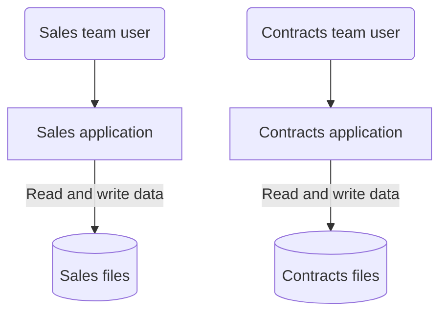
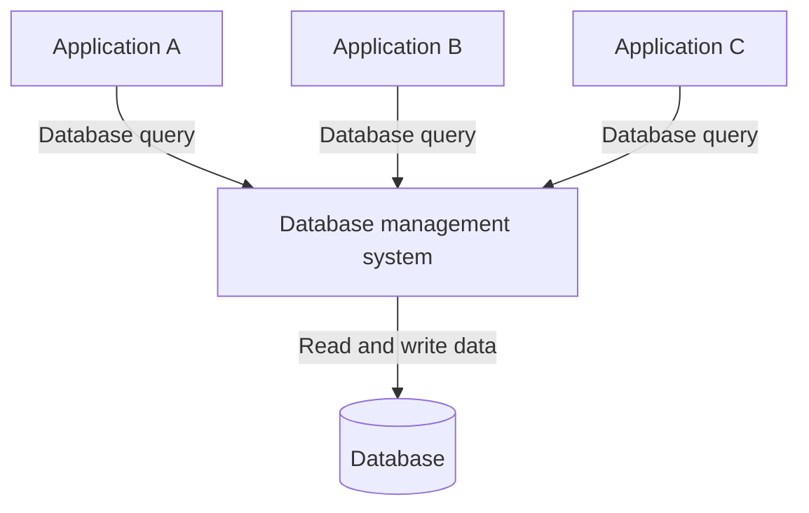
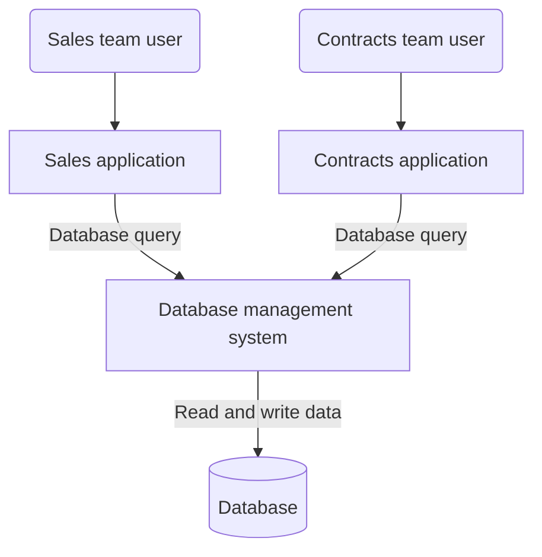
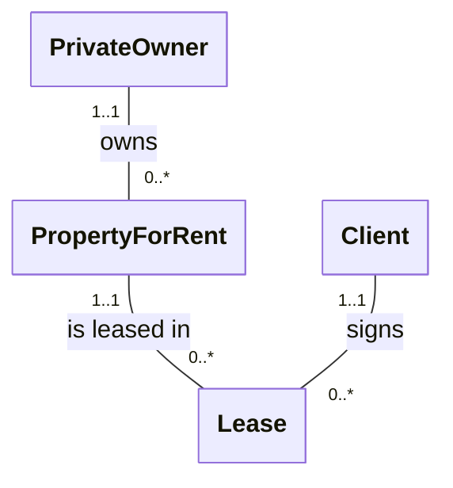

# Data Management and Databases

Welcome to the Data Management and Databases course! 👋

---

## Introduction to databases

- The learning objectives for this week are:
  - Knowing what kind of topics are covered during the course
  - Knowing the course schedule and the purpose of the weekly teaching sessions
  - Knowing how the course is assessed
  - Knowing the objective of **data management**
  - Knowing the meaning of the term **database** and **database management system** (DBMS)
  - Knowing what kind of functions a full-scale DBMS should provide
  - Knowing and advantages of the **database approach** over the **file-based approach** in data management

<div class="text-sm text-gray-5" style="position: absolute; left: 16px; bottom: 0px;">

_A substantial portion of these materials is derived from the work of Kari Silpiö. Any use, reproduction, or distribution of this content requires prior written permission from him._

</div>

---

## About the course

- During the course, we will learn among other things:
  - The key concepts and terminology of data management and databases
  - Design and document the database's structure based on the requirements
  - Retrieve and manipulate the database's data with SQL
- Each week there are two different teaching sessions:
  - Lectures where we go through the theory of the weekly topics
  - Laboratory sessions where we apply what we've learned by working on exercises together
- The teaching session schedule can be found on the course's Moodle page
- There are weekly exercises that need to be submitted in Moodle before the next week's lecture

---

## Schedule

- The course takes place in **two teaching periods**
- During the first period we will some basic concepts of databases and how to operate databases using the SQL query language
- The first period is followed by the **mid-term exam**, which only covers SQL
- During the second period we will mostly cover database design and a few SQL related topics
- Throughout the second period we will also be working on a **case assignment** group work related to database design
- The second period is followed by the **final exam**, which covers everything except SQL

---

## Assessment

- ⚠️ To confirm the course participation the following need to be submitted **before the second week's session**:
  - The first part of your learning diary
  - The first week's assignments (orientation exercise and intro assignment)
- The course assessment is based on the combined points from two exams:
  - The mid-term exam, half way through the course, will cover SQL operations
  - The final exam, at the end of the course, will cover rest of the course topics
- Passing grade has the following requirements:
  - Pass both exams with 50% points in each exam
  - At least 70% of the exercises, case assignment and learning diary must be submitted **before the final exam**
- More details about the exam schedule and practicalities can be found in Moodle

---

## Database

> _"A representation of facts or ideas in a formalized manner capable of being communicated or manipulated by some process."_
>
> ― Definition for the word "Data" in Oxford Languages

- In a digital world we are constantly accessing and manipulating stored information, for example, when we open our favorite messaging application, we can see the previously sent messages and we can send new messages
- The backbone of basically any information system is a **database**, an organized collection of data that allows for easy access, management, and updating of information
- Databases help store large amounts of structured data efficiently and enable fast querying and data manipulation
- There are many different kind of database technologies, such as, PostgreSQL, MySQL and MongoDB

---

## Definition of database

- There have been many different formal definitions for the term _"database"_ and the definition has evolved during the years:
  - Date in 1990: _"A database consists of some collection of persistent data that is used by the application systems of some given enterprise."_
  - Ramakrishnan & Gerhke in 2000: _"A database is a collection of data, typically describing the activities of one or more related organizations."_
- Based on a bit more recent definition of Connolly & Begg in year 2005, database is defined as:
  
> _"A database is a shared collection of logically related data (and a description of this data), designed to meet the information needs of an organization."_

---

## Definition of database

> _"A database is a shared collection of logically related data (and a description of this data), designed to meet the information needs of an organization."_

- _"shared collection"_: database is **accessible** to specific applications, users, and organizations
- _"logically related data"_: the different pieces of **information has logical relations**, e.g. messages in a messaging app are related to the sender and the receiver users
- _"persistent data"_: data is in **permanent storage** and doesn't unexpectedly vanish
- _"description of this data"_: on top of the actual data such as the user's name, the database contains **metadata** like table and column names
- _"information needs"_: the kind of information stored in the database is **use-case specific**. For example, a messaging application needs to store information about users and messages

---

## Data management

- **Data management** is the development, maintenance and coordination of **database systems**
- A database system consists of five major components:
  - **Hardware** consists of the physical devices (for example, servers and hard drives) and infrastructure that support the database system
  - **Software** consists of the set of applications used to manage and interact with the database
  - **Data** (the database) constitutes of the actual stored information that the database system manages
  - **Procedures** consists of the documented instructions and rules for using and managing the database system
  - **Users** who are the people or applications who interact with the database system

---

## The objective of data management

- The objective of data management is to design, implement, coordinate, and maintain database systems in such a way that all the required data is:
  - Valid and consistent
  - Up to date
  - Available in the required format
  - Available when needed
  - Retrievable fast enough
  - Safe from different types of technical failures and accidents
  - Protected from unauthorized access and other types of misuse

---

## Data management example

- Let's consider the following information needs for a database:
  - A real estate company is renting properties
  - Each property has a property owner and a lease if the property is rented
  - Each lease has a client who is renting the property from the owner
  - The company has a **sales team** responsible for finding clients for the available properties and a **contracts team** responsible for managing the leases
- Next, we will have a look at two possible approaches of managing this data, which are the **file-based** and **data management system** approaches

---

## File-based approach in data management

<div class="flex">
<div class="flex-1 m-r-2">



</div>

<div class="flex-1">

- Data for sales and contracts teams is in **separate files**
- Each team uses a separate application that defines and manages data in application-specific files
- Each file has a specific format
- Applications that use these files depend on knowledge about that format

</div>
</div>

---

## File-based approach in data management

- The sales application operates with the following **sales files**:
  - _private-owner.csv_ (ownernumber, firstname, lastname, address, phone)
  - ⚠️ _property-for-rent.csv_ (propertynumber, street, city, postcode, size, rooms, rent, ownernumber)
  - ⚠️ _client.csv_ (clientnumber, firstname, lastname, address, phone, maxrent, sizepreference)
- And the contracts application with the separate **contracts files**:
  - _lease.csv_ (leasenumber, propertynumber, clientnumber, deposit, paid, rentstart, rentfinish)
  - ⚠️ _property-for-rent.csv_ (propertynumber, street, city, postcode, rent)
  - ⚠️ _client.csv_ (clientnumber, firstname, lastname, address, phone)
- The same client and property information is stored in **both sales and contracts files**. Such **data reduncancy** will lead to inconsistent information, e.g. the same client having a different phone number in different files

---

## Problems of file-based approach

- **Data dependence**: code is being tightly coupled with the file structure and if it is modified, all applications that use the file have to be changed accordingly
- **Data redundancy**: the same information is stored in multiple files (e.g. the client files in both sales and contacts teams), which will lead to inconsistency
- **Difficulty in accessing data**: applications are written to satisfy particular functions and any new requirement needs a new application or changes in an existing one
- **No provision for security and shared access to the data**: there is no service for providing user access to some, but not all, data
- **Lack of coordination and standardisation**: there is no centralised control of enterprise data, which makes it difficult to enforce standards and share data structures between applications

---

## Database Management System (DBMS)

<div class="flex">
<div class="flex-basis-50% m-r-2">



</div>

<div class="flex-1">

- Problems of the file-based approach can be avoided by delegating data related operations to a separate software, **Database Management System** (DBMS)
- It controls all access to the database
- It allows users to define the database, usually through a **Data Definition Language** (DDL)
- It allows insert, update, delete, and retrieve data from the database, usually through a **Data Manipulation Language** (DML)

</div>
</div>

---

## Database approach in data management

<div class="flex">
<div class="flex-1 m-r-2">



</div>

<div class="flex-1">

- Data for both sales and contracts team is in the **same database**, without data redundancies
- Each team uses a separate application that communicates with the **same DBMS** using a data manipulation language
- The DBMS retrieves and manipulates data in the database on behalf of the application
- The key difference is that **the applications don't access the data directly**, but trough the DBMS

</div>
</div>

---

## Database approach in data management

<div class="flex">
<div class="flex-basis-35% m-r-2">



</div>

<div class="flex-1">

- In the database, the sales and contracts details can be structured into the following **database tables**:
  - _PrivateOwner_ (ownernumber, firstname, lastname, address, phone)
  - _PropetyForRent_ (propertynumber, street, city, postcode, size, rooms, rent, ownernumber)
  - _Client_ (clientNo, firstname, lastname, address, phone, maxrent, sizepreference)
  - _Lease_ (leasenumber, propertynumber, clientnumber, deposit, paid, rentstart, rentfinish)
- Now, there's a **common structure** for the organization's data without duplication and structural differences

</div>
</div>

---

## Advantages of database approach

- **Data independence**: applications don't need to know about the physical level storage structures, which improves data accessibility, maintainability of the applications and reusability of existing data
- **Effective access to data**: multiple users can access the data
concurrently using a standard database language with both programmatic and interactive interfaces
- **Data integrity**: integrity can be maintained by using user-defined integrity constraints
- **Data security**: security restrictions can be applied on detailed level
- **Coordination and standardisation**: centralised data administration eliminates redundancy and enforces standards
- **Increased application development productivity**: standard database language simplifies the development of applications and provides portability

---

## Functions of a DBMS

- The most fundamental function of DBMS is **data storage and data retrieval and update operations**
- This function should be provided in such a way that the physical level storage structures are completely hidden from the user, which enables data independence
- Other important functions of a DBMS are:
  - Integrity services
  - Transaction support
  - Concurrency control services
  - Recovery services
  - Authorization services
  - User-accessible system catalog
  - Support for data communication

---

## Functions of a DBMS

- **Integrity services**: protects data integrity (correctness and consistency of stored data) based on user-specifiable **integrity constraints** (consistency rules)
- **Transaction support**: protects database integrity by providing reliable units of work (database transactions) that allow correct recovery from failures and providing isolation between users accessing the database concurrently
- **Concurrency control services**: allows shared access to of the database and ensure that the database is updated correctly when multiple users are updating the database concurrently
- **Recovery Services** database is able to recover to a consistent state after a system crash, media failure, a hardware or software error
- **Authorization services**: controls access to the data and ensure that the data is secure
- **User-accessible system catalog**: describes the database itself
- **Support for data communication**: the DBMS should be accessible remotely over network

---

## Relational database managament systems (RDBMS)

- **Relational database management systems** (RDBMS) are among the most popular database management systems
- The word _"relational"_ refers to the structure of the data in such DBMS
- **Structured Query Language** (SQL) is the formal and most widely used database language standard for RDBMSs
- SQL offers both **data definition language** (DDL) and **data manipulation language** (DML) features
- There are multiple RDBMS products, such as SQL Server, MySQL and PostgreSQL
- During this course we will be using the **SQL Server** RDBMS

```sql
-- Example of DML syntax in SQL
SELECT clientnumber, firstname, lastname, address FROM Client
WHERE maxrent < 1000
```

---

## Summary

- **Database** is a shared collection of logically related persistent data, which is designed to meet specific information needs
- **Data management** is the development, maintenance and coordination of **database systems**
- **Database management system** (DBMS) is a software that allows users to insert, update, delete, and retrieve data from the database
- **Data independence**, **effective access to data** and **data integrity** are some of the key benefits of a DBMS approach in data management
- The most fundamental function of DBMS is **data storage and data retrieval and update operations**
- **Relational database management system** (RDBMS) are among the most popular database management systems
