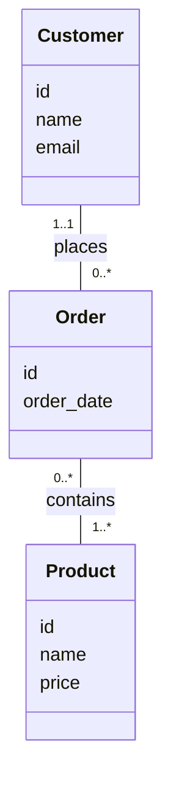

## The relational model

- The learning objectives for this week are:
  - Knowing what is a **data model**
  - Knowing what is the **relational data model**
  - Knowing the core terminology of the relational model
  - Knowing what are the properties of database **relations**
  - Knowing what are **domain integrity**, **entity integrity**, and **referential integrity** rules
  - Knowing how to identify **candidate keys**, **primary keys**, **alternate keys**, and **foreign keys**
  - Knowing how to formulate **relation schemas** and **relational schemas**
  - Knowing how tables are used to represent data

<div class="text-sm text-gray-5" style="position: absolute; left: 16px; bottom: 0px;">

_A substantial portion of these materials is derived from the work of Kari Silpiö. Any use, reproduction, or distribution of this content requires prior written permission from him._

</div>

---

## Data Model

<div class="flex">

<div class="flex-basis-11% m-r-2">



</div>

<div class="flex-1">

- A **data model** is a conceptual model that defines how data is structured, stored, and accessed in a system
- For example, **entity-relationship model** describes **entities** (things about which data is stored), **attributes** (details about each entity), and **relationships** (how entities are connected)
- In case of a simple online store, a "Customer" **entity** consists of **attributes** such as "name" and "email"
- The "Customer" entity could have a **relationship** with the "Order" entity, describing which orders a specific customer has placed
- Data model **helps design the structure** of a database and **makes data requirements easier to understand**, ensuring that both technical and non-technical stakeholders share a common understanding of the data

</div>

</div>

---

## Components of a data model

- A data model consists of three components:
  1. **Structural part**: what types of data exist and how they relate to each other. For example data model could consist of "Course implementation" and "Teacher" entities, and "Teacher" entity has a relationship with the "Course implementation" entity (the teacher teaching the course implementation)
  2. **Integrity part**: how the data can be used, validated, and maintained. For example "credits" attribute of a "Course" entity should be a number between 0 and 10
  3. **Manipulative part**: what can be done with the data (like creating, reading, updating, deleting)

---

## The relational model

- When all data model's data is logically structured within **relations**, the model is a **relational model**
- **Relation** (informally called a **table**) represents a data entity organized in a specific structure, such as "Course"
- Each relation consists of **attributes** (informally called **columns**) that define its properties, such as "name" and "credits"
- Attributes have a set of allowable values, which is referred to as the attribute's **domain**. For example, "Course" relation's "credits" attribute could be an integer value between 1 and 10
- The actual data is in relations's **tuples** (informally called **rows**)
- **Relationships** between two relations are established using a **foreign key**, which references other relation's unique **primary key**. For example "Course implementation" relation has a "teacherno" foreign key referencing the "Teacher" relation's "teacherno" attribute

---

## The relational model

| code    | name                        | credits | programmecode |
| ------- | --------------------------- | ------- | ------------- |
| HIS201  | World History               | 5       | HIS           |
| MATH201 | Calculus II                 | 3       | MATH          |
| ENG150  | Academic Writing            | 2       | LING          |
| CSC102  | Introduction to Programming | 5       | CS            |

- The following data represents a "Course" **relation**
- The relation has four **attributes** "code", "name", "credits" and "programmecode"
- There a four **tuples** containing the actual data
- The "code" attribute is a **primary key**, which uniquely identifies each tuple (no two tuples have the same value for the attribute)

---

## Properties of relations

- Each relation has a name that is **distinct from all other relation names**
- Each attribute of a relation has a **distinct name within the relation**
- Each relation has a **primary key** attribute, which **unique identifies each tuple** and makes sure, there's no duplicate values. For example "code" primary key for "Course" relation and "studentnumber" primary key for "Student" relation
- Each attribute is **atomic**, meaning that each tuple's cell contains exactly one value. For example, it is not possible to have a "emails" attribute representing multiple email addresses
- Values of an attribute are all **from the same domain**. For example, "name" attribute values are only text and "credits" attribute values are only numbers

---

## Integrity constraints

| order_id | customer_id | order_date   | total_amount |
| -------- | ----------- | ------------ | ------------ |
| ❌ 1      | 102         | 2025-01-13   | ❌ -50.00     |
| ❌ 1      | ❌ NULL      | 2025-01-14   | 150.00       |
| 6        | 104         | ❌ 02.02.2025 | 200.00       |

- The quality of the data directly determines the quality of the whole database
- Therefore preventing entry of incorrect data is one of the most important functions of a DBMS
- **Integrity constraints** are different kind of rules used to control the legal database states enforcing database **integrity**
- If the database satisfies all the integrity constraints specified on the database schema, it is in a legal state

---

## Superkey, candidate key and primary key

- A **superkey** is an attribute or group of attributes that **uniquely identifies** each tuple of a relation
- Superkey consisting of a group of attributes is called a **composite key**
- Relation can have multiple superkeys, for example in the "Course" relation the "code" attribute, and group of "code" and "name" attributes (composite key) are superkeys
- ❓ What other superkeys does the "Course" relation have?

| code    | name                        | credits | programmecode |
| ------- | --------------------------- | ------- | ------------- |
| CS102   | Introduction to Programming | 5       | CS            |
| MATH201 | Calculus II                 | 4       | MATH          |
| ENG150  | Academic Writing            | 2       | LING          |

---

## Superkey, candidate key and primary key

- A composite **candidate key** is a superkey that satisfies the property of **minimality**
- Minimality is satisfied if an attribute can't be removed from the composite key without breaking the uniqueness property
- In the "Course" relation the group of "code" and "name" attributes doesn't satify minimality, so it isn't a candidate key
- ❓ What other candidate keys does the "Course" relation have?

| code    | name                        | credits | programmecode |
| ------- | --------------------------- | ------- | ------------- |
| CS102   | Introduction to Programming | 5       | CS            |
| MATH201 | Calculus II                 | 4       | MATH          |
| ENG150  | Academic Writing            | 2       | LING          |

---

## Entity integrity

- From the set of candidate keys for the relation, **exactly one** candidate key is chosen to be the **primary key**
- The other candidate keys become **alternate keys**
- Each tuple has a value for the primary key, **it can't be missing**
- Primary key's value **should not change**. For example person's name or phone number might sound tempting options for a primary key but are actully subject to change
- **Primary key constraint** prevents duplicate tuples to exist for the relation
- Primary key constraints enforce **entity integrity**

---

## Surrogate keys

- If there is initially no candidate key for a relation, then we cannot determine a **natural primary key**
- For example, the relation "Messages", representing email messages:

| from                       | to                         | title    | body         |
| -------------------------- | -------------------------- | -------- | ------------ |
| kalle.ilves@haaga-helia.fi | john.doe@gmail.com         | Greeting | Hello John!  |
| john.doe@gmail.com         | kalle.ilves@haaga-helia.fi | Response | Hello Kalle! |

---

## Surrogate keys

- We have to take care of the situation by including an extra attribute in the relation to act as the primary key
- For example a "messageid" column that holds a unique number for each tuple:

| messageid | from                       | to                         | title    | body         |
| --------- | -------------------------- | -------------------------- | -------- | ------------ |
| 1         | kalle.ilves@haaga-helia.fi | john.doe@gmail.com         | Greeting | Hello John!  |
| 2         | john.doe@gmail.com         | kalle.ilves@haaga-helia.fi | Response | Hello Kalle! |

---

## Surrogate keys

- Such primary key is called a **surrogate key**
- Surrogate key has no relationship to the real-world meaning of the data held in a tuple
- Surrogate keys are quite common and a natural key is often replaced with a surrogate key
- Surrogate keys are commonly generated by the DBMS once a tuple is inserted
- Automatically incremented numbers (1, 2, 3, ...) and randomly generated values like UUID are common surrogate key values

---

## Choosing a primary key

- Let's consider a suitable primary key in the following cases:
  - ❓ Is "Student" relation's "phonenumber" attribute a good option for a primary key? Why or why not?
  - ❓ A "Customer" relation has attributes "address", "name", "email" and "social_security_number". What would be suitable primery key for this relation and why?

| social_security_number | name          | address                  | email                    |
| ---------------------- | ------------- | ------------------------ | ------------------------ |
| 123-45-6789            | Alice Johnson | 742 Evergreen Terrace    | alicejohnson@gmail.com   |
| 987-65-4321            | Bob Smith     | 221B Baker Street        | bobthebot87@hotmail.com  |
| 555-12-3456            | Carol Nguyen  | 1600 Pennsylvania Avenue | carolnguyen123@gmail.com |

---

## Referential Integrity

- **Foreign key** is a attribute or group attributes whose values are required to match those of the primary key of the referenced relation
- There can be several foreign keys in a relation
- Foreign-to-primary-key matching is the "glue" which holds the database together
- **Foreign key constraint** prevents foreign key not being matched by a primary key in the referenced relation
- Foreign key constraints enforce **referential integrity**

---

## Referential Integrity

<div class="flex">
<div class="flex-1 m-r-2">


</div>

<div class="flex-1">

- In this example we have two relations: "Employee" and "Department"
- Each employee belongs to one department, where they work in
- This relationship is established between entities by using a **foreign key** attribute "deptno" in the "Employee" relation, which is linked to the "Department" relation's **primary key** attribute "deptno"
- ⚠️ A general rule is, that foreign key **always references a primary key**
  
</div>
</div>

---

## Example of primary and foreign keys

<div class="flex">
<div class="flex-basis-26% m-r-2">


</div>

<div class="flex-1">

- Let's consider the following question related to these "Team", "Artist" and "Team_Artist" relations:
  - ❓ What are the **primary keys** for each table?
  - ❓ What are the **foreign keys** for each table?
  
</div>
</div>

---

# Relation schema and relational schema

- To provide a textual presentation of relation or a collection related relations, we can use **relation schemas** and **relational schemas**
- **Relation schema** describes a single relation. It includes the name of the relation, the
names of attributes and the **primary key** attribute underlined

<pre>
Course (<u>courseCode</u>, courseName, credits)
</pre>

- **Relational schema** describes a collection of relations (the logical structure of a relational database)

<pre>
Course (<u>courseCode</u>, courseName, credits)
Student (<u>studentNumber</u>, familyName, givenName, birthdate)

CourseGrade (<u>courseCode</u>, <u>studentNumber</u>, grade)
 FOREIGN KEY (courseCode) REFERENCES Course (courseCode)
 FOREIGN KEY (studentNumber) REFERENCES Student (studentNumber)
</pre>

---

## Domain integrity

- A **domain constraint** specifies the set of allowable values for an attribute
- It includes attribute's **type-based restriction** (e.g. integer, string, or date) and further restrictions based on user-defined rules. For example:
  - Valid grade marks are integers between 0 and 5
  - Student's birth date is a valid date before today's date
  - Student's email should be a string in format `%@%.%`
- Domain constraints enforce **domain integrity**

---

## Not null constraint

| studentid | name          | phonenumber    | major            |
| --------- | ------------- | -------------- | ---------------- |
| 2001      | Emma Thompson | (415) 555-0198 | Computer Science |
| 2002      | Liam Martinez | ⚠️ NULL         | Computer Science |
| 2003      | Sophia Chen   | (212) 555-0843 | Psychology       |

- **Null** is a marker for a missing attribute value
- Null is not the same as e.g. blanks or zero. Null represents **absence of a value**
- The **not null constraint** is a restriction placed on an attribute, which enforces that in every tuple of data the attribute **must have a value**
- For example, it would make sense that in the "Employee" relation, the "deptno" attribute has a not null constraint, meaning that every employee belongs to a department

---

## Database manipulation

- A **manipulation mechanism** is among the most important parts of a data model
- A manipulation mechanism allows the data to be retrieved and updated
- **Structured Query Language** (SQL) is the standard database language for relational databases. With SQL we can:
  - Create the database and relation structures
  - Perform insertion, modification, and deletion of data from the relations
  - Perform database queries
- Instead of using formal terms of relations, attributes, and tuples, the terms **tables**, **columns**, and **rows** are used in the SQL standard

---

## SQL

- An **SQL query** is a single statement in which you describe what kind of data we want to **retrieve from the database** or **how we want to manipulate it** (insert, update, delete)
- While retrieving data, the query operates on tables and builds a result table from one or more tables in the database
- Here's an example of an SQL query and its result table:

<div class="m-b-2">

```sql
SELECT code, name, credits
FROM course
WHERE name = 'Data Management and Databases';
```

</div>

| code  | name                          | credits |
| ----- | ----------------------------- | ------- |
| CS220 | Data Management and Databases | 5       |

---

## Summary

- A **data model** consists of three components: the **structural part**, the **integrity part** and the **manipulative part**
- In the **relational model**, all data is logically structured within relations that have attributes and tuples
- **SQL** is the standard database language for relational databases
- **Integrity constraints** are rules which make sure that the database is in a legal state
- **Domain constraint** specifies the set of allowable values for an attribute
- **Primary key constraint** prevents duplicate tuples to exist for the relation
- **Foreign key constraint** prevents foreign key not being matched by a primary key in the referenced relation
- **Not null constraint** enforces that in every tuple of data the specified attribute **must have a value**
