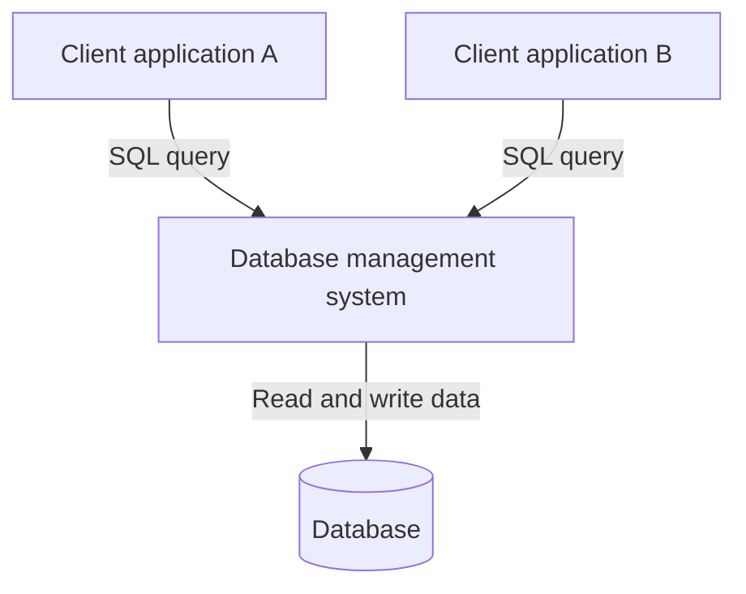
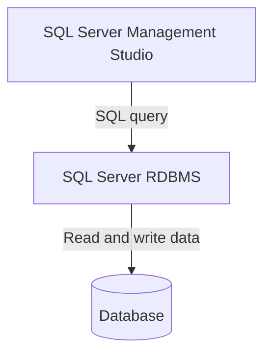
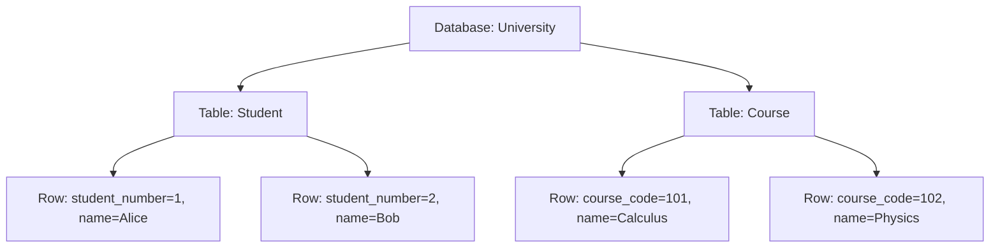

## Introduction to SQL

- The learning objectives for this week are:
  - Knowing how to use **SQL Server Management Studio** to connect to the SQL Server RDBMS
  - Knowing how to use SQL Server Management Studio to execute database queries
  - Knowing how to to create database tables using SQL
  - Knowing how to to insert data into a table using SQL
  - Knowing how to to retrieve data from the database using SQL

---

## SQL

- **Structured Query Language** (SQL) is the standard database language for relational databases
- With SQL we can, create the database and table structures, manipulate data in the tables (insert, update, delete) and retrieve data from the tables
- An **SQL query** is a single statement in which describes what we want from the database
- The query operates on **tables** and builds a result table from one or more tables in the database

<div class="m-b-2">

```sql
SELECT teacher_number, email, phone
FROM Teacher
WHERE first_name = 'John' AND surname = 'Doe';
```

</div>

| teacher_number | email                   | phone          |
| -------------- | ----------------------- | -------------- |
| T254           | john.doe@haaga-helia.fi | (415) 555-0198 |

---

## SQL syntax variations

- There is an official standard for SQL maintained by ISO/IEC and **most of the syntax is the same in all RDBMS**, but **every major RDBMS introduces its own extensions, syntax tweaks, or behaviors**
- However, learning the SQL syntax of a specific RDMBS makes it very easy to learn the minor differences of another one

| Operation        | SQL Server                  | PostgreSQL                    |
| ---------------- | --------------------------- | ----------------------------- |
| Limit rows       | `SELECT TOP 5 * FROM table` | `SELECT * FROM table LIMIT 5` |
| Current datetime | `GETDATE()`                 | `NOW()`                       |
| String length    | `LEN(string)`               | `LENGTH(string)`              |

---

## Communicating with a RDBMS using SQL

<div class="flex">
<div class="flex-0 m-r-2">



</div>

<div class="flex-1">

- SQL is used with a relational database management systems (RDBMS), such as **Microsoft SQL Server**, which we will be using during the course
- RDBMS software can be running on local computer on a server on the internet
- We can send database queries to a RDBMS using a **client application**, which can be, for example a programming interface, a command line interface or a graphical interface
- During the course we have the option to either install the SQL Server on our computer or use the SQL server running in Haaga-Helia's servers

</div>
</div>

---

## Communicating with a RDBMS

<div class="flex">
<div class="flex-0 m-r-2">



</div>

<div class="flex-1">

- During this course we will be using a graphical interface called **SQL Server Management Studio** to communicate with the SQL Server RDBMS
- With SQL Server Management Studio we can for example inspect and manage database related information, perform database queries and visualize the structure of the database tables

</div>
</div>

---

## Creating a database



- In SQL, a **database** is a named collection of **tables**
- In addition to tables, database holds different kinds of configuration, for example related to access control
- We can create a database with the `CREATE DATABASE` statement

```sql
CREATE DATABASE University
```

---

## Creating a table

- The actual data of a database lives inside **tables**
- Table has a name and a collection of **columns**
- We can create a table with the `CREATE TABLE` statement

```sql
CREATE TABLE Student (
    student_number INTEGER,
    first_name VARCHAR(50),
    surname VARCHAR(50)
)
```

| student_number | first_name | surname |
| -------------- | ---------- | ------- |
| 1001           | Alice      | Johnson |
| 1002           | Bob        | Smith   |
| 1003           | Charlie    | Nguyen  |

---

## Creating a table

- Table and column names **should describe the information they store**
  - The "Student" table contains rows that represent students
  - The "first_name" column contains the first name of the student
- Table and column names should consist of letters, digits or underscores. They **should not contain whitespace**
- In column names, a underscore symbol (_) is commonly used instead of whitespace. For example "first_name" instead of "first name"
- Table names are commonly in **singular format**, for example "Student"
- Each column has a **data-type** that determines the kind of values the column can have
- For example an `INTEGER` type of column can only contain integer values and `VARCHAR(n)` column string values

---

## SQL Server data types

| Category        | Data Type      | Description                                                          |
| --------------- | -------------- | -------------------------------------------------------------------- |
| Integer Types   | `INT`          | Integer from -2,147,483,648 to 2,147,483,647                         |
|                 | `BIGINT`       | Integer from -9,223,372,036,854,775,808 to 9,223,372,036,854,775,807 |
| Decimal Types   | `DECIMAL(p,s)` | Fixed precision and scale numeric data                               |
| Character Types | `CHAR(n)`      | Fixed-length non-Unicode string (max 8,000 chars)                    |
|                 | `VARCHAR(n)`   | Variable-length non-Unicode string                                   |
| Unicode Types   | `NCHAR(n)`     | Fixed-length Unicode string                                          |
|                 | `NVARCHAR(n)`  | Variable-length Unicode string                                       |
| Date & Time     | `DATE`         | Stores date (YYYY-MM-DD)                                             |
|                 | `TIME`         | Stores time only (HH:MM:SS)                                          |

---

## Constraints

- **Constraints** specify rules for the data in a table
- For example `NOT NULL` constraint ensures that a column cannot have a `NULL` (empty) value
- The `NOT NULL` constraint is defined **after the column type** in the `CREATE TABLE` statement

```sql
CREATE TABLE Student (
    student_number INTEGER NOT NULL,
    first_name VARCHAR(50) NOT NULL,
    surname VARCHAR(50) NOT NULL
)
```

---

## Primary key constraint

- **Primary key** uniquely identifies each row in the table
- **Primary key constraint** prevents duplicate rows to exist for the table
- Primary key constraint is defined with the `PRIMARY KEY` constraint **after the column definitions** in the `CREATE TABLE` statement

```sql
CREATE TABLE Student (
    student_number INTEGER NOT NULL,
    first_name VARCHAR(50) NOT NULL,
    surname VARCHAR(50) NOT NULL,

    -- the primary key is the student_number column
    CONSTRAINT Pk_Student PRIMARY KEY (student_number)
)
```

---

## Foreign key constraint

- **Foreign key** is a column or group columns whose values are required to match those of the primary key of the referenced table
- **Foreign key constraint** prevents foreign key not being matched by a primary key in the referenced table
- Foreign key constraint is defined with the `FOREIGN KEY` constraint **after the column definitions** in the `CREATE TABLE` statement

```sql
CREATE TABLE Laptop (
    serial_number VARCHAR(10) NOT NULL,
    student_number INTEGER NOT NULL,
    -- he primary key is the serial_number column
    CONStTRAINT Pk_Laptop PRIMARY KEY (serial_number),
    --  the foreign key student_number references the student_number in the Student table
    CONSTRAINT Fk_Student FOREIGN KEY (student_number)
    REFERENCES Student(student_number)
)
```

---

## Inserting data

- We insert a new row into a table by defining the table name and the values for the columns
- A new row can be inserted with the `INSERT INTO` statement
- ⚠️ String literals are defined with **single quotes**, for example `'Kalle'`

```sql
INSERT INTO Student (student_number, first_name, surname) VALUES (1, 'Kalle', 'Ilves')
```

---

## Constraint violations while inserting data

- Constraits are checked once a new row if inserted or updated
- If there are any constraint violations, **the new row won't be inserted**
- For example if `NOT NULL` constraint of a column is violated, there will be an error

```sql
-- ❌ surname columns has a NOT NULL constraint, omitting it will cause an error
INSERT INTO Student (student_number, first_name) VALUES (1, 'Kalle')
```

---

## Retrieving data

- The `SELECT` statement is used to select rows from a table
- With the `SELECT` statement we define a group of columns we want to select the data from and the name of the target table
- The result is a **result table** containing the rows from the target table with the specified columns

```sql
SELECT first_name, surname FROM Student
```

| first_name | surname |
| ---------- | ------- |
| Alice      | Johnson |
| Bob        | Smith   |
| Charlie    | Nguyen  |

---

## Summary

- We communicate with a **RDBMS server**, such as SQL Server using a **client application**, such as SQL Server Management Studio
- We can create database tables using the `CREATE TABLE` statement
- `PRIMARY KEY` constraint is used to define the table's primary key
- `FOREIGN KEY` constraint is used to define a foreign key referencing primary key column of another table
- `INSERT INTO` statement is used to insert a new row for the table
- `SELECT` statement is used to select rows from a table
