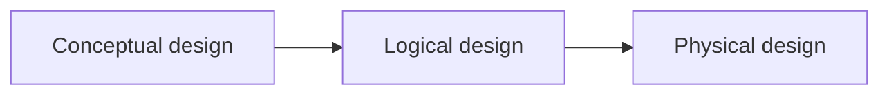
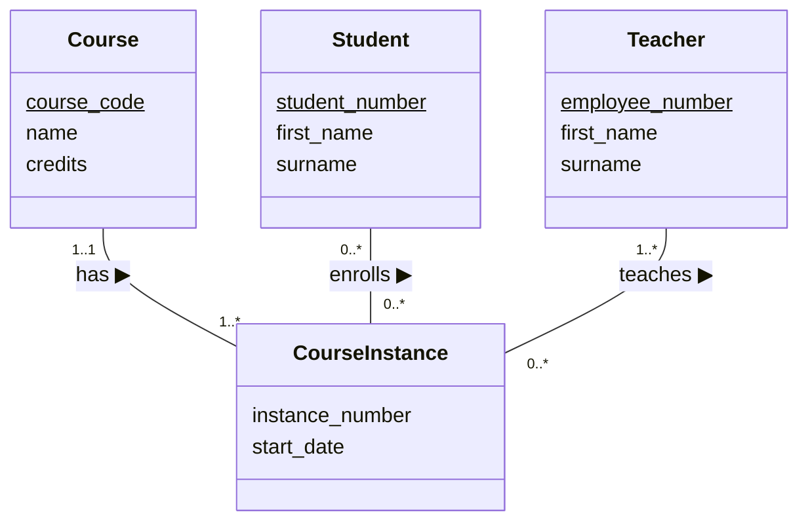
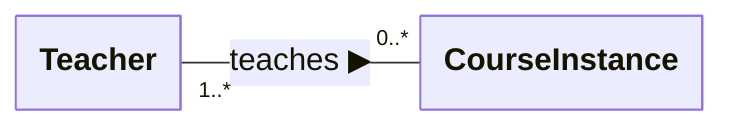
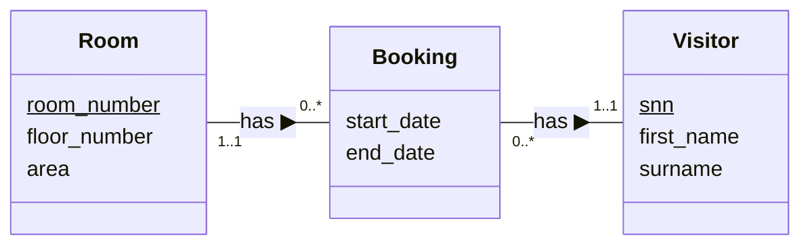

## Database design

- The learning objectives for this week are:
  - Knowing what **database development lifecycle** is and from which phases it consists of
  - Knowing what **conceptual database design** is
  - Knowing what is **entity-relationship modeling**
  - Knowing how to implement and interpret **entity-relationship diagrams**

<div class="text-sm text-gray-5" style="position: absolute; left: 16px; bottom: 0px;">

_A substantial portion of these materials is derived from the work of Kari Silpiö. Any use, reproduction, or distribution of this content requires prior written permission from him._

</div>

---

## Database development lifecycle

- So far we have explored and written SQL queries for existing databases, such as the Takkula database
- We have been able to successfully retrieve all kinds of relevant information from the database
- What we might not have thought is that **why** the Takkula database structured as it is
  - Why does it have these specific tables and columns?
  - Why does it have these relationships between tables?
- The end result is an outcome of the **database development lifecycle**

---

## Database development lifecycle

- The **database development lifecycle** is a step-by-step process of implementing a database for certain set of requirements
- According to Coronel and Morris (2019) it consists of the following phases:
  1. **Initial study**: gather and analyze the requirements, define the objectives and define the scope and boundaries
  2. **Design**: create a design that meets the requirements
  3. **Implementation**: setup a specific DBMS, create the database and load or convert the data
  4. **Testing**: verify that the actual database works as intended and meets the requirements
  5. **Operation**: move the database into a real-world environment (e.g. cloud) where actual users and applications interact with it
  6. **Maintenance**: monitor performance and health of the database, apply updates and handle database recovery after possible failures

---

## Database design

- Once the users' requirements are identified after the **database initial study** phase, the **database design** phase can start
- **Database design** is a the process of creating a design that will meet the **data requirements** of the database's users and support their operations
- For example, the following could be a part of the data requirements for a university database:

> _"University offers many courses with a name, course code and number of credits. Each course is taught in course instances one or more times during an academic year. Course instance has an instance number and it starts at a specific date. Each course instance is taught by one teacher. Teacher has a employee number and first and last name."_

- The design should provide all the required details for the **database implementation**

---

## Database design



- A common approach in database design, is the **top-down** approach
- We start from the "top", with the development of high-level **conceptual data model** with few high-level entity types (for example "Course", "Course instance" and "Teacher")
- Then we move down to the "bottom" by adding details step-by-step until we have developed the **physical data model** with all the tables, columns and other details about the database schema
- The typical main phases in a systematic top-down database design process are:
  1. Conceptual database design
  2. Logical database design
  3. Physical database design

---

## Conceptual database design

- During the **conceptual database design** phase, a high-level conceptual model of the data requirements of the enterprise is constructed
- The model represents the entities and their relationships
- The model is **independent of all physical considerations**, for example how the data is actually organized into database tables
- The lack of technical implementation details allows the same conceptual design to be applied to implement the database on basically any DBMS
- The end result is a **conceptual database schema**

---

## Example of conceptual database schema

- Here's an example of the conceptual database schema for a course enrollment database:



---

## Conceptual database design

- The objective of conceptual database design is:
  - To assist in understanding the meaning (semantics) of the data
  - To facilitate communication about the data requirements
  - To understand the requirements (**what** should be done), well enough before moving to any technical considerations (**how** to do it)
- A conceptual data model is used to summarise the designer's understanding of the data requirements, to support communication within the development team and to support communication between the designers and users

---

## Logical database design

- During the **logical database design** phase, the conceptual schema is translated into a logical database structure based on a specific data model (for example the relational model)
- The model represents details about the entities, such as relations, attributes, primary and foreign key contraints and other type of constraints
- The model is **independent of a particular DBMS product** and other physical considerations
- The end result is a **logical database schema**

---

## Example of logical database schema

- Here's an example of the logical database schema for the course enrollment database:

<pre>
Course(<u>course_code</u>, name, credits)
Teacher(<u>employee_number</u>, first_name, surname)
Student(<u>student_number</u>, first_name, surname)

CourseInstance(<u>course_code</u>, <u>instance_number</u>, start_date)
  FOREIGN KEY (course_code) REFERENCES Course(course_code)

Enrollment(<u>course_code</u>, <u>instance_number</u>, <u>student_number</u>)
  FOREIGN KEY (course) REFERENCES Course(course_code)
  FOREIGN KEY (course_code, instance_number)
  REFERENCES CourseInstance(course_code, instance_number)
  FOREIGN KEY (student_number) REFERENCES Student(student_number)
</pre>

---

## Physical database design

- During the **physical database design** phase, a description of the physical implementation of the database is produced
- The model describes the implemention using a **particular DBMS product**
- The model includes tables, columns, column types and all other DBMS specific details
- The end result is a **physical database schema**

---

## Example of physical database schema

- Here's an example of the physical database schema for the course enrollment database:

```sql
CREATE TABLE Course (
    course_code VARCHAR(10) PRIMARY KEY,
    name VARCHAR(100) NOT NULL,
    credits INT NOT NULL
);

CREATE TABLE CourseInstance (
    course_code VARCHAR(10),
    instance_number INT,
    start_date DATE NOT NULL,
    PRIMARY KEY (course_code, instance_number),
    FOREIGN KEY (course_code) REFERENCES Course(course_code)
);

-- ...
```

---

## Entity-relationship modeling

- **Entity-relationship modeling** (ER) is a conceptual database design approach to visually represent the data structures and their relationships within a system
- Entity-relationship model is commonly visualized as a **entity-relationship diagram** consisting of **entities**, **attributes** and **relationships** between different entities
- **Entities** are real-world objects or concepts that can be distinctly identified. For example "Course", "CourseInstance" and "Student"
- **Attributes** are characteristics or properties of an entity. For example "Course" entity has attributes "name" and "credits"
- **Relationships** are connection or association between entities. For example "Teacher teaches CourseInstance" and "Student enrolls CourseInstance"

---

## Entity-relationship diagram

<div class="flex">

<div class="flex-1">


</div>

<div class="flex-1 m-l-2">

- This entity-relationship diagram contains four entities: "Course", "CourseInstance", "Teacher" and "Student"
- Entities are visualized as boxes and entity's attributes are listed inside the box and **primary key is underlined**
- Relationships are visualized as lines between the entity boxes
- Relationship specifies the number of instances of one entity that can be associated with instances of another and optionally a description of the relationship

</div>

</div>

---

## Entity-relationship diagram



- The **multiplicity constraints** describes the number of instances of one entity that can be associated with instances of another
- Multiplicity constraints are represented as **min..max** ranges as below:

| Multiplicity constraint | Meaning      |
| ----------------------- | ------------ |
| 0..1                    | zero or one  |
| 1..1                    | exactly one  |
| 0..*                    | zero or many |
| 1..*                    | one or many  |

- We can also define more specific numbers, for example "5..*" would mean "at least 5"

---

## Relationships in entity-relationship diagrams


- While interpreting the number of instances associated with the entity, we look at the multiplicity constaint on the **opposite side of the relationship**
- For example, "teacher teaches **zero or many** (0..*) course intances". Here we look at the multiplicity constaint on the opposite side of the "Teacher" entity box
- We always interpret a relationship type in both directions, so, for example the **"teaches"** relationship is interpreted as follows:
  - Each teacher teaches **zero or more** (0..*) course instances
  - Each course instance is taught by **one or many** (1..*) teachers

---

## User's requirements to conceptual model

- Conceptual data model is derived from users' non-technical requirements and commonly requires active communication with the users during the design process
- Entity-relationship diagram can be derived from these requirements by following these steps:
  1. Identify **entity types**, which are the key concepts in the requirements
  2. Identify **relationship types**, which describe how entities are related to each other
  3. Identify and associate **attributes** with entity types, which describe additional properties of the entities
  4. Determine **unique identifier** for each entity type (if any available)

---

## User's requirements to conceptual model

- Let's consider the following requirements for a hotel booking database:

> _"A hotel offers many rooms for its visitors. A room has a room number, a floor number and area as square meters. Each room has zero or more bookings. A booking has a start and end date. Each booking is made by one visitor. A visitor has a social security number, a first name and a surname."_
>

- Entity types: **Room**, **Booking**, **Visitor**
- Attributes and unique identifiers (underlined):
  - Room: <u>room_number</u>, floor_number, area
  - Booking: start_date, end_date
  - Visitor: <u>snn</u>, first_name, surname
- Relationships: "room has zero or many bookings", "booking has one room", "visitor has zero or many bookings", "booking has one visitor"

---

## User's requirements to conceptual model

> _"A hotel offers many rooms for its visitors. A room has a room number, a floor number and area as square meters. Each room has zero or more bookings. A booking has a start and end date. Each booking is made by one visitor. A visitor has a social security number, a first name and a surname."_



---

## Summary

- The **database development lifecycle** is a step-by-step process of implementing a database for certain set of requirements
- **Database design** is a the process of creating a design that will meet the **data requirements** of the enterprise and support its operations
- During the **conceptual database design** phase, a high-level conceptual model of the data requirements of the enterprise is constructed
- **Entity-relationship modeling** (ER) is a conceptual database design approach to visually represent the data structures and their relationships within a system
