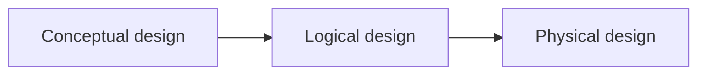
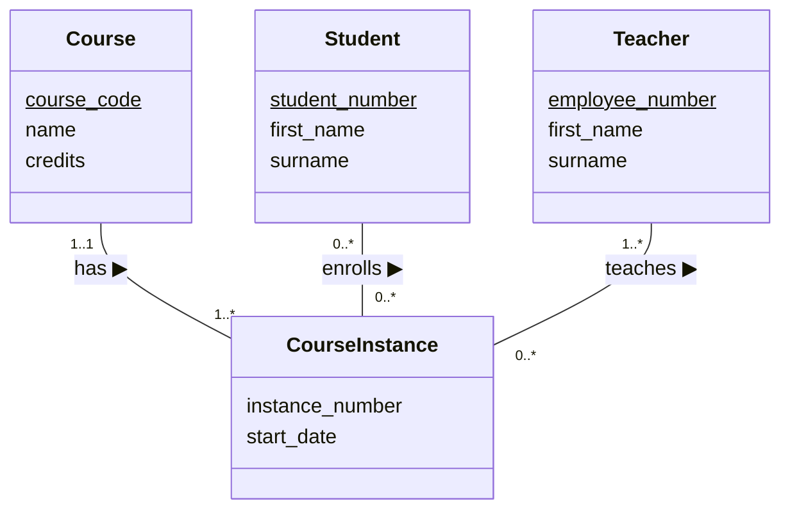
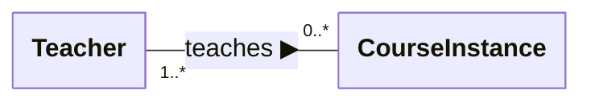

## Database design

- The learning objectives for this week are:
  - Knowing what **database development lifecycle** is and from which phases it consists of
  - Knowing what **conceptual database design** is
  - Knowing what is **entity-relationship modeling**
  - Knowing how to implement and interpret **entity-relationship diagrams**

---

## Database development lifecycle

- So far we have explored and written SQL queries for existing databases, such as the Takkula database
- We have been able to successfully retrieve all kinds of relevant information from the database
- What we might not have thought is that **why** the Takkula database structured as it is
  - Why does it have these specific tables and columns?
  - Why does it have these relationships between tables?
- The end result is an output of the **database development lifecycle**

---

## Database development lifecycle

- The **database development lifecycle** is a step-by-step process of implementing a database for certain set of requirements
- It consists of the following phases:
  1. Database planning
  2. System definition
  3. Requirements collection and analysis
  4. Database design
  5. Database implementation
  6. Data conversion and loading
  7. Testing
  8. Operational maintenance

---

## Database design

- Once the users' requirements are identified after the **requirements collection and analysis phase**, the **database design** phase can start
- **Database design** is a the process of creating a design that will meet the **data requirements** of the enterprise and support its operations
- For example, this is could be one data requirement in the Takkula database:
  - "University has courses. Each course has multiple course instances which are taught during a certain time period. Each course instance has a teacher"

---

## Database design



- A common approach in database design, is the **top-down** approach
- We start from the "top", with the development of high-level conceptual data model with few high-level entity types (for example "Course", "Course instance" and "Teacher")
- Then we move down to the "bottom" by adding details step-by-step until we have developed the physical data model with all the tables, columns and other details about the database schema
- The typical main phases in a systematic top-down database design process are:
  1. Conceptual database design
  2. Logical database design
  3. Physical database design

---

## Conceptual database design

- During the **conceptual database design** phase, a high-level conceptual model of the data requirements of the enterprise is constructed
- The model represents the entities and their relationships
- The model is **independent of all physical considerations**, for example how the data is actually organized into database tables
- The end result is a **conceptual database schema**

---

## Example of conceptual database schema

- Here's an example of the conceptual database schema for a course enrollment database:



---

## Conceptual database design

- The objective of conceptual database design is:
  - To assist in understanding the meaning (semantics) of the data
  - To facilitate communication about the data requirements
  - To understand the requirements (**what** should be done), well enough before moving to any technical considerations (**how** to do it)
- A conceptual data model is used to summarise the designer's understanding of the data requirements, to support communication within the development team and to support communication between the designers and users

---

## Logical database design

- During the **logical database design** phase, the conceptual schema is translated into a logical database structure based on a specific data model (for example the relational model)
- The model represents details about the entities, such as relations, attributes, primary and foreign key contraints and other type of constraints
- The model is **independent of a particular DBMS product** and other physical considerations
- The end result is a **logical database schema**

---

## Example of logical database schema

- Here's an example of the logical database schema for the course enrollment database:

<pre>
Course(<u>course_code</u>, name, credits)
Teacher(<u>employee_number</u>, first_name, surname)
Student(<u>student_number</u>, first_name, surname)

CourseInstance(<u>course_code</u>, <u>instance_number</u>, start_date)
  FOREIGN KEY (course_code) REFERENCES Course(course_code)

Enrollment(<u>course_code</u>, <u>instance_number</u>, <u>student_number</u>)
  FOREIGN KEY (course) REFERENCES Course(course_code)
  FOREIGN KEY (course_code, instance_number)
  REFERENCES CourseInstance(course_code, instance_number)
  FOREIGN KEY (student_number) REFERENCES Student(student_number)
</pre>

---

## Physical database design

- During the **physical database design** phase, a description of the physical implementation of the database is produced
- The model describes the implemention using a **particular DBMS product**
- The model includes tables, columns, column types and all other DBMS specific details
- The end result is a **physical database schema**

---

## Example of physical database schema

- Here's an example of the physical database schema for the course enrollment database:

```sql
CREATE TABLE Course (
    course_code VARCHAR(10) PRIMARY KEY,
    name VARCHAR(100) NOT NULL,
    credits INT NOT NULL
);

CREATE TABLE CourseInstance (
    course_code VARCHAR(10),
    instance_number INT,
    start_date DATE NOT NULL,
    PRIMARY KEY (course_code, instance_number),
    FOREIGN KEY (course_code) REFERENCES Course(course_code)
);

-- ...
```

---

## User views

- Different database users have a different requirements for the database
- A **user view** defines what is required of a database system from the perspective of a particular job role (such as manager or supervisor) or enterprise application area (such as marketing or human resources)
- Each user view defines from its own perspective **what data is held in the database** and **what the user will do with the data** (user transactions)
- We need to able to manage **multiple user views** during the design process
- There is three main approaches to solve this problem: the **centralised**, the **user view integration** and the **combined approach**

---

## Managing multiple user views

- With the **centralised approach**, we first merge requirements for all user views into a
  **single set of requirements** and then create a **single data model** that represents all
  user views
- With the **user view integration approach**, we first create **a separate data model** for each user view and then merge these data models into a **single data model**
- With the **combined approach**, we first, merge some user views and then continue with user view integration approach
- Out of these three approaches, the user view integration approach is preferred when the system is more complex and there are significant differences between user views

---

## Entity-relationship modeling

- **Entity-relationship modeling** (ER) is a conceptual database design approach to visually represent the data structures and their relationships within a system
- Entity-relationship model is commonly visualized as a **entity-relationship diagram** consisting of **entities**, **attributes** and **relationships** between different entities
- **Entities** are real-world objects or concepts that can be distinctly identified. For example "Course", "CourseInstance" and "Student"
- **Attributes** are characteristics or properties of an entity. For example "Course" entity has attributes "name" and "credits"
- **Relationships** are connection or association between entities. For example "Teacher teaches CourseInstance" and "Student enrolls CourseInstance"

---

## Entity-relationship diagram

<div class="flex">

<div class="flex-1">


</div>

<div class="flex-1 m-l-2">

- This ER diagram contains four entities: "Course", "CourseInstance", "Teacher" and "Student"
- Entities are visualized as boxes and entity's attributes are listed inside the box and **primary key is underlined**
- Relationships are visualized as lines between the entity boxes
- Relationship specifies the number of instances of one entity that can be associated with instances of another and optionally a description of the relationship

</div>

</div>

---

## Entity-relationship diagram



- The **multiplicity constraints** describes the number of instances of one entity that can be associated with instances of another
- Multiplicity constraints are represented as **min..max** ranges as below:

| Multiplicity constraint | Meaning      |
| ----------------------- | ------------ |
| 0..1                    | zero or one  |
| 1..1                    | exactly one  |
| 0..*                    | zero or many |
| 1..*                    | one or many  |

- We can also define more specific numbers, for example "5..*" would mean "at least 5"

---

## Relationships in entity-relationship diagrams


- While interpreting the number of instances associated with the entity, we look at the multiplicity constaint on the **opposite side of the relationship**
- For example, "teacher teaches **zero or more** (0..*) course intances". Here we look at the multiplicity constaint on the opposite side of the "Teacher" entity box
- We always interpret a relationship type in both directions, so, for example the **"teaches"** relationship is interpreted as follows:
  - Each teacher teaches on **zero or more** (0..*) course instances
  - Each course instance is taught by **one or more** (1..*) teachers
