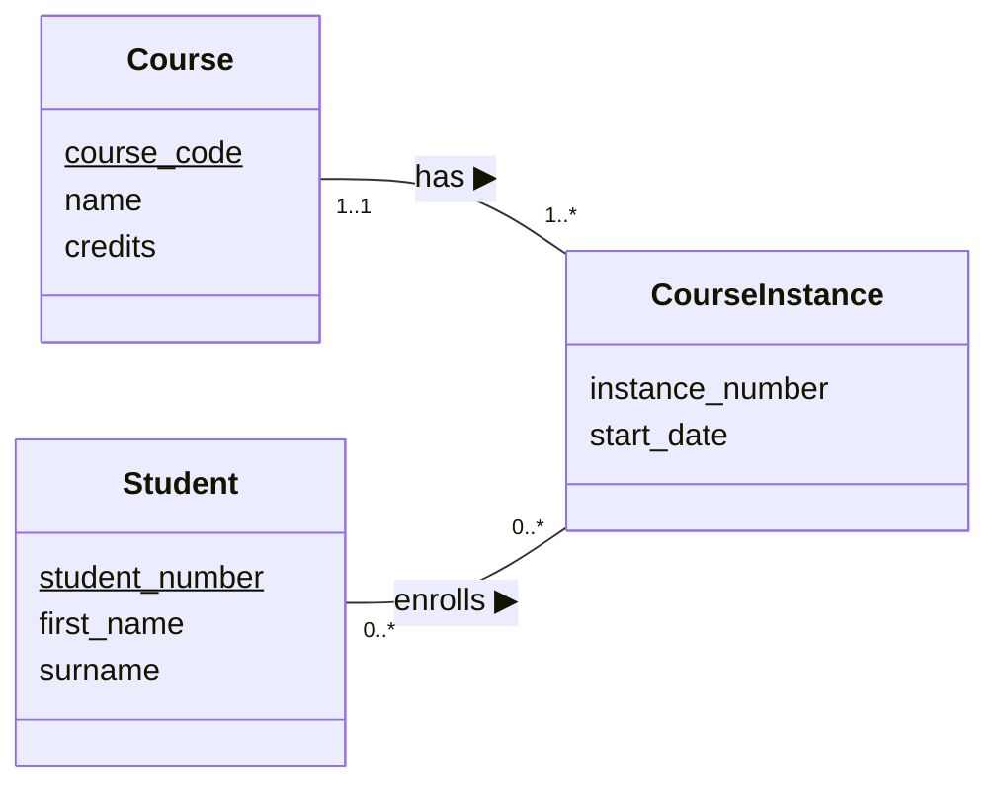
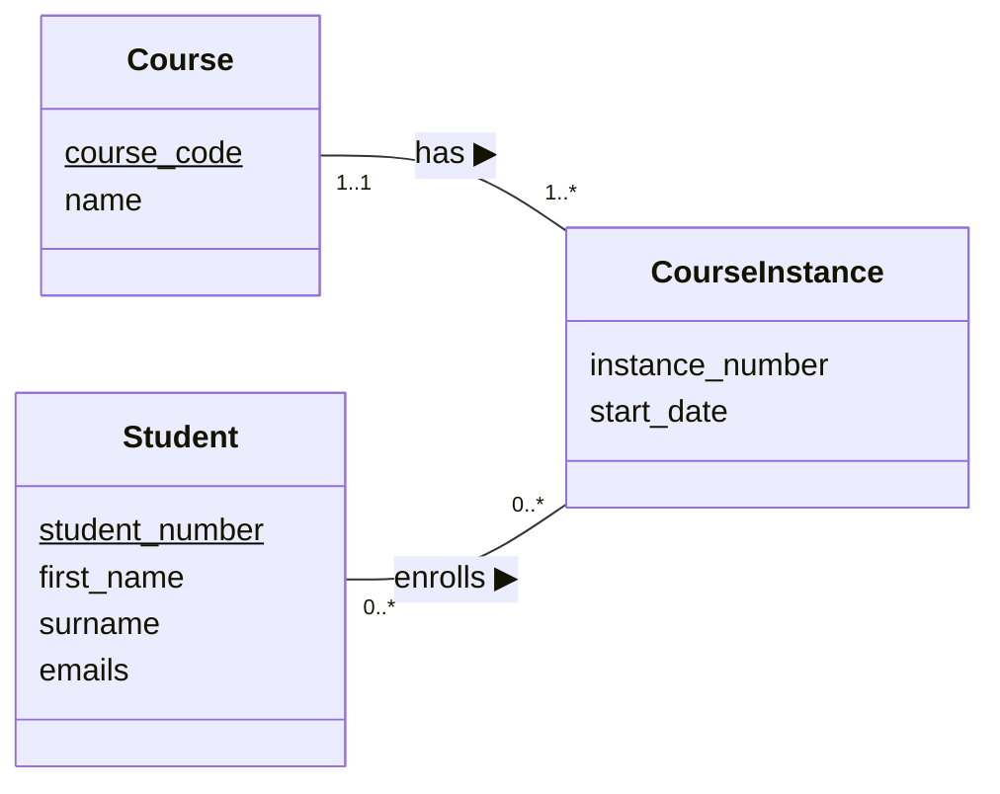
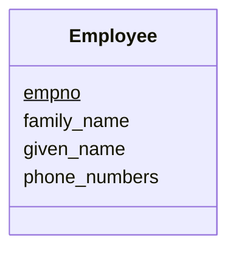

## Logical database design

- The learning objectives for this week are:
  - Knowing what is the objective **logical database design**
  - Knowing how to **derive relations** from entity-relationship diagrams
  - Knowing how to determine **natural primary keys** and **foreign keys**

_A substantial portion of these materials is derived from the work of Kari Silpiö. Any use, reproduction, or distribution of this content requires prior written permission from him._

---

## Logical database design

- The typical main phases in a database design process are:
  1. Conceptual database design
  2. Logical database design
  3. Physical database design
- Each phase from top to bottom adds more detail to the design
- We have familiarized ourselves with the **conceptual database design** by defining entities and their attributes and relationships based on the requirements
- The **logical database design** is the process of refining and translating the conceptual schema into a **logical database schema** based on a specific data model, for example the relational model

---

## Conceptual vs. logical database schema

- Here's a comparison of conceptual (left) and logical (right) database schema of a course enrollment database:

<pre>
Course(<u>course_code</u>, name, credits)
Student(<u>student_number</u>, first_name, surname)

CourseInstance(<u>course_code</u>, <u>instance_number</u>, start_date)
  FOREIGN KEY (course_code) REFERENCES Course(course_code)

Enrollment(<u>course_code</u>, <u>instance_number</u>, <u>student_number</u>)
  FOREIGN KEY (course) REFERENCES Course(course_code)
  FOREIGN KEY (course_code, instance_number)
  REFERENCES CourseInstance(course_code, instance_number)
  FOREIGN KEY (student_number)
  REFERENCES Student(student_number)
</pre>

---

## Logical database design

- Entity types, attributes, and relationship types can be directly transformed into relations with some simple rules
- Typically, the logical database design process includes the following types of activities:
  1. Deriving relations for the logical data model
  2. Validating relations using normalisation
  3. Validating relations against user transaction
  4. Double-checking integrity constraints
  5. Reviewing logical data model with user

---

## Deriving relations for the logical data model

- The process starts by **deriving relations for the logical data model**, which includes:
  1. Creating the relations
  2. Refining the attributes
  3. Determining primary and foreign keys
  4. Determining other types of integrity constraints

---

## Creating relations

- To transform a conceptual schema into a relational database schema, we might need **additional relations** to establish specific relationships
- We create the relations in the following manner:
  - For **each entity type**, we create a relation that includes all simple (single-value) attributes of the entity
  - For **many-to-many relationship types** ("..*" on both sides of the relationship), we create a **"bridge relation"** to represent the relationship
  - For **multi-valued attributes**, we create a new relation to represent the multi-valued attribute. For example, a person may have several phone numbers, but multi-valued attributes are not allow in relations

---

## Example of creating relations

- Let's consider creating relations for the following conceptual model:

---

## Example of creating relations

- In the example we have one **many-to-many relationship** between the _Student_ and _CourseInstance_ entities ("..*" on both sides of the "enrolls" relationship):
  - _"Student enrolls to zero or many course instances and course instance has zero or many students"_
  - In this case we create an additional **bridge relation**, for example _Enrollment_
- There is a **multi-valued attribute** _emails_ in the _Student_ entity
  - In this case we create an additional entity, for example _StudentEmail_
- This leaves with the following relations: _Student_, _CourseInstance_, _Enrollment_ and _StudentEmail_

---

## Refining the attributes

- Once we have created the relations, we need to refine the attributes in the following manner:
  - We divide a non-atomic attribute into smaller (atomic) attributes. For example student's home address can be divided into, city, postal code and street_address attributes
  - We define general (not DBMS-specific) attribute data-types, for example "string" or "integer"
  - We define which attributes can have `NULL` values. We should allow `NULL` in an attribute only based on **strong arguments**

---

## Determining primary keys

<pre>
Student(<u>student_number</u>, first_name, surname)
</pre>

- There should be **exactly one primary key in each relation**
- The primary key can be either a **simple key** (single column, like `course_code` in the `Course` relation) or a **composite key** (several columns, like `course_code` and `instance_number` in the `CourseInstance` relation)
- By definition, the primary key should always satisfy the properties of **requiredness** (not `NULL`), **uniqueness** and **minimality**
- The primary key **should remain stable**. That is, primary key values should not be updated later
- The primary key should be **reasonably short**
- The primary key should have **no privacy issues**. For example social security number has privacy issues

---

## Determining primary key for a weak entity type

- A **weak entity type** is an entity type that is dependent on the existence of another entity type
- For example _CourseGrade_ is existence-dependent on _Student_ and _CourseInstance_
- When a relation derived from a weak entity type, the natural primary key is partially or fully derived from the weak entity type's owner entity type
- For example, the natural primary key of the _CourseGrade_ relation is a composite key that **includes columns from two foreign keys**, one referencing _Student_ and other referencing _CourseInstance_
- The primary key of the weak entity's relation cannot be made until after the foreign keys have been determined for the relation

---

## Surrogate keys

- If there is initially no suitable candidate key for a relation, then we cannot determine a natural primary key
- We have to take care of the situation by including an extra attribute in the relation to act as the primary key
- This kind of primary key is a **surrogate key**
- Surrogate keys are commonly generated values, such as incrementing or random numbers, like the `messageid` primary key in the data below

| messageid | from                       | to                         | title    | body         |
| --------- | -------------------------- | -------------------------- | -------- | ------------ |
| 1         | kalle.ilves@haaga-helia.fi | john.doe@gmail.com         | Greeting | Hello John!  |
| 2         | john.doe@gmail.com         | kalle.ilves@haaga-helia.fi | Response | Hello Kalle! |
| ...       | ...                        | ...                        | ...      | ...          |

---

## Alternate keys

- Candidate keys that are not selected to be primary the key are called **alternate keys**
- We should consider the use of the **unique constraint** on alternate keys to make sure that their values remain unique:

  <pre>
  Student (<u>studentnumber</u>, ssn, familyname, givenname)
    UNIQUE (ssn)
  </pre>

- Especially, when we are using a surrogate primary key, a unique constraint on at least one natural alternate key improves data quality

---

## Determing foreign keys

- In a relational database, **relationships** are represented by the **primary key/foreign key mechanism**
- To know in which relation be need to place the foreign key, we need to identify the **relationship type** between the two entities
- During the course, we will use the following syntax to define the relation's foreign keys in the **relation schema**:

<pre>
Course(<u>course_code</u>, name, credits)

CourseInstance(<u>course_code</u>, <u>instance_number</u>, start_date)
  FOREIGN KEY (course_code) REFERENCES Course(course_code)
</pre>

---

## Determing foreign keys

- Most often the relationship type between two entities falls in **many-to-one**, **many-to-many** and **one-to-one** categories
- Example of **many-to-one relationship** with "..*" on one side and "..1" on another:

- Example of **many-to-many relationship** with "..*" on both sides:

- Example of **one-to-one relationship** with "..1" on both sides:

---

## Many-to-one relationship (1:N)

> _"Division has one or many companies"_

- Place a copy of the **parent relation's** ("..1" side) primary key into the **child relation** ("..\*" side), to act as a foreign key
- If the child relation is derived from a weak entity type, then the primary key of the child relation is typically a composite key

  <pre>
  Company (<u>company_id</u>, name)
  
  Division (<u>division_id</u>, company_id, name)
    FOREIGN KEY (company_id) REFERENCES Company(company_id)
  </pre>

---

## Many-to-many relationship (M:N)

> "Athlete participates in zero or many races and race zero or many athlete participants"

- Create a **bridge relation** to represent the relationship and place a copy of the primary key from each of the parent relations into the bridge relation to act as foreign keys
- Typically, the bridge relation's primary key is a composite key that includes the both foreign keys

  <pre>
  Athlete (<u>athlete_id</u>, first_name, family_name)
  Race (<u>race_id</u>, name, date)
  RaceParticipation(<u>athlete_id</u>, <u>race_id</u>)
    FOREIGN KEY (athlete_id) REFERENCES Athlete(athlete_id),
    FOREIGN KEY (race_id) REFERENCES Race(race_id)
  </pre>

---

## One-to-one relationship (1:1)

> "Team has exactly one athlete leader"

- In case of **mandatory participation** ("1..1" on one side only), place a copy of the primary key from the relation on the "1..1" side into the relation on the "0..1" side to act as the foreign key
- In case of **mandatory participation on both sides** we can usually **combine the two** into one relation
- In case **optional participation** ("0..1" on both sides) the foreign key can be placed in either relation

  <pre>
  Athlete (<u>athlete_id</u>, first_name, family_name)
  Team (<u>team_id</u>, athlete_id, name)
    FOREIGN KEY (athlete_id) REFERENCES Athlete(athlete_id)
  </pre>

---

## Multi-value attributes

- A relation can't have attributes with **multiple values**, such as the _phone\_numbers_ attribute of the _Employee_ entity type in this example (employee has many phone numbers)
- In such case, we must create a **new relation** to represent the multi-valued attribute, for example _EmployeePhone_
- We move the attribute from the original relation and place it to the new relation and place a copy of the parent relation's primary key into the child relation, to act as the foreign key

---

## Multi-value attributes

- In this example, we would get the following relation schema:

  <pre>
  Employee (<u>empno</u>, first_name, family_name)
  EmployeePhone (<u>phone_number</u>, empno)
    FOREIGN KEY (empno) REFERENCES Employee(empno)
  </pre>

---

## Summary

- The objective of logical database design is to translate the conceptual schema into a **logical database schema** based on a specific data model
- During the course, we represent logical database schema as **relation schema**, containing relations their attributes, primary key and foreign keys
- When we derive relations from entity types, we create a relation for each entity type
- Many-to-many relationship requires an additional **bridge relation**
- A **multi-valued attributes** requires an additional relation
- There should be exactly one primary key in each relation
- The foreign key placement depends on the **relationship type** (many-to-one, many-to-many or one-to-one)
