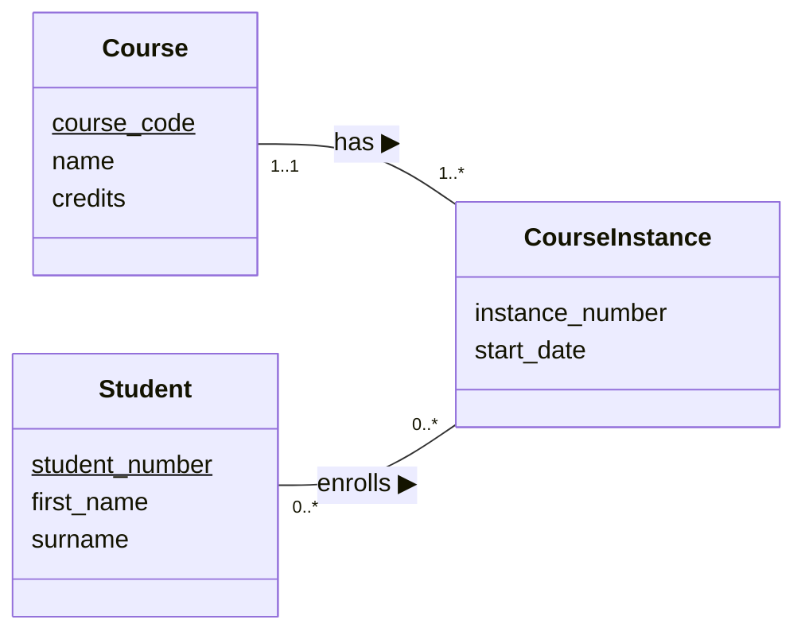
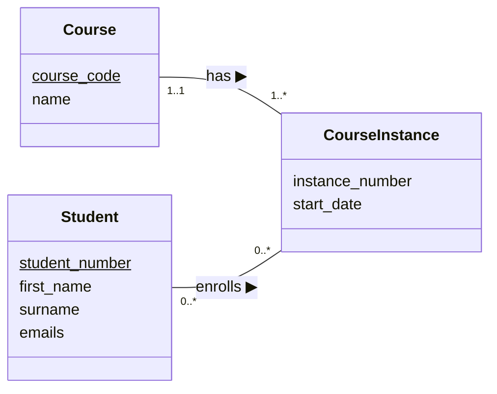
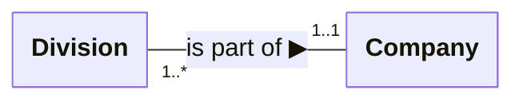
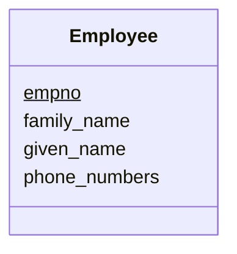

## Logical database design

- The learning objectives for this week are:
  - Knowing what is the objective **logical database design**
  - Knowing how to **derive relations** from entity-relationship diagrams
  - Knowing how to determine **natural primary keys** and **foreign keys**

_A substantial portion of these materials is derived from the work of Kari Silpiö. Any use, reproduction, or distribution of this content requires prior written permission from him._

---

## Logical database design

- The typical main phases in a database design process are:
  1. Conceptual database design
  2. Logical database design
  3. Physical database design
- Each phase from top to bottom adds more detail to the design
- We have familiarized ourselves with the **conceptual database design** by defining entities and their attributes and relationships based on the requirements
- The **logical database design** is the process of refining and translating the conceptual schema into a **logical database schema** based on a specific data model, for example the relational model

---

## Conceptual vs. logical database schema

- Here's a comparison of conceptual (left) and logical (right) database schema of a course enrollment database:

```mermaid
classDiagram
    direction LR
    Course "1..1" -- "1..*" CourseInstance : has ▶
    Student "0..*" -- "0..*" CourseInstance: enrolls ▶

    class Course {
      course_code$
      name
      credits
    }

    class CourseInstance {
      instance_number
      start_date
    }

    class Student {
        student_number$
        first_name
        surname
    }
```

<pre>
Course(<u>course_code</u>, name, credits)
Student(<u>student_number</u>, first_name, surname)

CourseInstance(<u>course_code</u>, <u>instance_number</u>, start_date)
  FOREIGN KEY (course_code) REFERENCES Course(course_code)

Enrollment(<u>course_code</u>, <u>instance_number</u>, <u>student_number</u>)
  FOREIGN KEY (course) REFERENCES Course(course_code)
  FOREIGN KEY (course_code, instance_number)
  REFERENCES CourseInstance(course_code, instance_number)
  FOREIGN KEY (student_number)
  REFERENCES Student(student_number)
</pre>

---

## Logical database design

- Typically, the logical database design process includes the following types of activities:
  1. Derive relations for the logical data model. Entity types, attributes, and relationship types from a conceptual schema can be directly transformed into relations with some simple rules
  2. Validate that the relations don't have redundancies using normalization techniques
  3. Validate relations against users' requirements. For example, _"list all course names a student has enrolled to"_ could be a user's requirement for a schema
  4. Verify integrity constraints, e.g., primary keys, foreign keys and not null contraints
  5. Review the model with users

---

## Deriving relations for the logical data model

- The process starts by **deriving relations for the logical data model**, which includes:
  1. Creating the relations
  2. Refining the attributes. For example, a non-atomic `full_name` attribute could be refined to `first_name` and `surname` attributes
  3. Determining primary and foreign keys
  4. Determining other types of integrity constraints. For example `Course` relation's `name` attribute should have a not null constraint

---

## Creating relations

- To transform a conceptual schema into a relational database schema, we might need **additional relations** to establish specific relationships
- We create the relations in the following manner:
  - For **each entity type**, we create a relation that includes all simple (single-value) attributes of the entity
  - For **many-to-many relationship types** ("..\*" on both sides of the relationship), we create a **"bridge relation"** to represent the relationship
  - For **multi-valued attributes**, we create a new relation to represent the multi-valued attribute. For example, a person may have several phone numbers, but multi-valued attributes are not allowed in relations

---

## Example of creating relations

- Let's consider creating relations for the following conceptual model:

```mermaid
classDiagram
    direction LR
    Course "1..1" -- "1..*" CourseInstance : has ▶
    Student "0..*" -- "0..*" CourseInstance: enrolls ▶

    class Course {
      course_code$
      name
    }

    class CourseInstance {
      instance_number
      start_date
    }

    class Student {
        student_number$
        first_name
        surname
        emails
    }
```

---

## Example of creating relations

- In the example we have one **many-to-many relationship** between the `Student` and `CourseInstance` entities ("..\*" on both sides of the "enrolls" relationship):
  - _"Student enrolls to zero or many course instances and course instance has zero or many students"_
  - In this case we create an additional **bridge relation**, for example `Enrollment`
- There is a **multi-valued attribute** `emails` in the `Student` entity
  - In this case we create an additional entity, for example `StudentEmail`
- This leaves with the following relations: `Student`, `CourseInstance`, `Enrollment` and `StudentEmail`

---

## Refining the attributes

- Once we have created the relations, we need to refine the attributes in the following manner:
  - Divide non-atomic attributes into smaller, atomic attributes. For example, a student's home address can be split into `city`, `postal_code`, and `street_address`
  - Define general (not DBMS-specific) attribute data types, such as `text`, `integer` or `date`
  - Decide which attributes can have a `NULL` (missing) value. Allow a `NULL` value only when there is a clear and valid reason, because inappropriate `NULL` values degrade data quality

---

## Determining primary keys

<pre>
Student(<u>student_number</u>, first_name, surname)
</pre>

- There should be **exactly one primary key in each relation**
- The primary key can be either a **simple key** (single column, like `course_code` in the `Course` relation) or a **composite key** (several columns, like `course_code` and `instance_number` in the `CourseInstance` relation)
- By definition, the primary key should always satisfy the properties of **requiredness** (not `NULL`), **uniqueness** and **minimality**
- The primary key **should remain stable**. That is, primary key values should not be updated later
- The primary key should be **reasonably compact** (e.g. a short string or an integer), to improve performance and minimize storage

---

## Primary key of a weak entity type

- A **weak entity type** is an entity type that is dependent on the existence of another entity type and cannot be uniquely identified by its own attributes alone
- For example, `CourseGrade` cannot exist without a `Student` and a `CourseInstance`
- When a relation is derived from a weak entity type, its natural primary key is usually derived partly or fully from the owner entity type(s)
- In practice, `CourseGrade` can use a composite primary key such as (`student_number`, `course_code`, `instance_number`), where the columns come from foreign keys to `Student` and `CourseInstance`
- Because of this, we determine the foreign keys first and then define the weak entity relation's primary key

---

## Surrogate keys

- If there is initially no suitable candidate key for a relation, then we cannot determine a natural primary key
- We have to take care of the situation by including an extra attribute in the relation to act as the primary key, which is called a **surrogate key**
- Surrogate keys are commonly generated values, such as incrementing or random numbers, like the `messageid` primary key in the data below

| messageid | from                       | to                         | title    | body         |
| --------- | -------------------------- | -------------------------- | -------- | ------------ |
| 1         | kalle.ilves@haaga-helia.fi | john.doe@gmail.com         | Greeting | Hello John!  |
| 2         | john.doe@gmail.com         | kalle.ilves@haaga-helia.fi | Response | Hello Kalle! |
| ...       | ...                        | ...                        | ...      | ...          |

---

## Alternate keys

- Candidate keys that are not selected to be primary the key are called **alternate keys**
- Alternate keys are unique by nature, so we should consider the use of the **unique constraint** on alternate keys to enforce their uniqueness:

  <pre>
  Student (<u>studentnumber</u>, ssn, familyname, givenname)
    UNIQUE (ssn)
  </pre>

- Especially, when we are using a surrogate primary key, a unique constraint on at least one natural alternate key improves data quality

---

## Determining foreign keys

- In the relational model, relationships are represented by a **foreign key that references a primary key**
- To decide where the foreign key should be placed, we first identify the **relationship type** between the entities
- In this course, we describe foreign keys in the **relation schema** using the following notation:

<pre>
Course(<u>course_code</u>, name, credits)

CourseInstance(<u>course_code</u>, <u>instance_number</u>, start_date)
  FOREIGN KEY (course_code) REFERENCES Course(course_code)
</pre>

---

## Relationship types

- Most often the relationship type between two entities falls in **many-to-one**, **many-to-many** and **one-to-one** categories
- Example of **many-to-one relationship** with "..\*" on one side and "..1" on another:

```mermaid
---
  config:
    class:
      hideEmptyMembersBox: true
---

classDiagram
    direction LR
    class Division {

    }

    class Company {

    }

    Division "1..*" -- "1..1" Company : is part of ▶
```

- Example of **many-to-many relationship** with "..\*" on both sides:

```mermaid
---
  config:
    class:
      hideEmptyMembersBox: true
---

classDiagram
    direction LR

    Athlete "0..*" -- "0..*" Race : participates ▶
```

- Example of **one-to-one relationship** with "..1" on both sides:

```mermaid
---
  config:
    class:
      hideEmptyMembersBox: true
---

classDiagram
    direction LR

    Athlete "1..1" -- "0..1" Team : leads ▶
```

---

## Many-to-one relationship (1:N)

> _"Division has one or many companies"_

```mermaid
---
  config:
    class:
      hideEmptyMembersBox: true
---

classDiagram
    direction LR

    Division "1..*" -- "1..1" Company : is part of ▶
```

- Place a copy of the **parent relation's** ("..1" side) primary key into the **child relation** ("..\*" side), to act as a foreign key
- If the child relation is derived from a weak entity type, then the primary key of the child relation is typically a composite key

  <pre>
  Company (<u>company_id</u>, name)
  
  Division (<u>division_id</u>, company_id, name)
    FOREIGN KEY (company_id) REFERENCES Company(company_id)
  </pre>

---

## Many-to-many relationship (M:N)

> "Athlete participates in zero or many races and race zero or many athlete participants"

```mermaid
---
  config:
    class:
      hideEmptyMembersBox: true
---

classDiagram
    direction LR

    Athlete "0..*" -- "0..*" Race : participates ▶
```

- Create a **bridge relation** to represent the relationship and place a copy of the primary key from each of the parent relations into the bridge relation to act as foreign keys
- Typically, the bridge relation's primary key is a composite key that includes the both foreign keys

  <pre>
  Athlete (<u>athlete_id</u>, first_name, family_name)
  Race (<u>race_id</u>, name, date)
  RaceParticipation(<u>athlete_id</u>, <u>race_id</u>)
    FOREIGN KEY (athlete_id) REFERENCES Athlete(athlete_id),
    FOREIGN KEY (race_id) REFERENCES Race(race_id)
  </pre>

---

## One-to-one relationship (1:1)

> "Team has exactly one athlete leader"

```mermaid
---
  config:
    class:
      hideEmptyMembersBox: true
---

classDiagram
    direction LR

    Athlete "1..1" -- "0..1" Team : leads ▶
```

- In case of **mandatory participation** ("1..1" on one side only), place a copy of the primary key from the relation on the "1..1" side into the relation on the "0..1" side to act as the foreign key
- In case of **mandatory participation on both sides** we can usually **combine the two** into one relation
- In case **optional participation** ("0..1" on both sides) the foreign key can be placed in either relation

  <pre>
  Athlete (<u>athlete_id</u>, first_name, family_name)
  Team (<u>team_id</u>, athlete_id, name)
    FOREIGN KEY (athlete_id) REFERENCES Athlete(athlete_id)
  </pre>

---

## Multi-value attributes

```mermaid
---
  config:
    class:
      hideEmptyMembersBox: true
---

classDiagram
    direction TB
    class Employee {
        empno$
        family_name
        given_name
        phone_numbers
    }
```

- A relation can't have attributes with **multiple values**, such as the _phone_numbers_ attribute of the `Employee` entity type in this example (employee has many phone numbers)
- In such case, we must create a **new relation** to represent the multi-valued attribute, for example a `EmployeePhone` relation
- We move the attribute from the original relation and place it to the new relation and place a copy of the parent relation's primary key into the child relation, to act as the foreign key

---

## Multi-value attributes

```mermaid
---
  config:
    class:
      hideEmptyMembersBox: true
---

classDiagram
    direction TB
    class Employee {
        empno$
        family_name
        given_name
        phone_numbers
    }
```

- In this example, we would get the following relation schema:

  <pre>
  Employee (<u>empno</u>, first_name, family_name)
  EmployeePhone (<u>phone_number</u>, empno)
    FOREIGN KEY (empno) REFERENCES Employee(empno)
  </pre>

---

## Summary

- The objective of logical database design is to translate the conceptual schema into a **logical database schema** based on a specific data model
- During the course, we represent logical database schema as **relation schema**, containing relations their attributes, primary key and foreign keys
- When we derive relations from entity types, we create a relation for each entity type
- Many-to-many relationship requires an additional **bridge relation**
- A **multi-valued attributes** requires an additional relation
- There should be exactly one primary key in each relation
- The foreign key placement depends on the **relationship type** (many-to-one, many-to-many or one-to-one)
