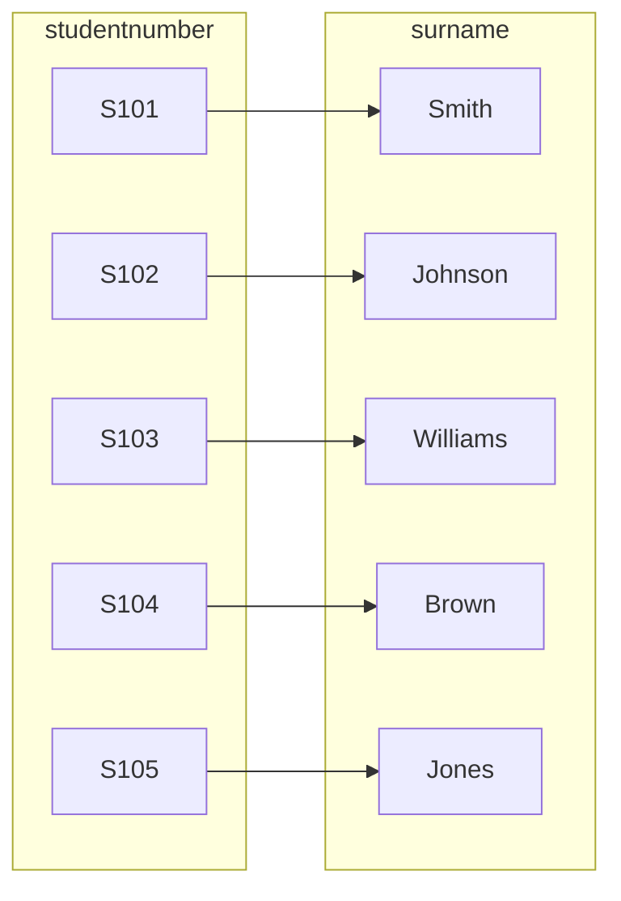

## Database normalisation

- The learning objectives for this week are:
  - Knowing the purpose of **database normalisation**
  - Knowing what is a **functional dependency**, a **partial dependency** and a **transitive dependency**
  - Knowing how to identify functional dependencies in a relation or table
  - Knowing the different **normal form** (1NF, 2NF, 3NF, BCNF) rules
  - Knowing how to formally check if a relation is in the **Boyce-Codd normal form** (BCNF)
  - Knowing how to **decompose a relation** into smaller relations if it is not in BCNF

<div class="text-sm text-gray-5" style="position: absolute; left: 16px; bottom: 0px;">

_A substantial portion of these materials is derived from the work of Kari Silpiö. Any use, reproduction, or distribution of this content requires prior written permission from him._

</div>

---

## Database normalisation

- **Database normalisation** is a formal technique of organizing data in a database in a way that **redundancy** and **inconsistency** within the data is eliminated
- The objective of database normalisation is to ensure that:
  - Attributes with a **close logical relationship** (functional dependency) are found in the **same relation**
  - The relations do not display **hidden data redundancy**, which can cause inconsistencies that violate database integrity
- The technique involves a set of normalisation rules, known as **normal forms**, which serve as criteria for achieving a well-structured, also called _"normalized"_, database design

---

## Redundancy example

- Let's consider **redundancy problems** with the following `CourseEnrolment` relation rows:

| course_code | instance_number | student_number | phone | email                       | enrolment_date |
| ----------- | --------------- | -------------- | ----- | --------------------------- | -------------- |
| C101        | 1               | S101            | 1234  | emma.wilson@university.com  | 2025-04-01     |
| C101        | 1               | S102            | 5555  | oliver.brown@university.com | 2025-04-02     |
| c102        | 3               | S103            | 8765  | sophia.clark@university.com | 2025-04-01     |
| C102        | 3               | S104            | 1414  | leo.miller@university.com   | 2025-04-03     |
| C102        | 3               | S101            | 1234  | emma.wilson@university.com  | 2025-04-07     |

---

## Redundancy example

- The student with student number `S101` has their **phone number and email duplicated** causing redundancy in the data
- While, for example, updating a phone number or inserting a new row, there's an inconsistency risk of having **multiple different phone numbers for the same student**:

| course_code | instance_number | student_number | phone                               | email                      | enrolment_date |
| ----------- | --------------- | -------------- | ----------------------------------- | -------------------------- | -------------- |
| C101        | 1               | S101            | <span v-mark.circle.red>1234</span> | emma.wilson@university.com | 2025-04-01     |
| ...         | ...             | ...            | ...                                 | ...                        | ...            |
| C102        | 3               | S101            | <span v-mark.circle.red>3338</span> | emma.wilson@university.com | 2025-04-07     |

---

## Database normalisation

- In a case of fixing an identified structural problem, normalisation involves **decomposing a relation into less redundant (and smaller) relations** without losing information
- For example, in the previous `CourseEnrolment` relation example, the student-related information would be extracted into a new `Student` relation
- When an **ER model is well designed**, the resulting correctly derived relations won't normally have such structural problems and they will meet the criteria of database normalisation
- Normalisation of candidate relations derived from ER diagrams is accomplished by analysing the **functional dependencies** associated with those relations

---

## Functional dependency

<div class="flex">

<div class="flex-basis-70% m-r-2">



</div>

<div>

- A **functional dependency** is a relationship between two attributes in which one attribute determines the value of another attribute
- We only care about relationships that are **always true**, not just true in one small sample
- For example, in the `Student` relation, **one student number is linked to exactly one surname**, so there is a functional dependency in which `studentnumber` determines the `surname`
- In contrast, **one surname can belong to many students**, so there is **no** functional dependency in which `surname` determines the `studentnumber`

</div>

</div>

---

## Functional dependency

- A functional dependency occurs when attribute A in a relation **uniquely determines** attribute B
- In other words: for each value of A there is **exactly one value** of B and that **holds all the time**. This can be written as `A → B`
- The **determinant** of a functional dependency refers to the attribute, or group of attributes, on the **left-hand side** of the arrow. In `A → B`, A is the determinant of B.
- On the **right-hand side**, there's the **dependent**. In `A → B`, B is the dependent of A.

$$
\underbrace{\text{studentnumber}}_{\text{determinant}} \rightarrow \underbrace{\text{surname}}_{\text{dependent}}
$$

---

## Example of functional dependency

- Let's suppose that each student has a unique student number. In the relation below, `studentnumber` uniquely determines `surname` and `firstname`. That is, **`studentnumber` is the determinant of `surname` and `firstname`**:

<pre>Student (<u>studentnumber</u>, surname, firstname)</pre>

- In this example, there are the following two functional dependencies:
  - `studentnumber → surname`
  - `studentnumber → firstname`
- In contrast, the following **is not a functional dependency**:
  - `surname → studentnumber`

---

## Example of functional dependency

- Let's suppose the following table occurrence:

  | studentnumber | surname | firstname |
  | ------------- | ------- | --------- |
  | S101           | Smith   | John      |
  | S102           | Smith   | Susan     |
  | S103           | Jones   | Susan     |

- The **functional dependency** `studentnumber → surname` guarantees that the query below (that uses an existing student number) returns exactly one surname and that holds all the time:

```sql
SELECT surname FROM Student WHERE studentnumber = 'a12345'
```

---

## Example of functional dependency

- `{A, B} → C` means that **A and B together uniquely determine C**. For example, `{course_code, instance_number} → start_date`
- `A → B, C, D` means that **A uniquely determines B, C, and D**. For example, `course_code → course_name, language, credits`

---

## Identifying undesired data redundancy

- 👍 Relations that **do not have** undesired data redundancy, **each determinant is a candidate key** (a unique attribute that is suitable for being the primary key)
- In such case **all arrows are arrows out of whole candidate keys** (simple or composite key)
- Let's consider the following relation **without data redundancy**:

<pre>CourseInstance (<u>course_code</u>, <u>instance_number</u>, startdate, teachernumber)</pre>

- In this relation, there are, for example, the following functional dependencies:
  - ✅ `{course_code, instance_number} → startdate, teachernumber`

---

## Identifying undesired data redundancy

- 👎 Relations that **have** undesired data redundancy, **there is a determinant that is not a candidate key**
- In such case **there is one arrow that is not an arrow out of a whole candidate key**
- Let's consider the following relation **with data redundancy**:

<pre>CourseInstance (<u>course_code</u>, <u>instance_number</u>, coursename, startdate, teachernumber, surname)</pre>

<div class="mt-2">

| course_code | instance_number | coursename                                      | startdate  | teachernumber | surname                              |
| ----------- | --------------- | ----------------------------------------------- | ---------- | ------------- | ------------------------------------ |
| C101        | 1               | <span v-mark.circle.red>Database Systems</span> | 2025-02-10 | T101          | <span v-mark.circle.red>Smith</span> |
| C101        | 2               | <span v-mark.circle.red>Database Systems</span> | 2025-09-05 | T102          | Jones                                |
| C102        | 1               | Web Development                                 | 2025-03-12 | T103          | Brown                                |
| C103        | 1               | Data Analytics                                  | 2025-05-20 | T101          | <span v-mark.circle.red>Smith</span> |

</div>

---

## Identifying undesired data redundancy

<pre>CourseInstance (<u>course_code</u>, <u>instance_number</u>, coursename, startdate, teachernumber, surname)</pre>

- In this relation, there are, for example, the following functional dependencies:
  - ✅ `{course_code, instance_number} → coursename, startdate, teachernumber, surname`
  - ❌ `course_code → coursename`
  - ❌ `teachernumber → surname`
- In functional dependencies `course_code → coursename` and `teachernumber → surname`, **the determinants are not candidate keys**
- With such functional dependencies, the relation has redundant data. For example the teacher's surname is repeated unnecessarily
- Instead, the teacher's information should be in a **separate relation**

---

## Calculated attributes

- We **should not include** attributes in a relation that we can **derive** from other relations or **calculate**
- For example, let's suppose that the company's total budget is the total of department budgets
- Therefore, `totalbudget` is a **calculated attribute** in the `Company` relation and its value should change whenever any department budget is changed in the company
- From the data redundancy and integrity viewpoint, we have a problem here because total budget exists twice in the design:

<pre>
Company (<u>companyno</u>, companyname,  <span v-mark="{ color: 'rgba(250, 204, 21, 0.5)', type: 'highlight' }">totalbudget</span>)
Department (<u>deptno</u>, deptname, deptbudget, companyno)
    FK (companyno) REFERENCES Company (companyno)</pre>

---

## Calculated attributes

- We shouldn't have the `totalbudget` attribute in the `Company` relation, instead we can calculate it with the following query:

```sql
SELECT SUM(deptbudget) as totalbudget FROM Department
WHERE companyno = 'c101'
```

<div class="mt-2">

| deptno | deptname                 | deptbudget | companyno |
| ------ | ------------------------ | ---------- | --------- |
| D101   | Research and Development | 1200000    | C101      |
| D102   | Marketing                | 850000     | C101      |
| D103   | Human Resources          | 400000     | C101      |

</div>

---

## Normal forms


- **Normal form** refers to a set of normalisation rules that a database relation should follow in order to be considered _"normalized"_ and thus **well-organized**
- During the course we will cover the most common normal forms: **first normal form** (1NF), **second normal form** (2NF), **third normal form** (3NF) and **Boyce-Codd normal form** (BCNF)
- Each normal form from 1NF to BCNF **adds more rules** to the previous normal form
- For example, the 2NF **includes all rules** of the 1NF and additional rules
- The Boyce-Codd Normal Form (BCNF) is the strictest of these normal forms
- To figure out the normal form of the relation, we start from the rules of first normal form and move on to the following normal forms until some rule is violated or the relation is in BCNF

---

## First normal form (1NF)

- A relation is in the **first normal form** (1NF) if the following rules apply:
  - All attributes in a relation **must have atomic values**. No multi-valued attributes are allowed
  - A relation **must have a primary key** and all its **attributes must be dependent on the primary key**
- Let's consider the following relation:

<pre>Student (<u>studentno</u>, surname, firstname, <span v-mark.underline.red>StudentEmail(email, verified)</span>)</pre>

- ❌ The relation has **a multi-valued attribute**, which represents the student's email addresses
- That is, the relation **is not in 1NF**

---

## Second normal form (2NF)

- A relation is in the **second normal form** (2NF) if the following rules apply:
  - Relation is in 1NF
  - Relation has no **partial functional dependencies**, meaning that there is no **part of a candidate key** that uniquely determines a **non-candidate-key** attribute
- Let's consider the following relation:

<pre>ClubMembership (<u>empno</u>, <span v-mark.circle.red><u>clubno</u></span>, <span v-mark.circle.red>clubname</span>, joindate)</pre>

- ❌ The relation has a **partial functional dependency** `clubno → clubname`, because the `clubno` attribute is part of the composite primary key `(empno, clubno)`
- That is, the relation **is not in 2NF**
- ❓ What is the normal form of the relation?

---

## Third normal form (3NF)

- A relation is in the **third normal form** (3NF) if the following rules apply:
  - Relation is in 2NF
  - Relation has no functional dependency between two **non-candidate-key** attributes, meaning no **non-candidate-key** attribute is allowed to be **transitively** dependent on any **candidate key** within the relation
- Let's consider the following relation:

<pre>Employee (<u>empno</u>, surname, firstname, <span v-mark.circle.red>deptno</span>, <span v-mark.circle.red>deptname</span>)</pre>

- ❌ The relation has a **transitive functional dependency** `deptno → deptname`, causing `deptname` to be **transitively dependent** on `empno` via `deptno`
- That is, the relation **is not in 3NF**
- ❓ What is the normal form of the relation?

---

## Boyce-Codd Normal Form (BCNF)

- A relation is in the **Boyce-Codd Normal Form** (BCNF) if the following rules\* apply:
  - Each determinant (left) is a candidate key
  - All attribute values are atomic (single values)
  - There is a determinant (left) for each attribute that is not contained in a candidate key
- Let's consider the following relation:

<pre>Teacher (<u>teacherno</u>, firstname, surname)</pre>

- `teacherno → firstname, surname` is the only functional dependency in the relation
- ✅ Each determinant is a candidate key
- ✅ All attribute values are atomic (single values)
- ✅ There is a determinant for each attribute that is not contained in a candidate key
- Thus, **the relation is in BCNF**

<div class="text-sm text-gray-5" style="position: absolute; left: 16px; bottom: 0px;">
* This is slighly simplified set of rules compared to the formal Boyce-Codd Normal Form
</div>

---

## Boyce-Codd Normal Form (BCNF)

- Let's consider the following relation:

<pre>CourseGrade (<u>course_code</u>, <span v-mark.circle.red><u>studentno</u></span>, <span v-mark.circle.red>firstname</span>, <span v-mark.circle.red>surname</span>, grade)</pre>

- `studentno → firstname, surname` is one of the functional dependencies in the relation
- ❌ `studentno` is **not a candidate key** in the relation (so each determinant is **not** a candidate key)
- Thus, **the relation is not in BCNF**
- ❓ What is the normal form of the relation?

---

## Turning a relation into Boyce-Codd Normal Form

- To convert a **non-BCNF relation to BCNF**, we must decompose the relation in two steps
- Step 1: Find a functional dependency `X → Y` which violates the BCNF rule (find a determinant that is **not a candidate key**)
- Step 2: Split the original relation in two relations as follows:
  - Create a new relation with all attributes (for example both X and Y) from the dependency. X will be the primary key in the new relation
  - Remove Y attribute(s) from the original relation and leave X in the original relation to act as a foreign key.
- We repeat the steps above until all of our relations are in BCNF

---

## Turning a relation into Boyce-Codd Normal Form

- Let's consider the following non-BCNF relation we want to convert to BCNF:

<pre>CourseInstance (<u>course_code</u>, <u>instance_number</u>, coursename, startdate, teacherno,  surname, firstname)</pre>

- In the first step, we identify the **functional dependencies**:
  - `{course_code, instance_number} → coursename, startdate, teacherno, surname, firstname`
  - `course_code → coursename`
  - `teacherno → surname, firstname`
- Then, we identify functional dependencies where the determinant is **not a candidate key**
- There are two such cases: `course_code → coursename` and `teacherno → surname, firstname`

---

## Turning a relation into Boyce-Codd Normal Form

- In the second step, to solve these two cases we split the original relation two times
- With `course_code → coursename` we create a new relation Course with attributes `course_code` and `coursename`
- The determinant, the `course_code` will be the primary key for the relation. We'll get the following relation:

<pre>Course (<u>course_code</u>, coursename)</pre>

- Finally, we remove the `coursename` from the CourseInstance relation and leave `course_code` as a foreign key:

<pre>
<span v-mark="{ color: 'rgba(250, 204, 21, 0.5)', type: 'highlight' }">Course (<u>course_code</u>, coursename)</span>

CourseInstance (<u>course_code</u>, <u>instance_number</u>, startdate, teacherno,  surname, firstname)
  <span v-mark="{ color: 'rgba(250, 204, 21, 0.5)', type: 'highlight' }">FK (course_code) REFERENCES Course(course_code)</span>
</pre>

---

## Turning a relation into Boyce-Codd Normal Form

- We will repeat the same process with `teacherno → surname, firstname`, and the final relations are the following:
  <pre>
  Course (<u>course_code</u>, coursename)
  <span v-mark="{ color: 'rgba(250, 204, 21, 0.5)', type: 'highlight' }">Teacher (<u>teacherno</u>, surname, firstname)</span>
  
  CourseInstance (<u>course_code</u>, <u>instance_number</u>, startdate, teacherno)
    FK (course_code) REFERENCES Course(course_code)
    <span v-mark="{ color: 'rgba(250, 204, 21, 0.5)', type: 'highlight' }">FK (teacherno) REFERENCES Teacher(teacherno)</span>
  </pre>

- Finally, we **check the decomposed relations**
- In each relation above each determinant is a candidate key and each attribute non-candidate-key attribute has a determinant
- Therefore, the **relations are in BCNF** and we have successfully removed all the undesired redundancy from the design

---

## Summary

- **Database normalisation** is a formal technique of organizing data in a database in a way that **redundancy** and **inconsistency** within the data is eliminated
- A **functional dependency** is a relationship between two attributes in which one attribute determines the value of another attribute
- Normalisation involves analyzing a relation agains **normalisation rules** to determine if a relation is in a certain **normal form** (1NF, 2NF, 3NF, BCNF)
- Normalisation rules determine what kind **functional dependencies** the relation can have
- We determine the normal form of relation by starting from the 1NF and checking the normal form rules until we find a violation or reach the BCNF
- We can turn a non-BCNF relation into BCNF relations by decomposing the relation
