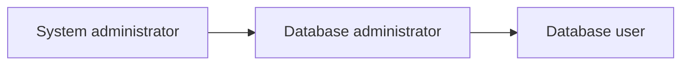
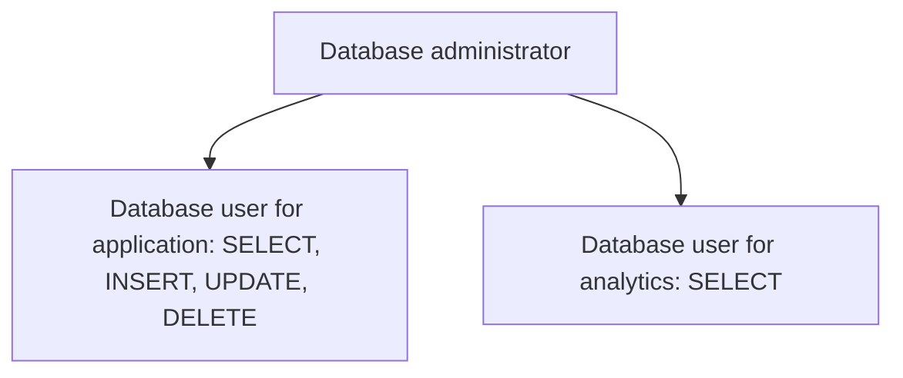
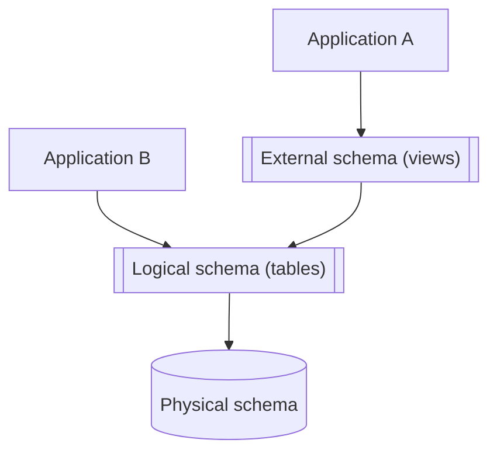

## SQL access control and views

- The learning objectives for this week are:
  - Knowing what is the purpose of access control in the database security
  - Knowing what is **discretionary access control**
  - Knowing what is the DBMS access control hierarchy
  - Knowing how to manage users, roles and privileges in the SQL server
  - Knowing the purpose of **SQL views** and how to create them

<div class="text-sm text-gray-5" style="position: absolute; left: 16px; bottom: 0px;">

_A substantial portion of these materials is derived from the work of Kari Silpiö. Any use, reproduction, or distribution of this content requires prior written permission from him._

</div>

---

## Database security

- Database security is accomplished by **verifying the identity of the database users** (authentication) and **controlling what these users are permitted to do** (authorization)
- User authentication is accomplished with either **SQL authentication** (using a username and password registered to the DBMS) or **operating system authentication** (the DBMS trusts the authentication service of the operating system)
- The typical user authorisation mechanism is called **discretionary access control** (DAC)

---

## Discretionary access control (DAC)

- In **discretionary access control** each user is given appropriate access rights (or privileges) on specific database objects (for example tables)
- Users can obtain certain privileges when they create an object (for example a table) and **they can pass some or all of these privileges to other users** at their discretion
- The ISO SQL Standard leaves many access control details to be **implementation-dependent**
- Different DBMS share many similarities in the access control implementation, but the detailed syntax for specifying access control is **DBMS-specific**
- In the upcoming examples we will learn how to specify access control in the SQL server

---

## DBMS access control hierarchy



- Privileges are granted to an user by another user in a higher **access control hierarchy level**
- At the top of the hierarchy there's is the **system administrator** user who has access to **everything**
- The system administrator's username is automatically created when the DBMS is installed
- The system administrator creates databases and usernames for **database administrators**
- Database administrators have all possible privileges on the database they are granted access to

---

## DBMS access control hierarchy



- Database administrators create usernames for **database users** and grant them different privileges
- For example, certain users can be granted privileges to create database tables and grant privileges to other users for the created tables
- In contrast, certain users can be granted privileges to only retrieve data from the database (`SELECT`)

---

## Users, database roles, and privileges

- **Database users** can be added to **database roles**, inheriting any privileges associated with those roles
- A user **privilege** is a right to execute a particular type of SQL statement (for example `SELECT`, `INSERT`, `UPDATE`), or a right to access another user's database object
- A privilege can be granted to directly a user or database role
- Database roles make it easier to manage privileges to be granted to a group of users of the same type
- The built-in **PUBLIC** role is contained in every database. Permissions granted to this role are inherited by all other users and roles

---

## Granting privileges

- This is the simplified syntax of the `GRANT` statement in SQL Server:
  
  ```sql
  GRANT privilegeList ON objectName
  TO { authorizationIdList | PUBLIC }
  [ WITH GRANT OPTION ]
  ```

- `privilegeList` consists of one or more of the following privileges
  separated by commas: `SELECT`, `INSERT`, `UPDATE`, `DELETE`, ...
- `objectName` can be any a base table, view etc.
- `authorizationIdList` consists of one or more of following separated
  by commas: user, role
- `WITH GRANT OPTION` allows privileges to be passed on to other users

---

## Example of granting privileges

- Here is an example, how we can grant `SELECT`, `INSERT`, and `UPDATE` privileges for the user `kalle` on a `Course` table:

  ```sql
  -- user "kalle" is granted privilege to connect to the database
  GRANT CONNECT TO kalle
  -- user "kalle" is granted privilege
  -- to perform SELECT, INSERT and UPDATE statements on the Course table
  GRANT SELECT, INSERT, UPDATE ON Course TO kalle
  ```

---

## Example of users, roles and privileges

- Here is an example, how we can create roles and grant privileges to roles:

  ```sql
  -- Change the database context to the specified database
  USE UniversityDatabase
  -- 1. Create database roles in the current database
  CREATE ROLE student_role
  CREATE ROLE teacher_role
  -- 2. Grant privileges to database roles
  -- Allow the user to connect to the database
  GRANT CONNECT TO student_role
  GRANT CONNECT TO teacher_role
  -- Allow the user to create tables
  -- and grant privileges on their own tables to other users/roles
  GRANT CREATE TABLE TO student_role WITH GRANT OPTION
  -- Grant different privileges on existing tables to different roles
  GRANT SELECT, INSERT, UPDATE, DELETE ON Course TO teacher_role
  GRANT SELECT ON Course TO student_role
  ```

---

## Example of users, roles and privileges

- Here is an example, how we can create username and password logins for users and add them to roles:

  ```sql
  -- 3. Create DBMS-instance-level login names for the DBMS instance
  CREATE LOGIN s001 WITH PASSWORD = 'wekPkuO-52'
  CREATE LOGIN h1234 WITH PASSWORD = 'fhhFkhw-12'
  -- 4. Create database-level user names based on existing logins
  -- Create a new user in the current database
  CREATE USER s001 FOR LOGIN s001
  CREATE USER kalle FOR LOGIN h1234
  -- 5. Add members to database roles
  ALTER ROLE student_role ADD MEMBER s001
  ALTER ROLE teacher_role ADD MEMBER kalle
  ```

---

## Modifying database roles and privileges

- Here is an example, how we can remove members and privileges from a role:

  ```sql
  -- Remove member from a database role
  ALTER ROLE student_role DROP MEMBER s001
  -- Revoke a privilege from a database user or role
  REVOKE DELETE ON Course FROM teacher_role
  -- Drop a database role
  DROP ROLE teacher_role
  ```

---

## SQL views

<div class="flex">

<div class="flex-1 m-r-2">



</div>

<div class="flex-1">

- **SQL view** is a virtual table based on a SQL query, which doesn't store data itself but displays data from one or more underlying tables
- Views act as an external schema, which applications can access with exactly same kind of `SELECT` syntax as with tables
- Views can simplify complex queries, restrict access to sensitive data (e.g., hide certain columns) and present a consistent interface to a changing schema

</div>

</div>

---

## Benefits of views

- Views promote **logical data independence**: if applications access data through views, underlying table structures can be changed to some extent without having to modify any applications
- Views allow fine-grained **security**: sensitive information in tables can be omited in views making it possible to tailor table visibility to different users in column-level
- Views offer **simplicity and reusability**: complicated SQL queries can be simplified when a view contains a part of the query

---

## How to create views

- View can be created using the `CREATE VIEW` statement:

  ```sql
  CREATE VIEW ViewName
  AS subselect
  [ WITH CHECK OPTION ]
  ```

- The `subselect` contains a `SELECT` statement, which determines the rows of the view:

  ```sql
  CREATE VIEW SalesEmployee
  AS SELECT id, name, title, city AS branch
  FROM Employee
  WHERE title = 'Salesperson'
  ```

- The view is like a virtual table, but the **data exists only in ordinary tables**

---

## How to access data in the views

- The view name can be used in an SQL statement **like it was a name of an ordinary table**:

  ```sql
  SELECT id, name, title, branch FROM SalesEmployee
  ```

<div class="flex m-t-2">

<div class="flex-1 m-r-1">

| id    | name            | title             | city              | salary    |
| ----- | --------------- | ----------------- | ----------------- | --------- |
| 1     | Alice Smith     | Software Engineer | New York          | 120000    |
| **2** | **Bob Johnson** | **Salesperson**   | **San Francisco** | **95000** |
| 3     | Carol Evans     | Product Manager   | Austin            | 110000    |
| **5** | **Emma Brown**  | **Salesperson**   | **Chicago**       | **88000** |

</div>

<div class="flex-1 m-l-1">

| id  | name        | title       | branch        |
| --- | ----------- | ----------- | ------------- |
| 2   | Bob Johnson | Salesperson | San Francisco |
| 5   | Emma Brown  | Salesperson | Chicago       |

</div>

</div>

---

## Updatable vs. non-updatable views

- View is **updatable** if it is defined by selecting some
existing columns and rows from a **single base table**
- The operations (e.g. deleting a row) reflects to the base table

  ```sql
  -- this will delete the corresponding row in the Employee table
  DELETE FROM SalesEmployee WHERE id = 2
  ```

- View is **non-updatable** if its query involves `JOIN` operations, `GROUP BY` operations, aggregate functions or set operations (e.g. `UNION`)

  ```sql
  -- non-updatable view
  CREATE VIEW SoftwareEngineerEmployee
  AS SELECT id, name, team.name AS team_name
  FROM Employee
  JOIN Team
  WHERE title = 'Software Engineer'
  ```

---

## Inserting rows to views

- When we insert a row to the view, the base table columns which aren't present in the view will have a `NULL` value

  ```sql
  INSERT INTO SalesEmployee (id, name, title, branch)
  VALUES (80, 'Matti Meikäläinen', 'Salesperson', 'Helsinki')
  ```

<div class="m-t-2">

| id    | name                  | title             | city          | salary   |
| ----- | --------------------- | ----------------- | ------------- | -------- |
| 1     | Alice Smith           | Software Engineer | New York      | 120000   |
| 2     | Bob Johnson           | Salesperson       | San Francisco | 95000    |
| 3     | Carol Evans           | Product Manager   | Austin        | 110000   |
| 5     | Emma Brown            | Salesperson       | Chicago       | 88000    |
| **6** | **Matti Meikäläinen** | **Salesperson**   | **Helsinki**  | **NULL** |

</div>

---

## Restricting non-matching inserts in views

- By default, we can insert rows to a view, which doesn't satisfy the `WHERE` condition

  ```sql
  CREATE VIEW SalesEmployee
  AS SELECT id, name, title, city AS branch
  FROM Employee
  WHERE title = 'Salesperson'
  
  -- "Office Dog" doesn't satisfy condition WHERE title = 'Salesperson'
  INSERT INTO SalesEmployee (id, name, title, branch)
  VALUES (80, 'Luna', 'Office Dog', 'Helsinki')
  ```

- We can disallow inserts, which aren't included in the view using the `WITH CHECK OPTION`

  ```sql
  CREATE VIEW SalesEmployee
  AS SELECT id, name, title, city AS branch
  FROM Employee
  WHERE title = 'Salesperson'
  WITH CHECK OPTION
  ```

---

## Summary

- In **discretionary access control** each user is given appropriate access rights (or privileges) on specific database objects
- Users can obtain certain privileges when they create an object and they can pass some or all of these privileges to other users at their discretion
- Privileges are granted to an user by another user in a higher **access control hierarchy level**
- The **system administrator** has access to everything and they grant database access to **database administrators**
- **Database users** can be added to **database roles**, inheriting any privileges associated with those roles
- A privilege can be granted with the `GRANT` statement directly to a user or a database role
- **SQL view** is a virtual table based on a SQL query, which doesn't store data itself but displays data from one or more underlying table
